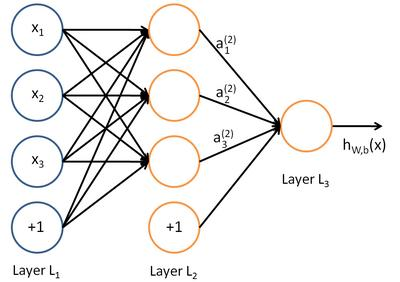
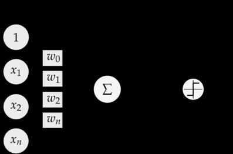
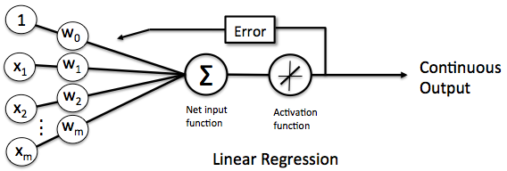
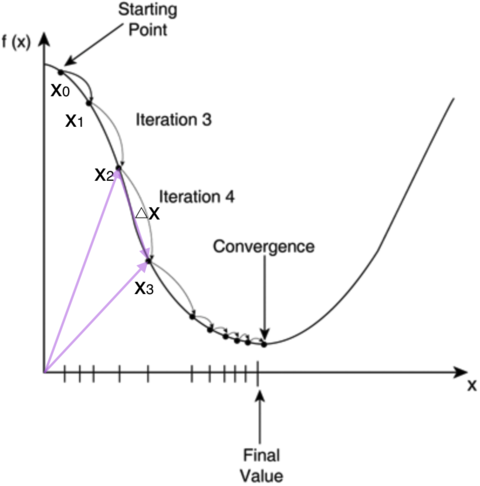
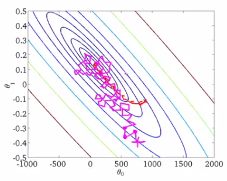
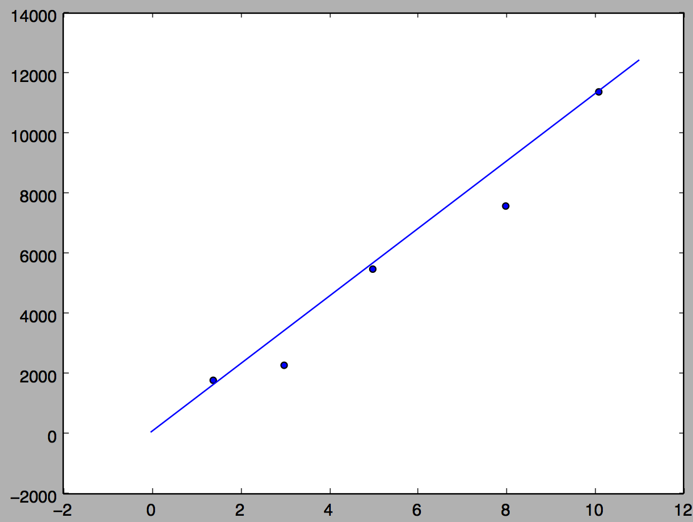

# AI 相关学习笔记汇总

[TOC]
# 前言
# 零基础入门深度学习
## 感知器

原文链接: <https://www.zybuluo.com/hanbingtao/note/433855>

> 无论即将到来的是大数据时代还是人工智能时代，亦或是传统行业使用人工智能在云上处理大数据的时代，作为一个有理想有追求的程序员，不懂深度学习（Deep Learning）这个超热的技术，会不会感觉马上就 out 了？现在救命稻草来了，《零基础入门深度学习》系列文章旨在讲帮助爱编程的你从零基础达到入门级水平。零基础意味着你不需要太多的数学知识，只要会写程序就行了，没错，这是专门为程序员写的文章。虽然文中会有很多公式你也许看不懂，但同时也会有更多的代码，程序员的你一定能看懂的（我周围是一群狂热的 Clean Code 程序员，所以我写的代码也不会很差）。

### 深度学习是啥

在人工智能领域，有一个方法叫机器学习。在机器学习这个方法里，有一类算法叫神经网络。神经网络如下图所示：



上图中每个圆圈都是一个神经元，每条线表示神经元之间的连接。我们可以看到，上面的神经元被分成了多层，层与层之间的神经元有连接，而层内之间的神经元没有连接。最左边的层叫做**输入层**，这层负责接收输入数据；最右边的层叫**输出层**，我们可以从这层获取神经网络输出数据。输入层和输出层之间的层叫做**隐藏层**。

隐藏层比较多（大于 2）的神经网络叫做深度神经网络。而深度学习，就是使用深层架构（比如，深度神经网络）的机器学习方法。

那么深层网络和浅层网络相比有什么优势呢？简单来说深层网络能够表达力更强。事实上，一个仅有一个隐藏层的神经网络就能拟合任何一个函数，但是它需要很多很多的神经元。而深层网络用少得多的神经元就能拟合同样的函数。也就是为了拟合一个函数，要么使用一个浅而宽的网络，要么使用一个深而窄的网络。而后者往往更节约资源。

深层网络也有劣势，就是它不太容易训练。简单的说，你需要大量的数据，很多的技巧才能训练好一个深层网络。这是个手艺活。

### 感知器

看到这里，如果你还是一头雾水，那也是很正常的。为了理解神经网络，我们应该先理解神经网络的组成单元——**神经元**。神经元也叫做**感知器**。感知器算法在上个世纪 50-70 年代很流行，也成功解决了很多问题。并且，感知器算法也是非常简单的。

#### 感知器的定义

下图是一个感知器：



可以看到，一个感知器有如下组成部分：

- **输入权值** 一个感知器可以接收多个输入$$x_1,x_2,...x_n$$，每个输入上有一个权值 $$w_i\in\Re$$，此外还有一个**偏置项**$$b\in\Re$$，就是上图中的$$w_0$$。
- **激活函数** 感知器的激活函数可以有很多选择，比如我们可以选择下面这个**阶跃函数$$f$$**来作为函数：

$$
f(z)=\begin{equation}\begin{cases}1\qquad z>0\\0\qquad otherwise\end{cases}\end{equation}
$$

- **输出** 感知器的输出由下面这个公式来计算

$$
y=f(\mathrm{w}\bullet\mathrm{x}+b)\qquad 公式(1)
$$

如果看完上面的公式一下子就晕了，不要紧，我们用一个简单的例子来帮助理解。

##### 例子：用感知器实现`and`函数

我们设计一个感知器，让它来实现`and`运算。程序员都知道，`and`是一个二元函数（带有两个参数和），下面是它的**真值表**：

| $$x_1$$ | $$x_2$$ | $$x_3$$ |
| ------- | ------- | ------- |
| 0       | 0       | 0       |
| 0       | 1       | 0       |
| 1       | 0       | 0       |
| 1       | 1       | 1       |

为了计算方便，我们用 0 表示**false**，用 1 表示**true**。这没什么难理解的，对于 C 语言程序员来说，这是天经地义的。

我们令$$w_1=0.5;w_2=0.5;b=-0.8$$，而激活函数$$f$$就是前面写出来的**阶跃函数**，这时，感知器就相当于`and`函数。不明白？我们验算一下：

输入上面真值表的第一行，即$$x_1=0;x_2=0$$，那么根据公式(1)，计算输出：

$$
\begin{align}
y&=f(\mathrm{w}\bullet\mathrm{x}+b)\\
&=f(w_1x_1+w_2x_2+b)\\
&=f(0.5\times0+0.5\times0-0.8)\\
&=f(-0.8)\\
&=0
\end{align}
$$

也就是当$$x_1x_2$$都为 0 的时候，$$y$$为 0，这就是**真值表**的第一行。读者可以自行验证上述真值表的第二、三、四行。

##### 例子：用感知器实现`or`函数

同样，我们也可以用感知器来实现`or`运算。仅仅需要把偏置项的值设置为-0.3 就可以了。我们验算一下，下面是`or`运算的**真值表**：

| $$x_1$$ | $$x_2$$ | $$x_3$$ |
| ------- | ------- | ------- |
| 0       | 0       | 0       |
| 0       | 1       | 1       |
| 1       | 0       | 1       |
| 1       | 1       | 1       |

我们来验算第二行，这时的输入是$$x_1=0;x_2=1$$，带入公式(1)：

$$
\begin{align}
y&=f(\mathrm{w}\bullet\mathrm{x}+b)\\
&=f(w_1x_1+w_2x_2+b)\\
&=f(0.5\times1+0.5\times0-0.3)\\
&=f(0.2)\\
&=1
\end{align}
$$

也就是当$$x_1=0;x_2=1$$时，$$y$$为 1，即`or`**真值表**第二行。读者可以自行验证其它行。

#### 感知器还能做什么

事实上，感知器不仅仅能实现简单的布尔运算。它可以拟合任何的线性函数，任何**线性分类**或**线性回归**问题都可以用感知器来解决。前面的布尔运算可以看作是**二分类**问题，即给定一个输入，输出 0（属于分类 0）或 1（属于分类 1）。如下面所示，`and`运算是一个线性分类问题，即可以用一条直线把分类 0（false，红叉表示）和分类 1（true，绿点表示）分开。


然而，感知器却不能实现异或运算，如下图所示，异或运算不是线性的，你无法用一条直线把分类 0 和分类 1 分开。

#### 感知器的训练

现在，你可能困惑前面的权重项和偏置项的值是如何获得的呢？这就要用到感知器训练算法：将权重项和偏置项初始化为 0，然后，利用下面的**感知器规则**迭代的修改$$w_i$$和$$b$$，直到训练完成。

$$
\begin{align}
w_i&\gets w_i+\Delta w_i \\
b&\gets b+\Delta b
\end{align}
$$

其中:

$$
\begin{align}
\Delta w_i&=\eta(t-y)x_i \\
\Delta b&=\eta(t-y)
\end{align}
$$

$$w_i$$是与输入$$x_i$$对应的权重项，$$b$$是偏置项。事实上，可以$$b$$把看作是值永远为 1 的输入$$x_b$$所对应的权重。$$t$$是训练样本的**实际值**，一般称之为**label**。而$$y$$是感知器的输出值，它是根据**公式(1)**计算得出。$$\eta$$是一个称为**学习速率**的常数，其作用是控制每一步调整权的幅度。

每次从训练数据中取出一个样本的输入向量$$\mathrm{x}$$，使用感知器计算其输出$$y$$，再根据上面的规则来调整权重。每处理一个样本就调整一次权重。经过多轮迭代后（即全部的训练数据被反复处理多轮），就可以训练出感知器的权重，使之实现目标函数。

#### 编程实战：实现感知器

> 完整代码请参考 GitHub: <https://github.com/hanbt/learn_dl/blob/master/perceptron.py> (python2.7)

对于程序员来说，没有什么比亲自动手实现学得更快了，而且，很多时候一行代码抵得上千言万语。接下来我们就将实现一个感知器。

下面是一些说明：

- 使用 python 语言。python 在机器学习领域用的很广泛，而且，写 python 程序真的很轻松。
- 面向对象编程。面向对象是特别好的管理复杂度的工具，应对复杂问题时，用面向对象设计方法很容易将复杂问题拆解为多个简单问题，从而解救我们的大脑。
- 没有使用 numpy。numpy 实现了很多基础算法，对于实现机器学习算法来说是个必备的工具。但为了降低读者理解的难度，下面的代码只用到了基本的 python（省去您去学习 numpy 的时间）。

下面是感知器类的实现，非常简单。去掉注释只有 27 行，而且还包括为了美观（每行不超过 60 个字符）而增加的很多换行。

```python
class Perceptron(object):
    def __init__(self, input_num, activator):
        '''
        初始化感知器，设置输入参数的个数，以及激活函数。
        激活函数的类型为double -> double
        '''
        self.activator = activator
        # 权重向量初始化为0
        self.weights = [0.0 for _ in range(input_num)]
        # 偏置项初始化为0
        self.bias = 0.0
    def __str__(self):
        '''
        打印学习到的权重、偏置项
        '''
        return 'weights\t:%s\nbias\t:%f\n' % (self.weights, self.bias)
    def predict(self, input_vec):
        '''
        输入向量，输出感知器的计算结果
        '''
        # 把input_vec[x1,x2,x3...]和weights[w1,w2,w3,...]打包在一起
        # 变成[(x1,w1),(x2,w2),(x3,w3),...]
        # 然后利用map函数计算[x1*w1, x2*w2, x3*w3]
        # 最后利用reduce求和
        return self.activator(
            reduce(lambda a, b: a + b,
                   map(lambda (x, w): x * w,
                       zip(input_vec, self.weights))
                , 0.0) + self.bias)
    def train(self, input_vecs, labels, iteration, rate):
        '''
        输入训练数据：一组向量、与每个向量对应的label；以及训练轮数、学习率
        '''
        for i in range(iteration):
            self._one_iteration(input_vecs, labels, rate)
    def _one_iteration(self, input_vecs, labels, rate):
        '''
        一次迭代，把所有的训练数据过一遍
        '''
        # 把输入和输出打包在一起，成为样本的列表[(input_vec, label), ...]
        # 而每个训练样本是(input_vec, label)
        samples = zip(input_vecs, labels)
        # 对每个样本，按照感知器规则更新权重
        for (input_vec, label) in samples:
            # 计算感知器在当前权重下的输出
            output = self.predict(input_vec)
            # 更新权重
            self._update_weights(input_vec, output, label, rate)
    def _update_weights(self, input_vec, output, label, rate):
        '''
        按照感知器规则更新权重
        '''
        # 把input_vec[x1,x2,x3,...]和weights[w1,w2,w3,...]打包在一起
        # 变成[(x1,w1),(x2,w2),(x3,w3),...]
        # 然后利用感知器规则更新权重
        delta = label - output
        self.weights = map(
            lambda (x, w): w + rate * delta * x,
            zip(input_vec, self.weights))
        # 更新bias
        self.bias += rate * delta
```

接下来，我们利用这个感知器类去实现`and`函数。

```python
def f(x):
    '''
    定义激活函数f
    '''
    return 1 if x > 0 else 0
def get_training_dataset():
    '''
    基于and真值表构建训练数据
    '''
    # 构建训练数据
    # 输入向量列表
    input_vecs = [[1,1], [0,0], [1,0], [0,1]]
    # 期望的输出列表，注意要与输入一一对应
    # [1,1] -> 1, [0,0] -> 0, [1,0] -> 0, [0,1] -> 0
    labels = [1, 0, 0, 0]
    return input_vecs, labels
def train_and_perceptron():
    '''
    使用and真值表训练感知器
    '''
    # 创建感知器，输入参数个数为2（因为and是二元函数），激活函数为f
    p = Perceptron(2, f)
    # 训练，迭代10轮, 学习速率为0.1
    input_vecs, labels = get_training_dataset()
    p.train(input_vecs, labels, 10, 0.1)
    #返回训练好的感知器
    return p
if __name__ == '__main__':
    # 训练and感知器
    and_perception = train_and_perceptron()
    # 打印训练获得的权重
    print and_perception
    # 测试
    print '1 and 1 = %d' % and_perception.predict([1, 1])
    print '0 and 0 = %d' % and_perception.predict([0, 0])
    print '1 and 0 = %d' % and_perception.predict([1, 0])
    print '0 and 1 = %d' % and_perception.predict([0, 1])
```

将上述程序保存为 perceptron.py 文件，通过命令行执行这个程序，其运行结果为：


神奇吧！感知器竟然完全实现了`and`函数。读者可以尝试一下利用感知器实现其它函数。

### 小结

终于看（写）到小结了...，大家都累了。对于零基础的你来说，走到这里应该已经很烧脑了吧。没关系，休息一下。值得高兴的是，你终于已经走出了深度学习入门的第一步，这是巨大的进步；坏消息是，这仅仅是最简单的部分，后面还有无数艰难险阻等着你。不过，你学的困难往往意味着别人学的也困难，掌握一门高门槛的技艺，进可糊口退可装逼，是很值得的。

下一篇文章，我们将讨论另外一种感知器：**线性单元**，并由此引出一种可能是最最重要的优化算法：**梯度下降**算法。

### 参考资料

1. Tom M. Mitchell, "机器学习", 曾华军等译, 机械工业出版社
## 线性单元和梯度下降

原文链接: <https://www.zybuluo.com/hanbingtao/note/448086>

### 往期回顾

在上一篇文章中，我们已经学会了编写一个简单的感知器，并用它来实现一个线性分类器。你应该还记得用来训练感知器的『感知器规则』。然而，我们并没有关心这个规则是怎么得到的。本文通过介绍另外一种『感知器』，也就是『线性单元』，来说明关于机器学习一些基本的概念，比如模型、目标函数、优化算法等等。这些概念对于所有的机器学习算法来说都是通用的，掌握了这些概念，就掌握了机器学习的基本套路。

### 线性单元是啥

感知器有一个问题，当面对的数据集不是**线性可分**的时候，『感知器规则』可能无法收敛，这意味着我们永远也无法完成一个感知器的训练。为了解决这个问题，我们使用一个**可导**的**线性函数**来替代感知器的**阶跃函数**，这种感知器就叫做**线性单元**。线性单元在面对线性不可分的数据集时，会收敛到一个最佳的近似上。

为了简单起见，我们可以设置线性单元的激活函数$$f$$为

$$
f(x) = x
$$

这样的线性单元如下图所示



对比此前我们讲过的感知器


这样替换了激活函数之后，**线性单元**将返回一个**实数值**而不是**0,1 分类**。因此线性单元用来解决**回归**问题而不是**分类**问题。

#### 线性单元的模型

当我们说**模型**时，我们实际上在谈论根据输入$$x$$预测输出$$y$$的**算法**。比如，$$x$$可以是一个人的工作年限，$$y$$可以是他的月薪，我们可以用某种算法来根据一个人的工作年限来预测他的收入。比如：

$$
y=h(x)=w*x+b
$$

函数$$h(x)$$叫做**假设**，而$$w$$、$$b$$是它的**参数**。我们假设参数$$w=1000$$，参数$$b=500$$，如果一个人的工作年限是 5 年的话，我们的模型会预测他的月薪为

$$
y=h(x)=1000*5+500=5500(元)
$$

你也许会说，这个模型太不靠谱了。是这样的，因为我们考虑的因素太少了，仅仅包含了工作年限。如果考虑更多的因素，比如所处的行业、公司、职级等等，可能预测就会靠谱的多。我们把工作年限、行业、公司、职级这些信息，称之为**特征**。对于一个工作了 5 年，在 IT 行业，百度工作，职级 T6 这样的人，我们可以用这样的一个特征向量来表示他

$$\mathrm{x}$$ = _(5, IT, 百度, T6)_。

既然输入$$\mathrm{x}$$变成了一个具备四个特征的向量，相对应的，仅仅一个参数$$w$$就不够用了，我们应该使用 4 个参数$$w_1,w_2,w_3,w_4$$，每个特征对应一个。这样，我们的模型就变成

$$
y=h(x)=w_1*x_1+w_2*x_2+w_3*x_3+w_4*x_4+b
$$

其中，$$x_1$$对应工作年限，$$x_2$$对应行业，$$x_3$$对应公司，$$x_4$$对应职级。

为了书写和计算方便，我们可以令$$w_0$$等于$$b$$，同时令$$w_0$$对应于特征$$x_0$$。由于$$x_0$$其实并不存在，我们可以令它的值永远为 1。也就是说

$$
b = w_0 * x_0\qquad其中x_0=1
$$

这样上面的式子就可以写成

$$
\begin{align}
y=h(x)&=w_1*x_1+w_2*x_2+w_3*x_3+w_4*x_4+b\\
&=w_0*x_0+w_1*x_1+w_2*x_2+w_3*x_3+w_4*x_4
\end{align}
$$

我们还可以把上式写成向量的形式

$$
y=h(x)=\mathrm{w}^T\mathrm{x}\qquad\qquad(式1)
$$

长成这种样子模型就叫做**线性模型**，因为输出就是输入特征的**线性组合**。

#### 监督学习和无监督学习

接下来，我们需要关心的是这个模型如何训练，也就是参数取什么值最合适。

机器学习有一类学习方法叫做**监督学习**，它是说为了训练一个模型，我们要提供这样一堆训练样本：每个训练样本既包括输入特征$\mathrm{x}$，也包括对应的输出$$y$$($$y$$也叫做**标记，label**)。也就是说，我们要找到很多人，我们既知道他们的特征(工作年限，行业...)，也知道他们的收入。我们用这样的样本去训练模型，让模型既看到我们提出的每个问题(输入特征$$\mathrm{x}$$)，也看到对应问题的答案(标记$$y$$)。当模型看到足够多的样本之后，它就能总结出其中的一些规律。然后，就可以预测那些它没看过的输入所对应的答案了。

另外一类学习方法叫做**无监督学习**，这种方法的训练样本中只有$$\mathrm{x}$$而没有$$y$$。模型可以总结出特征$$\mathrm{x}$$的一些规律，但是无法知道其对应的答案$$y$$。

很多时候，既有$$\mathrm{x}$$又有$$y$$的训练样本是很少的，大部分样本都只有$$\mathrm{x}$$。比如在语音到文本(STT)的识别任务中，$$\mathrm{x}$$是语音，$$y$$是这段语音对应的文本。我们很容易获取大量的语音录音，然而把语音一段一段切分好并**标注**上对应文字则是非常费力气的事情。这种情况下，为了弥补带标注样本的不足，我们可以用**无监督学习方法**先做一些**聚类**，让模型总结出哪些音节是相似的，然后再用少量的带标注的训练样本，告诉模型其中一些音节对应的文字。这样模型就可以把相似的音节都对应到相应文字上，完成模型的训练。

#### 线性单元的目标函数

现在，让我们只考虑**监督学习**。

在监督学习下，对于一个样本，我们知道它的特征$$\mathrm{x}$$，以及标记$$y$$。同时，我们还可以根据模型$$h(x)$$计算得到输出$$\bar{y}$$。注意这里面我们用$$y$$表示训练样本里面的**标记**，也就是**实际值**；用带上划线的$$\bar{y}$$表示模型计算的出来的**预测值**。我们当然希望模型计算出来的$$\bar{y}$$和$$y$$越接近越好。

数学上有很多方法来表示的$$\bar{y}$$和$$y$$的接近程度，比如我们可以用$$\bar{y}$$和$$y$$的差的平方的$$\frac{1}{2}$$来表示它们的接近程度

$$
e=\frac{1}{2}(y-\bar{y})^2
$$

我们把$$e$$叫做**单个样本**的**误差**。至于为什么前面要乘$$\frac{1}{2}$$，是为了后面计算方便。

训练数据中会有很多样本，比如$$N$$个，我们可以用训练数据中**所有样本**的误差的**和**，来表示模型的误差$$E$$，也就是

$$
E=e^{(1)}+e^{(2)}+e^{(3)}+...+e^{(n)}
$$

上式的$$e^{(1)}$$表示第一个样本的误差，$$e^{(2)}$$表示第二个样本的误差......。

我们还可以把上面的式子写成和式的形式。使用和式，不光书写起来简单，逼格也跟着暴涨，一举两得。所以一定要写成下面这样

$$
\begin{align}
E&=e^{(1)}+e^{(2)}+e^{(3)}+...+e^{(n)}\\
&=\sum_{i=1}^{n}e^{(i)}\\
&=\frac{1}{2}\sum_{i=1}^{n}(y^{(i)}-\bar{y}^{(i)})^2\qquad\qquad(式2)
\end{align}
$$

其中

$$
\begin{align}
\bar{y}^{(i)}&=h(\mathrm{x}^{(i)})\\
&=\mathrm{w}^T\mathrm{x^{(i)}}
\end{align}
$$

(式 2)中，$$x^{(i)}$$表示第$$i$$个训练样本的**特征**，$$y^{(i)}$$表示第$$i$$个样本的**标记**，我们也可以用**元组**$$(x^{(i)},y^{(i)})$$表示第$$i$$**训练样本**。$$\bar{y}^{(i)}$$则是模型对第个$$i$$样本的**预测值**。

我们当然希望对于一个训练数据集来说，误差最小越好，也就是(式 2)的值越小越好。对于特定的训练数据集来说，$$(x^{(i)},y^{(i)})$$的值都是已知的，所以(式 2)其实是参数$$w$$的函数。

$$
\begin{align}
E(\mathrm{w})&=\frac{1}{2}\sum_{i=1}^{n}(y^{(i)}-\bar{y}^{(i)})^2\\
&=\frac{1}{2}\sum_{i=1}^{n}(\mathrm{y^{(i)}}-\mathrm{w}^Tx^{(i)})^2
\end{align}
$$

由此可见，模型的训练，实际上就是求取到合适的$$w$$，使(式 2)取得最小值。这在数学上称作**优化问题**，而$$E(\mathrm{w})$$就是我们优化的目标，称之为**目标函数**。

#### 梯度下降优化算法

大学时我们学过怎样求函数$$y=f(x)$$的极值。函数的极值点，就是它的导数$$f'(x)=0$$的那个点。因此我们可以通过解方程$$f'(x)=0$$，求得函数的极值点$$(x_0,y_0)$$。

不过对于计算机来说，它可不会解方程。但是它可以凭借强大的计算能力，一步一步的去把函数的极值点『试』出来。如下图所示：



首先，我们随便选择一个点开始，比如上图的$$x_0$$点。接下来，每次迭代修改$$x$$的为$$x_1,x_2,x_3,...$$，经过数次迭代后最终达到函数最小值点。

你可能要问了，为啥每次修改$$x$$的值，都能往函数最小值那个方向前进呢？这里的奥秘在于，我们每次都是向函数$$y=f(x)$$的**梯度**的**相反方向**来修改。什么是**梯度**呢？翻开大学高数课的课本，我们会发现**梯度**是一个向量，它指向**函数值上升最快**的方向。显然，梯度的反方向当然就是函数值下降最快的方向了。我们每次沿着梯度相反方向去修改的值，当然就能走到函数的最小值附近。之所以是最小值附近而不是最小值那个点，是因为我们每次移动的步长不会那么恰到好处，有可能最后一次迭代走远了越过了最小值那个点。步长的选择是门手艺，如果选择小了，那么就会迭代很多轮才能走到最小值附近；如果选择大了，那可能就会越过最小值很远，收敛不到一个好的点上。

按照上面的讨论，我们就可以写出梯度下降算法的公式

$$
\mathrm{x}_{new}=\mathrm{x}_{old}-\eta\nabla{f(x)}
$$

其中，$$\nabla$$是**梯度算子**，$$\nabla{f(x)}$$就是指$$f(x)$$的梯度。$$\eta$$是步长，也称作**学习速率**。

对于上一节列出的目标函数(式 2)

$$
E(\mathrm{w})=\frac{1}{2}\sum_{i=1}^{n}(\mathrm{y^{(i)}-\bar{y}^{(i)}})^2
$$

梯度下降算法可以写成

$$
\mathrm{w}_{new}=\mathrm{w}_{old}-\eta\nabla{E(\mathrm{w})}
$$

聪明的你应该能想到，如果要求目标函数的**最大值**，那么我们就应该用**梯度上升**算法，它的参数修改规则是

$$
\mathrm{w}_{new}=\mathrm{w}_{old}+\eta\nabla{E(\mathrm{w})}
$$

下面，请先做几次深呼吸，让你的大脑补充足够的新鲜的氧气，**我们要来求取**$$\nabla{E(\mathrm{w})}$$，然后带入上式，就能得到线性单元的参数修改规则。

关于$$\nabla{E(\mathrm{w})}$$的推导过程，我单独把它们放到一节中。您既可以选择慢慢看，也可以选择无视。在这里，您只需要知道，经过一大串推导，目标函数$$E(w)$$的梯度是

$$
\nabla{E(\mathrm{w})}=-\sum_{i=1}^{n}(y^{(i)}-\bar{y}^{(i)})\mathrm{x}^{(i)}
$$

因此，线性单元的参数修改规则最后是这个样子

$$
\mathrm{w}_{new}=\mathrm{w}_{old}+\eta\sum_{i=1}^{n}(y^{(i)}-\bar{y}^{(i)})\mathrm{x}^{(i)}\qquad\qquad(式3)
$$

有了上面这个式子，我们就可以根据它来写出训练线性单元的代码了。

需要说明的是，如果每个样本有 M 个特征，则上式中的$\mathrm{x},\mathrm{w}$都是 M+1 维**向量**(因为我们加上了一个恒为 1 的虚拟特征，参考前面的内容)，而是**标量**。用高逼格的数学符号表示，就是

$$
\mathrm{x},\mathrm{w}\in\Re^{(M+1)}\\
y\in\Re^1
$$

为了让您看明白说的是啥，我吐血写下下面这个解释(写这种公式可累可累了)。因为$$\mathrm{w},\mathrm{x}$$是 M+1 维**列向量**，所以(式 3)可以写成

$$
\begin{bmatrix}
w_0 \\
w_1 \\
w_2 \\
... \\
w_m \\
\end{bmatrix}_{new}=
\begin{bmatrix}
w_0 \\
w_1 \\
w_2 \\
... \\
w_m \\
\end{bmatrix}_{old}+\eta\sum_{i=1}^{n}(y^{(i)}-\bar{y}^{(i)})
\begin{bmatrix}
1 \\
x_1^{(i)} \\
x_2^{(i)} \\
... \\
x_m^{(i)} \\
\end{bmatrix}
$$

如果您还是没看明白，建议您也吐血再看一下大学时学过的《线性代数》吧。

##### $$\nabla{E}(\mathrm{w})$$的推导

这一节你尽可以跳过它，并不太会影响到全文的理解。当然如果你非要弄明白每个细节，那恭喜你骚年，机器学习的未来一定是属于你的。

首先，我们先做一个简单的前戏。我们知道函数的梯度的定义就是它相对于各个变量的**偏导数**，所以我们写下下面的式子

$$
\begin{align}
\nabla{E(\mathrm{w})}&=\frac{\partial}{\partial\mathrm{w}}E(\mathrm{w})\\
&=\frac{\partial}{\partial\mathrm{w}}\frac{1}{2}\sum_{i=1}^{n}(y^{(i)}-\bar{y}^{(i)})^2\\
\end{align}
$$

可接下来怎么办呢？我们知道和的导数等于导数的和，所以我们可以先把求和符号里面的导数求出来，然后再把它们加在一起就行了，也就是

$$
\begin{align}
&\frac{\partial}{\partial\mathrm{w}}\frac{1}{2}\sum_{i=1}^{n}(y^{(i)}-\bar{y}^{(i)})^2\\
=&\frac{1}{2}\sum_{i=1}^{n}\frac{\partial}{\partial\mathrm{w}}(y^{(i)}-\bar{y}^{(i)})^2\\
\end{align}
$$

现在我们可以不管高大上的$$\sum$$了，先专心把里面的导数求出来。

$$
\begin{align}
&\frac{\partial}{\partial\mathrm{w}}(y^{(i)}-\bar{y}^{(i)})^2\\
=&\frac{\partial}{\partial\mathrm{w}}(y^{(i)2}-2\bar{y}^{(i)}y^{(i)}+\bar{y}^{(i)2})\\
\end{align}
$$

我们知道，$$y$$是$$\mathrm{w}$$与无关的常数，而$$\bar{y}=\mathrm{w}^T\mathrm{x}$$，下面我们根据链式求导法则来求导(上大学时好像叫复合函数求导法则)

$$
\frac{\partial{E(\mathrm{w})}}{\partial\mathrm{w}}=\frac{\partial{E(\bar{y})}}{\partial\bar{y}}\frac{\partial{\bar{y}}}{\partial\mathrm{w}}
$$

我们分别计算上式等号右边的两个偏导数

$$
\begin{align}
\frac{\partial{E(\mathrm{w})}}{\partial\bar{y}}=
&\frac{\partial}{\partial\bar{y}}(y^{(i)2}-2\bar{y}^{(i)}y^{(i)}+\bar{y}^{(i)2})\\
=&-2y^{(i)}+2\bar{y}^{(i)}\\\\
\frac{\partial{\bar{y}}}{\partial\mathrm{w}}=
&\frac{\partial}{\partial\mathrm{w}}\mathrm{w}^T\mathrm{x}\\
=&\mathrm{x}
\end{align}
$$

代入，我们求得$$\sum{}$$里面的偏导数是

$$
\begin{align}
&\frac{\partial}{\partial\mathrm{w}}(y^{(i)}-\bar{y}^{(i)})^2\\
=&2(-y^{(i)}+\bar{y}^{(i)})\mathrm{x}
\end{align}
$$

最后代入$$\nabla{E}(\mathrm{w})$$，求得

$$
\begin{align}
\nabla{E(\mathrm{w})}&=\frac{1}{2}\sum_{i=1}^{n}\frac{\partial}{\partial\mathrm{w}}(y^{(i)}-\bar{y}^{(i)})^2\\
&=\frac{1}{2}\sum_{i=1}^{n}2(-y^{(i)}+\bar{y}^{(i)})\mathrm{x}\\
&=-\sum_{i=1}^{n}(y^{(i)}-\bar{y}^{(i)})\mathrm{x}
\end{align}
$$

至此，大功告成。

##### 随机梯度下降算法(Stochastic Gradient Descent, SGD)

如果我们根据(式 3)来训练模型，那么我们每次更新$$\mathrm{w}$$的迭代，要遍历训练数据中所有的样本进行计算，我们称这种算法叫做**批梯度下降(Batch Gradient Descent)**。如果我们的样本非常大，比如数百万到数亿，那么计算量异常巨大。因此，实用的算法是 SGD 算法。在 SGD 算法中，每次更新$$\mathrm{w}$$的迭代，只计算一个样本。这样对于一个具有数百万样本的训练数据，完成一次遍历就会对$$\mathrm{w}$$更新数百万次，效率大大提升。由于样本的噪音和随机性，每次更新$$\mathrm{w}$$并不一定按照减少$$E$$的方向。然而，虽然存在一定随机性，大量的更新总体上沿着减少$$E$$的方向前进的，因此最后也能收敛到最小值附近。下图展示了 SGD 和 BGD 的区别



如上图，椭圆表示的是函数值的等高线，椭圆中心是函数的最小值点。红色是 BGD 的逼近曲线，而紫色是 SGD 的逼近曲线。我们可以看到 BGD 是一直向着最低点前进的，而 SGD 明显躁动了许多，但总体上仍然是向最低点逼近的。

最后需要说明的是，SGD 不仅仅效率高，而且随机性有时候反而是好事。今天的目标函数是一个『凸函数』，沿着梯度反方向就能找到全局唯一的最小值。然而对于非凸函数来说，存在许多局部最小值。随机性有助于我们逃离某些很糟糕的局部最小值，从而获得一个更好的模型。

### 实现线性单元

> 完整代码请参考 GitHub: https://github.com/hanbt/learn_dl/blob/master/linear_unit.py (python2.7)

接下来，让我们撸一把代码。

因为我们已经写了感知器的代码，因此我们先比较一下感知器模型和线性单元模型，看看哪些代码能够复用。

| 算法         | 感知器                                                                                                                     | 线性单元                                                |
| ------------ | -------------------------------------------------------------------------------------------------------------------------- | ------------------------------------------------------- |
| 模型$$h(x)$$ | $$y=f(\mathrm{w}^T\mathrm{x})\\f(z)=\begin{equation}\begin{cases}1\qquad z>0\\0\qquad otherwise\end{cases}\end{equation}$$ | $$y=f(\mathrm{w}^T\mathrm{x})\\f(z)=z$$                 |
| 训练规则     | $$\mathrm{w}\gets\mathrm{w}+\eta(y-\bar{y})\mathrm{x}$$                                                                    | $$\mathrm{w}\gets\mathrm{w}+\eta(y-\bar{y})\mathrm{x}$$ |

比较的结果令人震惊，原来除了激活函数$$f$$不同之外，两者的模型和训练规则是一样的(在上表中，线性单元的优化算法是 SGD 算法)。那么，我们只需要把感知器的激活函数进行替换即可。感知器的代码请参考上一篇文章[零基础入门深度学习(1) - 感知器](./01.md)，这里就不再重复了。对于一个养成良好习惯的程序员来说，重复代码是不可忍受的。大家应该把代码保存在一个代码库中(比如 git)。

```python
from perceptron import Perceptron
#定义激活函数f
f = lambda x: x
class LinearUnit(Perceptron):
    def __init__(self, input_num):
        '''初始化线性单元，设置输入参数的个数'''
        Perceptron.__init__(self, input_num, f)
```

通过继承 Perceptron，我们仅用几行代码就实现了线性单元。这再次证明了面向对象编程范式的强大。

接下来，我们用简单的数据进行一下测试。

```pytho
def get_training_dataset():
    '''
    捏造5个人的收入数据
    '''
    # 构建训练数据
    # 输入向量列表，每一项是工作年限
    input_vecs = [[5], [3], [8], [1.4], [10.1]]
    # 期望的输出列表，月薪，注意要与输入一一对应
    labels = [5500, 2300, 7600, 1800, 11400]
    return input_vecs, labels
def train_linear_unit():
    '''
    使用数据训练线性单元
    '''
    # 创建感知器，输入参数的特征数为1（工作年限）
    lu = LinearUnit(1)
    # 训练，迭代10轮, 学习速率为0.01
    input_vecs, labels = get_training_dataset()
    lu.train(input_vecs, labels, 10, 0.01)
    #返回训练好的线性单元
    return lu
if __name__ == '__main__':
    '''训练线性单元'''
    linear_unit = train_linear_unit()
    # 打印训练获得的权重
    print linear_unit
    # 测试
    print 'Work 3.4 years, monthly salary = %.2f' % linear_unit.predict([3.4])
    print 'Work 15 years, monthly salary = %.2f' % linear_unit.predict([15])
    print 'Work 1.5 years, monthly salary = %.2f' % linear_unit.predict([1.5])
    print 'Work 6.3 years, monthly salary = %.2f' % linear_unit.predict([6.3])
```

程序运行结果如下图

拟合的直线如下图



### 小结

事实上，一个机器学习算法其实只有两部分

- _模型_ 从输入特征$$\mathrm{x}$$预测输入$$y$$的那个函数$$h(x)$$
- _目标函数_ 目标函数取最小(最大)值时所对应的参数值，就是模型的参数的**最优值**。很多时候我们只能获得目标函数的**局部最小(最大)值**，因此也只能得到模型参数的**局部最优值**。

因此，如果你想最简洁的介绍一个算法，列出这两个函数就行了。

接下来，你会用**优化算法**去求取目标函数的最小(最大)值。**[随机]梯度{下降|上升}**算法就是一个**优化算法**。针对同一个**目标函数**，不同的**优化算法**会推导出不同的**训练规则**。我们后面还会讲其它的优化算法。

其实在机器学习中，算法往往并不是关键，真正的关键之处在于选取特征。选取特征需要我们人类对问题的深刻理解，经验、以及思考。而**神经网络**算法的一个优势，就在于它能够自动学习到应该提取什么特征，从而使算法不再那么依赖人类，而这也是神经网络之所以吸引人的一个方面。

现在，经过漫长的烧脑，你已经具备了学习**神经网络**的必备知识。下一篇文章，我们将介绍本系列文章的主角：**神经网络**，以及用来训练神经网络的大名鼎鼎的算法：**反向传播**算法。至于现在，我们应该暂时忘记一切，尽情奖励自己一下吧。

### 参考资料

1. Tom M. Mitchell, "机器学习", 曾华军等译, 机械工业出版社
# LSTM

<https://blog.csdn.net/weixin_39653948/article/details/104966046>
## 什么是 LSTMs

本章节介绍了 LSTMs 及其工作原理。完成本课后，你将会知道：

- 什么是序列预测，以及它们与一般预测建模问题有何不同。
- 多层感知器在序列预测方面的局限性，递归神经网络在序列预测方面的前景，以及 LSTMs 如何实现这一前景。
- 令人印象深刻的 LSTMs 在挑战序列预测问题上的应用，以及对 LSTMs 的一些局限性的警告。

### 序列预测问题

序列预测不同于其他类型的监督学习问题。**在训练模型和进行预测时，必须保持观察结果的顺序。**通常，涉及序列数据的预测问题被称为序列预测问题，尽管根据输入和输出序列有一系列不同的问题。这一节将研究 4 种不同类型的序列预测问题：

1. Sequence Prediction.
2. Sequence Classification.
3. Sequence Generation.
4. Sequence-to-Sequence Prediction.

但首先，要弄清楚**集合（set）**和**序列（sequence）**之间的区别。

#### Sequence

在应用机器学习中，我们经常处理集合，例如一列或一组样本的测试集。集合中的每个样本都可以看作是定义域中的一个观察值。在一个集合中，观察的顺序并不重要。

序列是不同的。序列对观测结果施加了明确的顺序。顺序很重要。在使用序列数据作为模型的输入或输出的预测问题的制定过程中，必须考虑到这一点。

#### Sequence Prediction

序列预测包括预测给定输入序列的下一个值。例如：

```shell
Input Sequence: 1, 2, 3, 4, 5
Output Sequence: 6
```

![epiction of a sequence prediction problem.][lstm-1-1]

序列预测一般也称为序列学习。从技术上讲，我们可以把下列所有问题都看作是一种序列预测问题。这可能会使初学者感到困惑。

> _序列数据的学习一直是模式识别和机器学习的基本任务和挑战。涉及顺序数据的应用程序可能需要预测新事件、生成新序列或决策，如序列或子序列的分类。_

一般来说，在这本书中，我们将使用**“序列预测”**来指代一般类型的序列数据预测问题。然而，在本节中，我们将把序列预测与其他形式的预测区别开来，将序列数据定义为下一个时间步的预测。

一些序列预测问题的例子包括：

- **天气预报**。根据一段时间内对天气的一系列观察，预测明天的天气。
- **股市预测**。 给定安全性随时间推移的一系列运动，请预测安全性的下一个运动。
- **产品推荐**。 给定客户过去的购买顺序，请预测客户的下一次购买。

#### Sequence Classification

序列分类涉及到预测给定输入序列的类标签。例如:

```shell
Input Sequence: 1, 2, 3, 4, 5
Output Sequence: "good"
```

![Depiction of a sequence classification problem.][lstm-1-2]

**序列分类的目的**：利用标记数据集[…]建立分类模型。因此，该模型可用于预测未知序列的类标签。

**输入序列可以由实值或离散值组成**。在后一种情况下，这类问题可称为离散序列分类问题。一些序列分类问题的例子包括:

- **DNA 序列分类**。给定 a、C、G 和 T 值的 DNA 序列，预测该序列是编码区还是非编码区。
- **异常检测**。 给定一系列观察结果，请预测该序列是否异常。
- **情感分析**。 给定一系列文本（例如评论或推文），预测文本的情绪是正面还是负面。

#### Sequence Generation

序列生成包括生成与语料库中的其他序列具有相同一般特征的新输出序列。例如:

```shell
Input Sequence: [1, 3, 5], [7, 9, 11]
Output Sequence: [3, 5 ,7]
```

![Depiction of a sequence generation problem.][lstm-1-3]

> [递归神经网络]可以通过一步一步地处理真实的数据序列并预测接下来会发生什么来训练序列生成。假设预测是概率性的，通过对网络的输出分布进行迭代采样，然后将样本作为下一步的输入，可以从训练好的网络中生成新的序列。换句话说，通过让网络把它的发明当作是真实的，就像在做梦一样。
>
> — Generating Sequences With Recurrent Neural Networks, 2013.

一些序列生成问题的例子包括：

- **文字生成**。 给定一个文本语料库（例如莎士比亚的作品），生成新的句子或文本段落，阅读它们可能是从该语料库中提取的。
- **手写预测**。 给定一个手写示例的语料库，为具有语料库中笔迹特性的新短语生成笔迹。
- **音乐生成**。 给定一个音乐实例集，生成具有该音乐集特性的新音乐作品。

序列的产生也可以指代给定单个观察作为输入的序列的产生。 一个示例是图像的自动文本描述。

- **图像标题生成**。 给定图像作为输入，生成描述图像的单词序列。

例如：

```shell
Input Sequence: [image pixels]
Output Sequence: ["man riding a bike"]
```

![Depiction of a sequence generation problem for captioning an image.][lstm-1-4]

> 能够用适当的英语句子自动描述图像的内容是一项非常具有挑战性的任务，但它可能会产生巨大的影响[…]事实上，一个描述不仅必须捕获图像中包含的对象，而且还必须表达这些对象如何相互关联，以及它们的属性和它们所涉及的活动。
>
> — Show and Tell: A Neural Image Caption Generator, 2015

#### Sequence-to-Sequence Prediction

序列到序列的预测涉及到给定输入序列的输出序列的预测。例如:

```shell
Input Sequence: 1, 2, 3, 4, 5
Output Sequence: 6, 7, 8, 9, 10
```

![Depiction of a sequence-to-sequence prediction problem.][lstm-1-5]

> 尽管深度神经网络具有灵活性和强大的功能，但它只适用于那些输入和目标可以用固定维数的向量合理编码的问题。这是一个重要的限制，因为许多重要的问题最好用长度未知的序列来表示。例如，语音识别和机器翻译是连续的问题。同样，回答问题也可以看作是将表示问题的单词序列映射到表示答案的单词序列。
>
> — Sequence to Sequence Learning with Neural Networks, 2014.

序列到序列预测是序列预测的一种微妙但具有挑战性的扩展，它不是预测序列中的一个单独的下一个值，而是预测一个可能与输入序列具有相同长度或相同时间的新序列。这种类型的问题最近在自动文本翻译(例如，将英语翻译成法语)领域中得到了大量的研究，可以用缩写 seq2seq 来指代。

> seq2seq 学习的核心是使用递归神经网络将可变长度的输入序列映射到可变长度的输出序列。虽然 seq2seq 方法相对较新，但在……机器翻译方面已经取得了最先进的成果。
>
> — Multi-task Sequence to Sequence Learning, 2016.

如果输入和输出序列是时间序列，则该问题可以称为**多步时间序列预测（multi-step time series forecasting）**。 序列间问题的一些示例包括：

- **多步时间序列预测**。 给定一个时间序列的观测值，可以预测一系列未来时间步长的观测值序列。
- **文字摘要**。 给定一个文本文件，该文件描述了源文件的重要部分。
- **程序执行**。 给定文本描述程序或数学方程式，可以预测描述正确输出的字符序列。

### Limitations of Multilayer Perceptrons

经典的神经网络称为**多层感知器**，简称 MLPs，可以应用于序列预测问题。mlp 近似一个从输入变量到输出变量的映射函数。这种通用能力对于序列预测问题(尤其是时间序列预测)是有价值的，原因有很多。

- **对噪声的鲁棒性（Robust to Noise）**。 神经网络对于输入数据和映射功能中的噪声具有鲁棒性，甚至在缺少值的情况下甚至可以支持学习和预测。
- **非线性**。神经网络对映射函数没有很强的假设，容易学习线性和非线性关系。

更具体地说，可以将 mlp 配置为支持映射函数中任意定义但固定数量的输入和输出。这意味着:

- **多变量输入**。可以指定任意数量的输入特征，为多元预测提供直接支持。
- **多步骤的输出**。可以指定任意数量的输出值，为多步甚至多变量预测提供直接支持。

这种能力克服了使用传统线性方法(如用于时间序列预测的 ARIMA 等工具)的限制。单就这些能力而言，前馈神经网络在时间序列预测中得到了广泛的应用。

MLPs 在序列预测中的应用要求将输入序列分割成较小的重叠子序列，并将这些重叠子序列显示给网络以生成预测。输入序列的时间步长成为网络的输入特征。子序列是重叠的，以模拟一个窗口沿序列滑动，以生成所需的输出。这可以很好地解决一些问题，但它有 5 个关键的局限性。

- **无状态的（Stateless）**。mlp 学习一个固定的函数近似值。任何依赖于输入序列上下文的输出都必须被一般化（generalized）并固定（frozen）到网络权值中。
- **不用关心时间结构（Unaware of Temporal Structure）**。 时间步长被建模为输入特征，这意味着网络对观察之间的时间结构或顺序没有明确的处理或理解。
- **混乱缩放（Messy Scaling）**：对于需要对多个并行输入序列进行建模的问题，输入特征的数量会随着滑动窗口大小的增加而增加，而无需明确区分序列的时间步长。
- **固定尺寸的输入（Fixed Sized Inputs）**：滑动窗口的大小是固定的，必须施加到网络的所有输入上。
- **固定大小的输出（Fixed Sized Outputs）**。 输出的大小也是固定的，任何不符合要求的输出都必须强制执行

**MLP**确实为序列预测提供了强大的功能，但仍然受到这一关键限制的影响，即**必须在模型的设计中明确指定观测值之间的时间相关性范围。** mlp 是建模序列预测问题的一个很好的起点，但是我们现在有了更好的选择。

#### Promise of Recurrent Neural Networks

长短时记忆(LSTM)网络是一种递归神经网络。递归神经网络(RNNs)是一种特殊的序列问题神经网络。给出一个标准的前馈 MLP 网络，一个 RNN 可以被认为是该体系结构中增加的循环。例如，在一个给定的层中，每个神经元除了向下一层传递信号外，还可以向后面(侧面)传递信号。网络的输出可以反馈为网络的输入，并带有下一个输入向量。等等。

重复连接将 state 或 memory 添加到网络中，使其能够学习和利用输入序列中观察到的有序特性。

> …递归神经网络包含一些周期，这些周期将先前时间步长的网络活动作为输入输入到网络中，从而影响当前时间步的预测。这些激活被存储在网络的内部状态中，这些状态在原则上可以保存长期的时间上下文信息。这种机制允许 RNNs 在输入序列历史记录上利用动态变化的上下文窗口
>
> — Long Short-Term Memory Recurrent Neural Network Architectures for Large Scale Acoustic Modeling, 2014.

> _长短时记忆(LSTM)能够利用固定大小的时间窗来解决前馈网络无法解决的许多时间序列任务。_
>
> — Applying LSTM to Time Series Predictable through Time-Window Approaches, 2001.

**除了使用神经网络进行序列预测的一般好处之外，RNNs 还可以学习和利用数据的时间依赖性。**也就是说，在最简单的情况下，网络可以从一个序列中一次显示一个观察结果，并可以了解它之前看到的哪些观察结果是相关的，以及它们与做出预测的关系如何。

> 由于 LSTM 网络能够学习序列中的长期相关性，因此不需要预先指定的时间窗口，并且能够准确地建模复杂的多元序列。
>
> — Long Short Term Memory Networks for Anomaly Detection in Time Series, 2015.\*

递归神经网络的前景是可以学习输入数据中的时间依赖性和上下文信息。

> 输入不是固定而是组成输入序列的递归网络可用于将输入序列转换为输出序列，同时以灵活的方式考虑上下文信息。
>
> — Learning Long-Term Dependencies with Gradient Descent is Diffcult, 1994.

有许多 RNNs，但是 LSTM 实现了 RNNs 对序列预测的承诺。这就是为什么现在有这么多关于 LSTMs 的讨论和应用。

**LSTMs 具有内部状态，它们明确地知道输入中的时间结构，能够分别对多个并行输入序列进行建模，并且能够单步通过不同长度的输入序列生成可变长度的输出序列，每次一个观察结果。**

接下来，让我们进一步了解 LSTM 网络。

### The Long Short-Term Memory Network

LSTM 网络不同于传统的 MLP。 像 MLP 一样，网络由神经元层组成。 输入数据通过网络传播，以便进行预测。

与 RNNs 一样，LSTMs 也有重复的连接，因此来自前一个时间步的神经元激活的状态被用作生成输出的上下文。但与其他 RNN 不同的是，LSTM 有一个独特的配方，它可以避免其他 RNN 的训练和规模的问题。这一点，以及可以实现的令人印象深刻的结果，是该技术流行的原因。

RNN 一直以来面临的关键技术挑战是如何有效地训练它们。实验表明，权重更新程序导致权重变化迅速变小，导致梯度消失，或导致非常大的变化甚至溢出（爆炸梯度）。 LSTM 克服了这一挑战。

> 不幸的是，标准的 RNNs 所能访问的上下文信息的范围实际上是相当有限的。问题是，给定的输入对隐含层的影响，以及因此对网络输出的影响，在围绕网络的循环连接时，要么衰减，要么呈指数级放大。这个缺点…在文献中被称为消失梯度问题…长短时记忆(LSTM)是一种专门针对消失梯度问题设计的 RNN 结构。
>
> — A Novel Connectionist System for Unconstrained Handwriting Recognition, 2009.

> LSTM 架构是通过对现有 RNN 中的错误流进行分析而得出的，该分析发现，现有架构无法访问长时间的信息，因为反向传播的错误会导致梯度爆炸或呈指数级衰减。LSTM 层由一组递归连接的块组成，称为内存块。这些块可以被认为是数字计算机中存储芯片的可微版本。每个单元包含一个或多个递归连接的存储单元和三个乘法单元——输入、输出和遗忘门，它们为单元提供连续的写、读和重置操作。网络只能通过门与细胞相互作用。
>
> — Framewise Phoneme Classification with Bidirectional LSTM and Other Neural Network Architectures, 2005.

#### LSTM Weights

记忆单元（memory cell）具有用于输入，输出以及通过暴露于输入时间步长而建立的内部状态的权重参数。

- **输入权重**。用于对当前时间步长的输入进行加权。
- **输出权值**。用于对最后一个时间步的输出进行加权。
- **内部状态（Internal State）**。内部状态用于计算此时间步长的输出。

#### LSTM Gates

记忆单元的关键是门（gate）。这些都是加权函数，进一步控制单元中的信息流。有三个门:

- Forget Gate（遗忘门）：决定从单元中丢弃哪些的信息。
- Input Gate（输入门）：决定哪些输出的值去更新记忆状态。
- Outut Gate（输出门）：根据输入和记忆单元确定输出什么。

**遗忘门和输入门用于内部状态的更新。输出门是单元实际输出内容的最终限制器。这些门和被称为 constant error carrousel（CEC）的一致的数据流使每个单元保持稳定(既不爆炸也不消失)。**

> 每个存储单元的内部结构保证了恒定的误差，在恒定的误差范围内。这是桥接很长时间滞后的基础。两个门单元学习在每个记忆单元的 CEC 中打开和关闭对错误流的访问。乘法输入门（multiplicative input gate）提供了对 CEC 的保护，使其不受无关输入的干扰。同样，乘法输出门保护其他单元不受当前不相关的记忆内容的干扰。
>
> — Long Short-Term Memory, 1997.

与传统的 MLP 神经元不同，LSTM 内存单元很难清晰地绘制出来。到处都是线、砝码和门。如果您认为 LSTM 内部的图片或基于等式的描述将进一步有所帮助，请参阅本章末尾的一些参考资料。我们可以总结出 LSTMs 的三个主要优点：

- **克服了训练 RNN 的技术问题，即梯度消失和爆炸。**
- **具有记忆，以克服长期时间依赖与输入序列的问题。**
- **按时间步长处理输入序列和输出序列，允许可变长度的输入和输出。**

### Applications of LSTMs

LSTMs 可以为具有挑战性的序列预测问题提供优雅的解决方案。本节将提供 3 个示例，以便提供 LSTMs 能够实现的结果的快照。

#### Automatic Image Caption Generation

自动图像字幕是这样一种任务:给定一幅图像，系统必须生成描述图像内容的字幕。2014 年，大量的深度学习算法在这个问题上取得了令人印象深刻的结果，这些算法利用顶级模型的工作来进行对象分类和照片中的对象检测。

一旦您可以在照片中检测对象并为这些对象生成标签，您就可以看到下一步是将这些标签转换为连贯的句子描述。该系统使用非常大的卷积神经网络来检测照片中的目标，然后使用 LSTM 将标签转换成连贯的句子。

![xample of LSTM generated captions, taken from Show and Tell: A Neural Image
Caption Generator, 2014. ][lstm-1-6]

#### Automatic Translation of Text

自动文本翻译是这样一种任务：给定一种语言的文本句子，把它们翻译成另一种语言的文本。例如，英语句子作为输入，中文句子作为输出。该模型必须学习单词的翻译、修改翻译的上下文，并支持输入和输出序列，这些序列的长度可能在一般情况下和相互之间有所不同。

![Example of English text translated to French comparing predicted to expected
translations, taken from Sequence to Sequence Learning with Neural Networks, 2014.][lstm-1-7]

#### Automatic Handwriting Generation

这是一个任务，在给定的手写示例库中，为给定的单词或短语生成新的手写。在创建手写样本时，手写作为笔使用的坐标序列提供。从这个语料库中，可以学习笔的运动和字母之间的关系，并生成新的例子。有趣的是，不同的风格可以学习，然后模仿。我很乐意看到这项工作结合一些法医笔迹分析专家。

![ Example of LSTM generated captions, taken from Generating Sequences With
Recurrent Neural Networks, 2014. ][lstm-1-8]

### Limitations of LSTMs

LSTMs 非常令人印象深刻。该网络的设计克服了神经网络的技术挑战，实现了神经网络序列预测的承诺。LSTMs 在一系列复杂序列预测问题中的应用取得了良好的效果。但是 LSTMs 并不适用于所有的序列预测问题。

例如，在时间序列预测中，与预测相关的信息通常在过去观测的一个小窗口内。通常，带有窗口或线性模型的 MLP 可能是较简单且更适合的模型。

> 在文献中发现的时间序列基准问题…通常比 LSTM 已经解决的许多任务在概念上更简单。它们通常根本不需要 RNN，因为关于下一个事件的所有相关信息都是通过包含在一个小时间窗口内的几个最近事件来传递的。
>
> — Applying LSTM to Time Series Predictable through Time-Window Approaches, 2001

LSTMs 的一个重要限制是记忆（memory）。或者更准确地说，记忆是如何被滥用的。有可能迫使 LSTM 模型在很长的输入时间步长的情况下记住单个观察结果。这是对 LSTM 的糟糕使用，并且需要 LSTM 模型来记住多个观察值将会失败。

这可以在将 LSTMs 应用于时间序列预测时看到，在这种情况下，问题被表述为一个自回归，该自回归要求输出是输入序列中多个距离时间步长的函数。LSTM 可能会被迫执行这个问题，但是它的效率通常比精心设计的自回归模型或问题的重新构造要低。

> 假设任何动态模型都需要 t-tau 的所有输入…，我们注意到[自回归]-RNN 必须存储从 t-tau 到 t 的所有输入，并在适当的时间覆盖它们。这需要实现一个循环缓冲区，这是 RNN 很难模拟的结构。
>
> — Applying LSTM to Time Series Predictable through Time-Window Approaches, 2001.

需要注意的是，使用 lstm 需要仔细考虑你问题得框架。可以将 LSTMs 的内部状态看作是一个方便的内部变量，以便捕获和提供用于进行预测的上下文。如果问题看起来像一个传统的自回归类型的问题，在一个小窗口中有最相关的滞后观察，那么在考虑 LSTM 之前，可以使用 MLP 和滑动窗口开发一个性能基线。

### Further Reading

如果您想更深入地了解算法的技术细节，请阅读以下有关 LSTM 的必读文章。

#### Sequence Prediction Problems

- Sequence on Wikipedia.
  <https://en.wikipedia.org/wiki/Sequence>
- On Prediction Using Variable Order Markov Models, 2004.
- Sequence Learning: From Recognition and Prediction to Sequential Decision Making, 2001.
- Chapter 14, Discrete Sequence Classification, Data Classification: Algorithms and Appli-cations, 2015.
  <http://amzn.to/2tkM723>
- Generating Sequences With Recurrent Neural Networks, 2013.
  <https://arxiv.org/abs/1308.0850>
- Show and Tell: A Neural Image Caption Generator, 2015.
  <https://arxiv.org/abs/1411.4555s>
- Multi-task Sequence to Sequence Learning, 2016.
  <https://arxiv.org/abs/1511.06114>
- Sequence to Sequence Learning with Neural Networks, 2014.
  <https://arxiv.org/abs/1409.3215>
- Recursive and direct multi-step forecasting: the best of both worlds, 2012.

#### MLPs for Sequence Prediction

- Neural Networks for Time Series Processing, 1996.
- Sequence to Sequence Learning with Neural Networks, 2014.
  https://arxiv.org/abs/1409.3215

#### Promise of RNNs

- Long Short-Term Memory Recurrent Neural Network Architectures for Large Scale Acoustic Modeling, 2014 .
- Applying LSTM to Time Series Predictable through Time-Window Approaches, 2001.
- Long Short Term Memory Networks for Anomaly Detection in Time Series, 2015.
- Learning Long-Term Dependencies with Gradient Descent is Difficult, 1994.
- On the difficulty of training Recurrent Neural Networks, 2013.
  <https://arxiv.org/abs/1211.5063>

#### LSTMs

- Long Short-Term Memory, 1997.
- Learning to forget: Continual prediction with LSTM, 2000.
- A Novel Connectionist System for Unconstrained Handwriting Recognition, 2009.
- Framewise Phoneme Classification with Bidirectional LSTM and Other Neural Network Architectures, 2005

#### LSTM Applications

- Show and Tell: A Neural Image Caption Generator, 2014 .
  <https://arxiv.org/abs/1411.4555>
- Sequence to Sequence Learning with Neural Networks, 2014.
  <https://arxiv.org/abs/1409.3215>
- Generating Sequences With Recurrent Neural Networks, 2014.
  <https://arxiv.org/abs/1308.0850>

### Extensions

[lstm-1-1]: ../.gitbook/assets/lstm/1-1.png
[lstm-1-2]: ../.gitbook/assets/lstm/1-2.png
[lstm-1-3]: ../.gitbook/assets/lstm/1-3.png
[lstm-1-4]: ../.gitbook/assets/lstm/1-4.png
[lstm-1-5]: ../.gitbook/assets/lstm/1-5.png
[lstm-1-6]: ../.gitbook/assets/lstm/1-6.png
[lstm-1-7]: ../.gitbook/assets/lstm/1-7.png
[lstm-1-8]: ../.gitbook/assets/lstm/1-8.png
## How to Train LSTMs

本章节讲解了用于训练 LSTMs 的时间反向传播算法。完成本课后，你将会知道：

- 什么是时间的反向传播，以及它如何与多层感知器网络使用的反向传播训练算法相关联。
- 导致需要通过时间进行**截断反向传播（Truncated Backpropagation）**的动机，这是 LSTMs 深度学习中最广泛使用的变体。
- 考虑配置“经过时间截断的反向传播”以及研究和深度学习库中使用的规范配置的概念。
- 关于配置“经过时间截断的反向传播”以及研究和深度学习库中使用的规范配置的一种表示法。

### Backpropagation Training Algorithm

反向传播指的是两件事：

- 导数计算的数学方法及导数链式法则的应用。
- 更新网络权值以最小化误差的训练算法。

本课中使用的正是后一种对反向传播的理解。反向传播训练算法的目标是修改神经网络的权值，使网络输出相对于相应输入的期望输出的误差最小化。它是一种监督学习算法，允许网络根据特定的错误进行纠正。一般算法如下:

1. 提供一个训练输入模式，并通过网络传播它以获得输出。
2. 将预测输出与预期输出进行比较，并计算误差。
3. 计算误差对网络权值的导数。
4. 调整权重以使误差最小化。
5. 重复。

### Unrolling Recurrent Neural Networks

递归神经网络的一个简单概念是作为一种神经网络，它从先前的时间步中获取输入。 我们可以用一个图表来证明这一点。

![lstm-02-01][lstm-02-01]

RNNs是适合的，并在许多时间步长的预测。随着时间步长的增加，具有循环连接的简单图开始失去所有意义。我们可以通过在输入序列上展开或展开RNN图来简化模型。


#### Unfolding the Forward Pass

考虑这样一种情况，我们有多个输入`(X(t)， X(t+1)，…)`的时间步长，多个内部状态`(u(t)， u(t+1)，…)`的时间步长，以及多个输出`(y(t)， y(t+1)，…)`的时间步长。我们可以将网络示意图展开成一个没有任何循环的图，如下图所示。

![lstm-02-02][lstm-02-02]

可以看到，我们移动的循环和上一个时间步骤的输出(y(t))和内部状态(u(t))作为处理下一个时间步骤的输入被传递到网络。这个概念的关键是网络(RNN)在展开的时间步之间不发生变化。具体来说，每个时间步使用相同的权值，只有输出和内部状态不同。通过这种方式，整个网络(拓扑结构和权值)在输入序列中的每个时间步都被复制。

我们可以将这一概念进一步推广，将网络的每个副本视为同一前馈神经网络的一个附加层。**较深的层作为输入前一层的输出以及一个新的输入时间步长**。这些层实际上是同一组权值的所有副本，内部状态从一层更新到另一层，这可能是这个经常使用的类比的延伸。

![lstm-02-03][lstm-02-03]

> RNNs沿着时间维度展开，就可以被看作是所有层具有相同权值的深度前馈网络。
>
> — Deep learning, Nature, 2015.

这是一个有用的概念工具和可视化工具，有助于理解在转发过程中网络中发生的事情。这可能是也可能不是深度学习库实现网络的方式。


#### Unfolding the Backward Pass

网络展开的思想在递归神经网络实现后向遍历的过程中起着越来越重要的作用。

> _与[时间反向传播]的标准一样，网络是随时间展开的，因此到达各层的连接被视为来自前一个时间步长。
> — Framewise phoneme classification with bidirectional LSTM and other neural network architectures, 2005._

**重要的是，给定时间步的误差反向传播取决于网络在前一时间步的激活。这样，反向传递需要展开网络的概念化。误差被传播回序列的第一个输入时间步，以便计算误差梯度并更新网络的权值。**

> _和标准的反向传播一样，[时间反向传播]由链规则的重复应用组成。其微妙之处在于，对于递归网络，损失函数不仅依赖于隐藏层对输出层的影响，而且还依赖于它在下一个时间步对隐藏层的影响。_
>
> _— Supervised Sequence Labelling with Recurrent Neural Networks, 2008._

展开递归网络图也会引入其他关注点。每一个时间步都需要一个新的网络副本，而这又需要更多的记忆，特别是对于具有数千或数百万权重的大型网络。训练大型递归网络的记忆需求会随着时间步数上升到数百步而迅速膨胀。

> _… 需要按输入序列的长度展开RNN。通过展开一个RNN N次，网络中神经元的每一次激活都被复制N次，这会消耗大量的内存，特别是当序列很长的时候。这阻碍了在线学习或适应的小规模实施。此外，这种“完全展开”使得在共享内存模型（如图形处理单元（GPU））上使用多个序列进行并行训练成为可能。_
>
> _— Online Sequence Training of Recurrent Neural Networks with Connectionist Temporal Classification, 2015._

### Backpropagation Through Time

时间反向传播（BPTT）是反向传播训练算法在递归神经网络中的应用。在最简单的情况下，递归神经网络每一个时间步显示一个输入，并预测一个输出。

从概念上讲，BPTT通过展开所有输入时间步骤来工作。每个时间步都有一个输入时间步、一个网络副本和一个输出。然后计算并累积每个时间步的误差。网络将回滚并更新权重。算法总结如下：

1. 向网络显示输入和输出对的时间步序列。
2. 展开网络，然后计算并累积每个时间步骤中的错误。
3. 卷起（Roll-up）网络并更新权重。
4. 重复。

随着时间步数的增加，BPTT的计算开销可能会增加。如果输入序列由数千个时间步组成，则这将是单个权重更新所需的导数数。这可能会导致权重消失或爆炸（归零或溢出），并使缓慢的学习和模型技能变得嘈杂。

> _BPTT的一个主要问题是单参数更新的代价很高，这使得无法使用大量的迭代。_
>
> _— Training Recurrent Neural Networks, 2013._

一种最小化爆炸和消失梯度问题的方法是在对权重进行更新之前限制多少时间步。

### Truncated Backpropagation Through Time

**截断时间反向传播（TBPTT）**是递归神经网络BPTT训练算法的改进版本，该算法一次处理一个时间步长，并定期对固定数量的时间步长进行更新。

> _截断的BPTT。。。一次处理一个时间步，每 k1 个时间步，它运行 k2 时间步的BPTT，所以如果k2很小，参数更新就很便宜。因此，它的隐藏状态暴露在许多时间步骤中，因此可能包含有关遥远过去的有用信息，这些信息将被机会主义地利用。_
>
> _— Training Recurrent Neural Networks, 2013._

算法总结如下：

1. 向网络呈现输入和输出对的k1时间步序列。
2. 展开网络，然后计算并累积k2时间步的错误。
3. 卷起网络并更新权重。
4. 重复。

TBPTT算法需要考虑两个参数：

- **k1**：更新之间的前向传递时间步数。通常，考虑到权重更新的频率，这会影响训练的速度或速度。
- **k2**：应用BPTT的时间步数。一般来说，它应该足够大，能够捕获问题中的时间结构，以便网络学习，值太大会梯度导致渐变消失。

### Configurations for Truncated BPTT

我们可以更进一步，定义一个符号来帮助更好地理解BPTT。Williams和Peng在他们对BPTT的研究中提出了一种*有效的基于梯度的递归网络轨迹在线训练算法*，他们设计了一种符号来捕获截断和非截断配置的频谱，例如BPTT（h）和BPTT（h；1）。

我们可以修改这个符号并使用Sutskever的k1和k2参数。使用这个符号，我们可以定义一些标准或通用的方法：注意：这里n是指输入序列中的时间步总数：

- TBPTT（n，n）：在序列结束时，在序列中的所有时间步执行更新（例如，经典BPTT）。
- TBPTT（1，n）：时间步一次处理一个，然后更新，覆盖到目前为止看到的所有时间步（例如威廉斯和彭的经典TBPTT）。
- TBPTT（k1,1）：网络可能没有足够的时间上下文来学习，严重依赖于内部状态和输入。
- TBPTT(k1,k2), where k1<k2<n：每个序列执行多个更新，可以加速训练。
- TBPTT（k1，k2），其中k1=k2：一种通用配置，其中固定数量的时间步用于向前和向后通过时间步（例如10s到100s）。

我们可以看到，所有的配置都是TBPTT（n，n）上的一个变体，本质上试图以更快的训练和更稳定的结果来近似相同的效果。文献中提出的典型TBPTT可被认为是TBPTT（k1，k2），w h e r e k1=k2=k和k<=n，其中所选参数很小（几十到几百个时间步）。这里，k是一个必须指定的参数。通常认为输入时间步的序列长度应限制在200-400之间。

### Keras Implementation of TBPTT

Keras深度学习lib库提供了一种TBPTT的训练神经网络的实现方法。实现比上面列出的一般版本受到更多限制。具体来说，k1和k2值彼此相等且固定。

```shell
TBPTT(k1, k2), where k1=k2=k.
```

这是通过训练像LSTM这样的递归神经网络所需的固定大小的三维输入来实现的。LSTM期望输入数据具有以下维度：**样本、时间步长和特征**。它是这个输入格式的第二个维度，时间步，定义了在序列预测问题上用于向前和向后传递的时间步数。

因此，在为Keras中的序列预测问题准备输入数据时，必须仔细选择指定的时间步数。时间步骤的选择将影响以下两个方面：

- **前进过程中积累的内部状态**。
- **用于更新后向通道上权重的梯度估计**。

请注意，默认情况下，网络的内部状态在每个批处理之后重置，但是可以通过使用所谓的有状态LSTM并手动调用重置操作来更明确地控制何时重置内部状态。稍后再谈。

该算法的Keras实现本质上是不截断的，要求在训练模型之前直接对输入序列执行任何截断。我们可以认为这是手动截断的BPTT。Sutskever称这是一个幼稚的方法。

> _… 一种简单的方法，将1000个长序列分成50个序列（比如说，每个序列的长度为20），并将每个序列的长度为20作为一个单独的训练案例。这是一种明智的方法，可以在实践中很好地工作，但它对跨越20多个时间步的时间依赖性是盲目的。_
>
> _— Training Recurrent Neural Networks, 2013_

这意味着作为构建问题框架的一部分，您必须将长序列分割成子序列，子序列的长度既足以捕获进行预测的相关上下文，又足以对网络进行有效的训练。

### Further Reading

#### Books

- Neural Smithing, 1999.
  <http://amzn.to/2u9yjJh>
- Deep Learning, 2016 .
  <http://amzn.to/2sx7oFo>
- Supervised Sequence Labelling with Recurrent Neural Networks, 2008.
  <http://amzn.to/2upsSJ9>

#### Research Papers

- Online Sequence Training of Recurrent Neural Networks with Connectionist Temporal Classification, 2015.

  <https://arxiv.org/abs/1511.06841>

- Framewise phoneme classification with bidirectional LSTM and other neural network architectures, 2005.

- Deep learning, Nature, 2015.

- Training Recurrent Neural Networks, 2013.

- Learning Representations By Backpropagating Errors, 1986.

- Backpropagation Through Time: What It Does And How To Do It, 1990.

- An Efficient Gradient-Based Algorithm for On-Line Training of Recurrent Network Trajectories, 1990.

- Gradient-Based Learning Algorithms for Recurrent Networks and Their Computational Complexity, 1995.


[lstm-02-01]: ../.gitbook/assets/lstm/02-01.png
[lstm-02-02]: ../.gitbook/assets/lstm/02-02.png
[lstm-02-03]: ../.gitbook/assets/lstm/02-03.png

