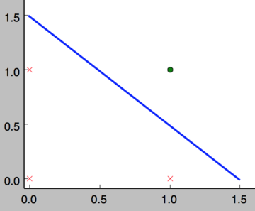

# AI 相关学习笔记汇总

[TOC]
# 前言
# 零基础入门深度学习
## 感知器

原文链接: <https://www.zybuluo.com/hanbingtao/note/433855>

> 无论即将到来的是大数据时代还是人工智能时代，亦或是传统行业使用人工智能在云上处理大数据的时代，作为一个有理想有追求的程序员，不懂深度学习（Deep Learning）这个超热的技术，会不会感觉马上就 out 了？现在救命稻草来了，《零基础入门深度学习》系列文章旨在讲帮助爱编程的你从零基础达到入门级水平。零基础意味着你不需要太多的数学知识，只要会写程序就行了，没错，这是专门为程序员写的文章。虽然文中会有很多公式你也许看不懂，但同时也会有更多的代码，程序员的你一定能看懂的（我周围是一群狂热的 Clean Code 程序员，所以我写的代码也不会很差）。

### 深度学习是啥

在人工智能领域，有一个方法叫机器学习。在机器学习这个方法里，有一类算法叫神经网络。神经网络如下图所示：


上图中每个圆圈都是一个神经元，每条线表示神经元之间的连接。我们可以看到，上面的神经元被分成了多层，层与层之间的神经元有连接，而层内之间的神经元没有连接。最左边的层叫做**输入层**，这层负责接收输入数据；最右边的层叫**输出层**，我们可以从这层获取神经网络输出数据。输入层和输出层之间的层叫做**隐藏层**。

隐藏层比较多（大于 2）的神经网络叫做深度神经网络。而深度学习，就是使用深层架构（比如，深度神经网络）的机器学习方法。

那么深层网络和浅层网络相比有什么优势呢？简单来说深层网络能够表达力更强。事实上，一个仅有一个隐藏层的神经网络就能拟合任何一个函数，但是它需要很多很多的神经元。而深层网络用少得多的神经元就能拟合同样的函数。也就是为了拟合一个函数，要么使用一个浅而宽的网络，要么使用一个深而窄的网络。而后者往往更节约资源。

深层网络也有劣势，就是它不太容易训练。简单的说，你需要大量的数据，很多的技巧才能训练好一个深层网络。这是个手艺活。

### 感知器

看到这里，如果你还是一头雾水，那也是很正常的。为了理解神经网络，我们应该先理解神经网络的组成单元——**神经元**。神经元也叫做**感知器**。感知器算法在上个世纪 50-70 年代很流行，也成功解决了很多问题。并且，感知器算法也是非常简单的。

#### 感知器的定义

下图是一个感知器：


可以看到，一个感知器有如下组成部分：

- **输入权值** 一个感知器可以接收多个输入$$x_1,x_2,...x_n$$，每个输入上有一个权值 $$w_i\in\Re$$，此外还有一个**偏置项**$$b\in\Re$$，就是上图中的$$w_0$$。
- **激活函数** 感知器的激活函数可以有很多选择，比如我们可以选择下面这个**阶跃函数$$f$$**来作为函数：

$$
f(z)=\begin{equation}\begin{cases}1\qquad z>0\\0\qquad otherwise\end{cases}\end{equation}
$$

- **输出** 感知器的输出由下面这个公式来计算

$$
y=f(\mathrm{w}\bullet\mathrm{x}+b)\qquad 公式(1)
$$

如果看完上面的公式一下子就晕了，不要紧，我们用一个简单的例子来帮助理解。

##### 例子：用感知器实现`and`函数

我们设计一个感知器，让它来实现`and`运算。程序员都知道，`and`是一个二元函数（带有两个参数和），下面是它的**真值表**：

| $$x_1$$ | $$x_2$$ | $$x_3$$ |
| ------- | ------- | ------- |
| 0       | 0       | 0       |
| 0       | 1       | 0       |
| 1       | 0       | 0       |
| 1       | 1       | 1       |

为了计算方便，我们用 0 表示**false**，用 1 表示**true**。这没什么难理解的，对于 C 语言程序员来说，这是天经地义的。

我们令$$w_1=0.5;w_2=0.5;b=-0.8$$，而激活函数$$f$$就是前面写出来的**阶跃函数**，这时，感知器就相当于`and`函数。不明白？我们验算一下：

输入上面真值表的第一行，即$$x_1=0;x_2=0$$，那么根据公式(1)，计算输出：

$$
\begin{align}
y&=f(\mathrm{w}\bullet\mathrm{x}+b)\\
&=f(w_1x_1+w_2x_2+b)\\
&=f(0.5\times0+0.5\times0-0.8)\\
&=f(-0.8)\\
&=0
\end{align}
$$

也就是当$$x_1x_2$$都为 0 的时候，$$y$$为 0，这就是**真值表**的第一行。读者可以自行验证上述真值表的第二、三、四行。

##### 例子：用感知器实现`or`函数

同样，我们也可以用感知器来实现`or`运算。仅仅需要把偏置项的值设置为-0.3 就可以了。我们验算一下，下面是`or`运算的**真值表**：

| $$x_1$$ | $$x_2$$ | $$x_3$$ |
| ------- | ------- | ------- |
| 0       | 0       | 0       |
| 0       | 1       | 1       |
| 1       | 0       | 1       |
| 1       | 1       | 1       |

我们来验算第二行，这时的输入是$$x_1=0;x_2=1$$，带入公式(1)：

$$
\begin{align}
y&=f(\mathrm{w}\bullet\mathrm{x}+b)\\
&=f(w_1x_1+w_2x_2+b)\\
&=f(0.5\times1+0.5\times0-0.3)\\
&=f(0.2)\\
&=1
\end{align}
$$

也就是当$$x_1=0;x_2=1$$时，$$y$$为 1，即`or`**真值表**第二行。读者可以自行验证其它行。

#### 感知器还能做什么

事实上，感知器不仅仅能实现简单的布尔运算。它可以拟合任何的线性函数，任何**线性分类**或**线性回归**问题都可以用感知器来解决。前面的布尔运算可以看作是**二分类**问题，即给定一个输入，输出 0（属于分类 0）或 1（属于分类 1）。如下面所示，`and`运算是一个线性分类问题，即可以用一条直线把分类 0（false，红叉表示）和分类 1（true，绿点表示）分开。



然而，感知器却不能实现异或运算，如下图所示，异或运算不是线性的，你无法用一条直线把分类 0 和分类 1 分开。

#### 感知器的训练

现在，你可能困惑前面的权重项和偏置项的值是如何获得的呢？这就要用到感知器训练算法：将权重项和偏置项初始化为 0，然后，利用下面的**感知器规则**迭代的修改$$w_i$$和$$b$$，直到训练完成。

$$
\begin{align}
w_i&\gets w_i+\Delta w_i \\
b&\gets b+\Delta b
\end{align}
$$

其中:

$$
\begin{align}
\Delta w_i&=\eta(t-y)x_i \\
\Delta b&=\eta(t-y)
\end{align}
$$

$$w_i$$是与输入$$x_i$$对应的权重项，$$b$$是偏置项。事实上，可以$$b$$把看作是值永远为 1 的输入$$x_b$$所对应的权重。$$t$$是训练样本的**实际值**，一般称之为**label**。而$$y$$是感知器的输出值，它是根据**公式(1)**计算得出。$$\eta$$是一个称为**学习速率**的常数，其作用是控制每一步调整权的幅度。

每次从训练数据中取出一个样本的输入向量$$\mathrm{x}$$，使用感知器计算其输出$$y$$，再根据上面的规则来调整权重。每处理一个样本就调整一次权重。经过多轮迭代后（即全部的训练数据被反复处理多轮），就可以训练出感知器的权重，使之实现目标函数。

#### 编程实战：实现感知器

> 完整代码请参考 GitHub: <https://github.com/hanbt/learn_dl/blob/master/perceptron.py> (python2.7)

对于程序员来说，没有什么比亲自动手实现学得更快了，而且，很多时候一行代码抵得上千言万语。接下来我们就将实现一个感知器。

下面是一些说明：

- 使用 python 语言。python 在机器学习领域用的很广泛，而且，写 python 程序真的很轻松。
- 面向对象编程。面向对象是特别好的管理复杂度的工具，应对复杂问题时，用面向对象设计方法很容易将复杂问题拆解为多个简单问题，从而解救我们的大脑。
- 没有使用 numpy。numpy 实现了很多基础算法，对于实现机器学习算法来说是个必备的工具。但为了降低读者理解的难度，下面的代码只用到了基本的 python（省去您去学习 numpy 的时间）。

下面是感知器类的实现，非常简单。去掉注释只有 27 行，而且还包括为了美观（每行不超过 60 个字符）而增加的很多换行。

```python
class Perceptron(object):
    def __init__(self, input_num, activator):
        '''
        初始化感知器，设置输入参数的个数，以及激活函数。
        激活函数的类型为double -> double
        '''
        self.activator = activator
        # 权重向量初始化为0
        self.weights = [0.0 for _ in range(input_num)]
        # 偏置项初始化为0
        self.bias = 0.0
    def __str__(self):
        '''
        打印学习到的权重、偏置项
        '''
        return 'weights\t:%s\nbias\t:%f\n' % (self.weights, self.bias)
    def predict(self, input_vec):
        '''
        输入向量，输出感知器的计算结果
        '''
        # 把input_vec[x1,x2,x3...]和weights[w1,w2,w3,...]打包在一起
        # 变成[(x1,w1),(x2,w2),(x3,w3),...]
        # 然后利用map函数计算[x1*w1, x2*w2, x3*w3]
        # 最后利用reduce求和
        return self.activator(
            reduce(lambda a, b: a + b,
                   map(lambda (x, w): x * w,
                       zip(input_vec, self.weights))
                , 0.0) + self.bias)
    def train(self, input_vecs, labels, iteration, rate):
        '''
        输入训练数据：一组向量、与每个向量对应的label；以及训练轮数、学习率
        '''
        for i in range(iteration):
            self._one_iteration(input_vecs, labels, rate)
    def _one_iteration(self, input_vecs, labels, rate):
        '''
        一次迭代，把所有的训练数据过一遍
        '''
        # 把输入和输出打包在一起，成为样本的列表[(input_vec, label), ...]
        # 而每个训练样本是(input_vec, label)
        samples = zip(input_vecs, labels)
        # 对每个样本，按照感知器规则更新权重
        for (input_vec, label) in samples:
            # 计算感知器在当前权重下的输出
            output = self.predict(input_vec)
            # 更新权重
            self._update_weights(input_vec, output, label, rate)
    def _update_weights(self, input_vec, output, label, rate):
        '''
        按照感知器规则更新权重
        '''
        # 把input_vec[x1,x2,x3,...]和weights[w1,w2,w3,...]打包在一起
        # 变成[(x1,w1),(x2,w2),(x3,w3),...]
        # 然后利用感知器规则更新权重
        delta = label - output
        self.weights = map(
            lambda (x, w): w + rate * delta * x,
            zip(input_vec, self.weights))
        # 更新bias
        self.bias += rate * delta
```

接下来，我们利用这个感知器类去实现`and`函数。

```python
def f(x):
    '''
    定义激活函数f
    '''
    return 1 if x > 0 else 0
def get_training_dataset():
    '''
    基于and真值表构建训练数据
    '''
    # 构建训练数据
    # 输入向量列表
    input_vecs = [[1,1], [0,0], [1,0], [0,1]]
    # 期望的输出列表，注意要与输入一一对应
    # [1,1] -> 1, [0,0] -> 0, [1,0] -> 0, [0,1] -> 0
    labels = [1, 0, 0, 0]
    return input_vecs, labels
def train_and_perceptron():
    '''
    使用and真值表训练感知器
    '''
    # 创建感知器，输入参数个数为2（因为and是二元函数），激活函数为f
    p = Perceptron(2, f)
    # 训练，迭代10轮, 学习速率为0.1
    input_vecs, labels = get_training_dataset()
    p.train(input_vecs, labels, 10, 0.1)
    #返回训练好的感知器
    return p
if __name__ == '__main__':
    # 训练and感知器
    and_perception = train_and_perceptron()
    # 打印训练获得的权重
    print and_perception
    # 测试
    print '1 and 1 = %d' % and_perception.predict([1, 1])
    print '0 and 0 = %d' % and_perception.predict([0, 0])
    print '1 and 0 = %d' % and_perception.predict([1, 0])
    print '0 and 1 = %d' % and_perception.predict([0, 1])
```

将上述程序保存为 perceptron.py 文件，通过命令行执行这个程序，其运行结果为：


神奇吧！感知器竟然完全实现了`and`函数。读者可以尝试一下利用感知器实现其它函数。

### 小结

终于看（写）到小结了...，大家都累了。对于零基础的你来说，走到这里应该已经很烧脑了吧。没关系，休息一下。值得高兴的是，你终于已经走出了深度学习入门的第一步，这是巨大的进步；坏消息是，这仅仅是最简单的部分，后面还有无数艰难险阻等着你。不过，你学的困难往往意味着别人学的也困难，掌握一门高门槛的技艺，进可糊口退可装逼，是很值得的。

下一篇文章，我们将讨论另外一种感知器：**线性单元**，并由此引出一种可能是最最重要的优化算法：**梯度下降**算法。

### 参考资料

1. Tom M. Mitchell, "机器学习", 曾华军等译, 机械工业出版社
## 线性单元和梯度下降

原文链接: <https://www.zybuluo.com/hanbingtao/note/448086>

### 往期回顾

在上一篇文章中，我们已经学会了编写一个简单的感知器，并用它来实现一个线性分类器。你应该还记得用来训练感知器的『感知器规则』。然而，我们并没有关心这个规则是怎么得到的。本文通过介绍另外一种『感知器』，也就是『线性单元』，来说明关于机器学习一些基本的概念，比如模型、目标函数、优化算法等等。这些概念对于所有的机器学习算法来说都是通用的，掌握了这些概念，就掌握了机器学习的基本套路。

### 线性单元是啥

感知器有一个问题，当面对的数据集不是**线性可分**的时候，『感知器规则』可能无法收敛，这意味着我们永远也无法完成一个感知器的训练。为了解决这个问题，我们使用一个**可导**的**线性函数**来替代感知器的**阶跃函数**，这种感知器就叫做**线性单元**。线性单元在面对线性不可分的数据集时，会收敛到一个最佳的近似上。

为了简单起见，我们可以设置线性单元的激活函数$$f$$为

$$
f(x) = x
$$

这样的线性单元如下图所示


对比此前我们讲过的感知器


这样替换了激活函数之后，**线性单元**将返回一个**实数值**而不是**0,1 分类**。因此线性单元用来解决**回归**问题而不是**分类**问题。

#### 线性单元的模型

当我们说**模型**时，我们实际上在谈论根据输入$$x$$预测输出$$y$$的**算法**。比如，$$x$$可以是一个人的工作年限，$$y$$可以是他的月薪，我们可以用某种算法来根据一个人的工作年限来预测他的收入。比如：

$$
y=h(x)=w*x+b
$$

函数$$h(x)$$叫做**假设**，而$$w$$、$$b$$是它的**参数**。我们假设参数$$w=1000$$，参数$$b=500$$，如果一个人的工作年限是 5 年的话，我们的模型会预测他的月薪为

$$
y=h(x)=1000*5+500=5500(元)
$$

你也许会说，这个模型太不靠谱了。是这样的，因为我们考虑的因素太少了，仅仅包含了工作年限。如果考虑更多的因素，比如所处的行业、公司、职级等等，可能预测就会靠谱的多。我们把工作年限、行业、公司、职级这些信息，称之为**特征**。对于一个工作了 5 年，在 IT 行业，百度工作，职级 T6 这样的人，我们可以用这样的一个特征向量来表示他

$$\mathrm{x}$$ = _(5, IT, 百度, T6)_。

既然输入$$\mathrm{x}$$变成了一个具备四个特征的向量，相对应的，仅仅一个参数$$w$$就不够用了，我们应该使用 4 个参数$$w_1,w_2,w_3,w_4$$，每个特征对应一个。这样，我们的模型就变成

$$
y=h(x)=w_1*x_1+w_2*x_2+w_3*x_3+w_4*x_4+b
$$

其中，$$x_1$$对应工作年限，$$x_2$$对应行业，$$x_3$$对应公司，$$x_4$$对应职级。

为了书写和计算方便，我们可以令$$w_0$$等于$$b$$，同时令$$w_0$$对应于特征$$x_0$$。由于$$x_0$$其实并不存在，我们可以令它的值永远为 1。也就是说

$$
b = w_0 * x_0\qquad其中x_0=1
$$

这样上面的式子就可以写成

$$
\begin{align}
y=h(x)&=w_1*x_1+w_2*x_2+w_3*x_3+w_4*x_4+b\\
&=w_0*x_0+w_1*x_1+w_2*x_2+w_3*x_3+w_4*x_4
\end{align}
$$

我们还可以把上式写成向量的形式

$$
y=h(x)=\mathrm{w}^T\mathrm{x}\qquad\qquad(式1)
$$

长成这种样子模型就叫做**线性模型**，因为输出就是输入特征的**线性组合**。

#### 监督学习和无监督学习

接下来，我们需要关心的是这个模型如何训练，也就是参数取什么值最合适。

机器学习有一类学习方法叫做**监督学习**，它是说为了训练一个模型，我们要提供这样一堆训练样本：每个训练样本既包括输入特征$\mathrm{x}$，也包括对应的输出$$y$$($$y$$也叫做**标记，label**)。也就是说，我们要找到很多人，我们既知道他们的特征(工作年限，行业...)，也知道他们的收入。我们用这样的样本去训练模型，让模型既看到我们提出的每个问题(输入特征$$\mathrm{x}$$)，也看到对应问题的答案(标记$$y$$)。当模型看到足够多的样本之后，它就能总结出其中的一些规律。然后，就可以预测那些它没看过的输入所对应的答案了。

另外一类学习方法叫做**无监督学习**，这种方法的训练样本中只有$$\mathrm{x}$$而没有$$y$$。模型可以总结出特征$$\mathrm{x}$$的一些规律，但是无法知道其对应的答案$$y$$。

很多时候，既有$$\mathrm{x}$$又有$$y$$的训练样本是很少的，大部分样本都只有$$\mathrm{x}$$。比如在语音到文本(STT)的识别任务中，$$\mathrm{x}$$是语音，$$y$$是这段语音对应的文本。我们很容易获取大量的语音录音，然而把语音一段一段切分好并**标注**上对应文字则是非常费力气的事情。这种情况下，为了弥补带标注样本的不足，我们可以用**无监督学习方法**先做一些**聚类**，让模型总结出哪些音节是相似的，然后再用少量的带标注的训练样本，告诉模型其中一些音节对应的文字。这样模型就可以把相似的音节都对应到相应文字上，完成模型的训练。

#### 线性单元的目标函数

现在，让我们只考虑**监督学习**。

在监督学习下，对于一个样本，我们知道它的特征$$\mathrm{x}$$，以及标记$$y$$。同时，我们还可以根据模型$$h(x)$$计算得到输出$$\bar{y}$$。注意这里面我们用$$y$$表示训练样本里面的**标记**，也就是**实际值**；用带上划线的$$\bar{y}$$表示模型计算的出来的**预测值**。我们当然希望模型计算出来的$$\bar{y}$$和$$y$$越接近越好。

数学上有很多方法来表示的$$\bar{y}$$和$$y$$的接近程度，比如我们可以用$$\bar{y}$$和$$y$$的差的平方的$$\frac{1}{2}$$来表示它们的接近程度

$$
e=\frac{1}{2}(y-\bar{y})^2
$$

我们把$$e$$叫做**单个样本**的**误差**。至于为什么前面要乘$$\frac{1}{2}$$，是为了后面计算方便。

训练数据中会有很多样本，比如$$N$$个，我们可以用训练数据中**所有样本**的误差的**和**，来表示模型的误差$$E$$，也就是

$$
E=e^{(1)}+e^{(2)}+e^{(3)}+...+e^{(n)}
$$

上式的$$e^{(1)}$$表示第一个样本的误差，$$e^{(2)}$$表示第二个样本的误差......。

我们还可以把上面的式子写成和式的形式。使用和式，不光书写起来简单，逼格也跟着暴涨，一举两得。所以一定要写成下面这样

$$
\begin{align}
E&=e^{(1)}+e^{(2)}+e^{(3)}+...+e^{(n)}\\
&=\sum_{i=1}^{n}e^{(i)}\\
&=\frac{1}{2}\sum_{i=1}^{n}(y^{(i)}-\bar{y}^{(i)})^2\qquad\qquad(式2)
\end{align}
$$

其中

$$
\begin{align}
\bar{y}^{(i)}&=h(\mathrm{x}^{(i)})\\
&=\mathrm{w}^T\mathrm{x^{(i)}}
\end{align}
$$

(式 2)中，$$x^{(i)}$$表示第$$i$$个训练样本的**特征**，$$y^{(i)}$$表示第$$i$$个样本的**标记**，我们也可以用**元组**$$(x^{(i)},y^{(i)})$$表示第$$i$$**训练样本**。$$\bar{y}^{(i)}$$则是模型对第个$$i$$样本的**预测值**。

我们当然希望对于一个训练数据集来说，误差最小越好，也就是(式 2)的值越小越好。对于特定的训练数据集来说，$$(x^{(i)},y^{(i)})$$的值都是已知的，所以(式 2)其实是参数$$w$$的函数。

$$
\begin{align}
E(\mathrm{w})&=\frac{1}{2}\sum_{i=1}^{n}(y^{(i)}-\bar{y}^{(i)})^2\\
&=\frac{1}{2}\sum_{i=1}^{n}(\mathrm{y^{(i)}}-\mathrm{w}^Tx^{(i)})^2
\end{align}
$$

由此可见，模型的训练，实际上就是求取到合适的$$w$$，使(式 2)取得最小值。这在数学上称作**优化问题**，而$$E(\mathrm{w})$$就是我们优化的目标，称之为**目标函数**。

#### 梯度下降优化算法

大学时我们学过怎样求函数$$y=f(x)$$的极值。函数的极值点，就是它的导数$$f'(x)=0$$的那个点。因此我们可以通过解方程$$f'(x)=0$$，求得函数的极值点$$(x_0,y_0)$$。

不过对于计算机来说，它可不会解方程。但是它可以凭借强大的计算能力，一步一步的去把函数的极值点『试』出来。如下图所示：


首先，我们随便选择一个点开始，比如上图的$$x_0$$点。接下来，每次迭代修改$$x$$的为$$x_1,x_2,x_3,...$$，经过数次迭代后最终达到函数最小值点。

你可能要问了，为啥每次修改$$x$$的值，都能往函数最小值那个方向前进呢？这里的奥秘在于，我们每次都是向函数$$y=f(x)$$的**梯度**的**相反方向**来修改。什么是**梯度**呢？翻开大学高数课的课本，我们会发现**梯度**是一个向量，它指向**函数值上升最快**的方向。显然，梯度的反方向当然就是函数值下降最快的方向了。我们每次沿着梯度相反方向去修改的值，当然就能走到函数的最小值附近。之所以是最小值附近而不是最小值那个点，是因为我们每次移动的步长不会那么恰到好处，有可能最后一次迭代走远了越过了最小值那个点。步长的选择是门手艺，如果选择小了，那么就会迭代很多轮才能走到最小值附近；如果选择大了，那可能就会越过最小值很远，收敛不到一个好的点上。

按照上面的讨论，我们就可以写出梯度下降算法的公式

$$
\mathrm{x}_{new}=\mathrm{x}_{old}-\eta\nabla{f(x)}
$$

其中，$$\nabla$$是**梯度算子**，$$\nabla{f(x)}$$就是指$$f(x)$$的梯度。$$\eta$$是步长，也称作**学习速率**。

对于上一节列出的目标函数(式 2)

$$
E(\mathrm{w})=\frac{1}{2}\sum_{i=1}^{n}(\mathrm{y^{(i)}-\bar{y}^{(i)}})^2
$$

梯度下降算法可以写成

$$
\mathrm{w}_{new}=\mathrm{w}_{old}-\eta\nabla{E(\mathrm{w})}
$$

聪明的你应该能想到，如果要求目标函数的**最大值**，那么我们就应该用**梯度上升**算法，它的参数修改规则是

$$
\mathrm{w}_{new}=\mathrm{w}_{old}+\eta\nabla{E(\mathrm{w})}
$$

下面，请先做几次深呼吸，让你的大脑补充足够的新鲜的氧气，**我们要来求取**$$\nabla{E(\mathrm{w})}$$，然后带入上式，就能得到线性单元的参数修改规则。

关于$$\nabla{E(\mathrm{w})}$$的推导过程，我单独把它们放到一节中。您既可以选择慢慢看，也可以选择无视。在这里，您只需要知道，经过一大串推导，目标函数$$E(w)$$的梯度是

$$
\nabla{E(\mathrm{w})}=-\sum_{i=1}^{n}(y^{(i)}-\bar{y}^{(i)})\mathrm{x}^{(i)}
$$

因此，线性单元的参数修改规则最后是这个样子

$$
\mathrm{w}_{new}=\mathrm{w}_{old}+\eta\sum_{i=1}^{n}(y^{(i)}-\bar{y}^{(i)})\mathrm{x}^{(i)}\qquad\qquad(式3)
$$

有了上面这个式子，我们就可以根据它来写出训练线性单元的代码了。

需要说明的是，如果每个样本有 M 个特征，则上式中的$\mathrm{x},\mathrm{w}$都是 M+1 维**向量**(因为我们加上了一个恒为 1 的虚拟特征，参考前面的内容)，而是**标量**。用高逼格的数学符号表示，就是

$$
\mathrm{x},\mathrm{w}\in\Re^{(M+1)}\\
y\in\Re^1
$$

为了让您看明白说的是啥，我吐血写下下面这个解释(写这种公式可累可累了)。因为$$\mathrm{w},\mathrm{x}$$是 M+1 维**列向量**，所以(式 3)可以写成

$$
\begin{bmatrix}
w_0 \\
w_1 \\
w_2 \\
... \\
w_m \\
\end{bmatrix}_{new}=
\begin{bmatrix}
w_0 \\
w_1 \\
w_2 \\
... \\
w_m \\
\end{bmatrix}_{old}+\eta\sum_{i=1}^{n}(y^{(i)}-\bar{y}^{(i)})
\begin{bmatrix}
1 \\
x_1^{(i)} \\
x_2^{(i)} \\
... \\
x_m^{(i)} \\
\end{bmatrix}
$$

如果您还是没看明白，建议您也吐血再看一下大学时学过的《线性代数》吧。

##### $$\nabla{E}(\mathrm{w})$$的推导

这一节你尽可以跳过它，并不太会影响到全文的理解。当然如果你非要弄明白每个细节，那恭喜你骚年，机器学习的未来一定是属于你的。

首先，我们先做一个简单的前戏。我们知道函数的梯度的定义就是它相对于各个变量的**偏导数**，所以我们写下下面的式子

$$
\begin{align}
\nabla{E(\mathrm{w})}&=\frac{\partial}{\partial\mathrm{w}}E(\mathrm{w})\\
&=\frac{\partial}{\partial\mathrm{w}}\frac{1}{2}\sum_{i=1}^{n}(y^{(i)}-\bar{y}^{(i)})^2\\
\end{align}
$$

可接下来怎么办呢？我们知道和的导数等于导数的和，所以我们可以先把求和符号里面的导数求出来，然后再把它们加在一起就行了，也就是

$$
\begin{align}
&\frac{\partial}{\partial\mathrm{w}}\frac{1}{2}\sum_{i=1}^{n}(y^{(i)}-\bar{y}^{(i)})^2\\
=&\frac{1}{2}\sum_{i=1}^{n}\frac{\partial}{\partial\mathrm{w}}(y^{(i)}-\bar{y}^{(i)})^2\\
\end{align}
$$

现在我们可以不管高大上的$$\sum$$了，先专心把里面的导数求出来。

$$
\begin{align}
&\frac{\partial}{\partial\mathrm{w}}(y^{(i)}-\bar{y}^{(i)})^2\\
=&\frac{\partial}{\partial\mathrm{w}}(y^{(i)2}-2\bar{y}^{(i)}y^{(i)}+\bar{y}^{(i)2})\\
\end{align}
$$

我们知道，$$y$$是$$\mathrm{w}$$与无关的常数，而$$\bar{y}=\mathrm{w}^T\mathrm{x}$$，下面我们根据链式求导法则来求导(上大学时好像叫复合函数求导法则)

$$
\frac{\partial{E(\mathrm{w})}}{\partial\mathrm{w}}=\frac{\partial{E(\bar{y})}}{\partial\bar{y}}\frac{\partial{\bar{y}}}{\partial\mathrm{w}}
$$

我们分别计算上式等号右边的两个偏导数

$$
\begin{align}
\frac{\partial{E(\mathrm{w})}}{\partial\bar{y}}=
&\frac{\partial}{\partial\bar{y}}(y^{(i)2}-2\bar{y}^{(i)}y^{(i)}+\bar{y}^{(i)2})\\
=&-2y^{(i)}+2\bar{y}^{(i)}\\\\
\frac{\partial{\bar{y}}}{\partial\mathrm{w}}=
&\frac{\partial}{\partial\mathrm{w}}\mathrm{w}^T\mathrm{x}\\
=&\mathrm{x}
\end{align}
$$

代入，我们求得$$\sum{}$$里面的偏导数是

$$
\begin{align}
&\frac{\partial}{\partial\mathrm{w}}(y^{(i)}-\bar{y}^{(i)})^2\\
=&2(-y^{(i)}+\bar{y}^{(i)})\mathrm{x}
\end{align}
$$

最后代入$$\nabla{E}(\mathrm{w})$$，求得

$$
\begin{align}
\nabla{E(\mathrm{w})}&=\frac{1}{2}\sum_{i=1}^{n}\frac{\partial}{\partial\mathrm{w}}(y^{(i)}-\bar{y}^{(i)})^2\\
&=\frac{1}{2}\sum_{i=1}^{n}2(-y^{(i)}+\bar{y}^{(i)})\mathrm{x}\\
&=-\sum_{i=1}^{n}(y^{(i)}-\bar{y}^{(i)})\mathrm{x}
\end{align}
$$

至此，大功告成。

##### 随机梯度下降算法(Stochastic Gradient Descent, SGD)

如果我们根据(式 3)来训练模型，那么我们每次更新$$\mathrm{w}$$的迭代，要遍历训练数据中所有的样本进行计算，我们称这种算法叫做**批梯度下降(Batch Gradient Descent)**。如果我们的样本非常大，比如数百万到数亿，那么计算量异常巨大。因此，实用的算法是 SGD 算法。在 SGD 算法中，每次更新$$\mathrm{w}$$的迭代，只计算一个样本。这样对于一个具有数百万样本的训练数据，完成一次遍历就会对$$\mathrm{w}$$更新数百万次，效率大大提升。由于样本的噪音和随机性，每次更新$$\mathrm{w}$$并不一定按照减少$$E$$的方向。然而，虽然存在一定随机性，大量的更新总体上沿着减少$$E$$的方向前进的，因此最后也能收敛到最小值附近。下图展示了 SGD 和 BGD 的区别


如上图，椭圆表示的是函数值的等高线，椭圆中心是函数的最小值点。红色是 BGD 的逼近曲线，而紫色是 SGD 的逼近曲线。我们可以看到 BGD 是一直向着最低点前进的，而 SGD 明显躁动了许多，但总体上仍然是向最低点逼近的。

最后需要说明的是，SGD 不仅仅效率高，而且随机性有时候反而是好事。今天的目标函数是一个『凸函数』，沿着梯度反方向就能找到全局唯一的最小值。然而对于非凸函数来说，存在许多局部最小值。随机性有助于我们逃离某些很糟糕的局部最小值，从而获得一个更好的模型。

### 实现线性单元

> 完整代码请参考 GitHub: https://github.com/hanbt/learn_dl/blob/master/linear_unit.py (python2.7)

接下来，让我们撸一把代码。

因为我们已经写了感知器的代码，因此我们先比较一下感知器模型和线性单元模型，看看哪些代码能够复用。

| 算法         | 感知器                                                                                                                     | 线性单元                                                |
| ------------ | -------------------------------------------------------------------------------------------------------------------------- | ------------------------------------------------------- |
| 模型$$h(x)$$ | $$y=f(\mathrm{w}^T\mathrm{x})\\f(z)=\begin{equation}\begin{cases}1\qquad z>0\\0\qquad otherwise\end{cases}\end{equation}$$ | $$y=f(\mathrm{w}^T\mathrm{x})\\f(z)=z$$                 |
| 训练规则     | $$\mathrm{w}\gets\mathrm{w}+\eta(y-\bar{y})\mathrm{x}$$                                                                    | $$\mathrm{w}\gets\mathrm{w}+\eta(y-\bar{y})\mathrm{x}$$ |

比较的结果令人震惊，原来除了激活函数$$f$$不同之外，两者的模型和训练规则是一样的(在上表中，线性单元的优化算法是 SGD 算法)。那么，我们只需要把感知器的激活函数进行替换即可。感知器的代码请参考上一篇文章[零基础入门深度学习(1) - 感知器](./01.md)，这里就不再重复了。对于一个养成良好习惯的程序员来说，重复代码是不可忍受的。大家应该把代码保存在一个代码库中(比如 git)。

```python
from perceptron import Perceptron
#定义激活函数f
f = lambda x: x
class LinearUnit(Perceptron):
    def __init__(self, input_num):
        '''初始化线性单元，设置输入参数的个数'''
        Perceptron.__init__(self, input_num, f)
```

通过继承 Perceptron，我们仅用几行代码就实现了线性单元。这再次证明了面向对象编程范式的强大。

接下来，我们用简单的数据进行一下测试。

```pytho
def get_training_dataset():
    '''
    捏造5个人的收入数据
    '''
    # 构建训练数据
    # 输入向量列表，每一项是工作年限
    input_vecs = [[5], [3], [8], [1.4], [10.1]]
    # 期望的输出列表，月薪，注意要与输入一一对应
    labels = [5500, 2300, 7600, 1800, 11400]
    return input_vecs, labels
def train_linear_unit():
    '''
    使用数据训练线性单元
    '''
    # 创建感知器，输入参数的特征数为1（工作年限）
    lu = LinearUnit(1)
    # 训练，迭代10轮, 学习速率为0.01
    input_vecs, labels = get_training_dataset()
    lu.train(input_vecs, labels, 10, 0.01)
    #返回训练好的线性单元
    return lu
if __name__ == '__main__':
    '''训练线性单元'''
    linear_unit = train_linear_unit()
    # 打印训练获得的权重
    print linear_unit
    # 测试
    print 'Work 3.4 years, monthly salary = %.2f' % linear_unit.predict([3.4])
    print 'Work 15 years, monthly salary = %.2f' % linear_unit.predict([15])
    print 'Work 1.5 years, monthly salary = %.2f' % linear_unit.predict([1.5])
    print 'Work 6.3 years, monthly salary = %.2f' % linear_unit.predict([6.3])
```

程序运行结果如下图

拟合的直线如下图


### 小结

事实上，一个机器学习算法其实只有两部分

- _模型_ 从输入特征$$\mathrm{x}$$预测输入$$y$$的那个函数$$h(x)$$
- _目标函数_ 目标函数取最小(最大)值时所对应的参数值，就是模型的参数的**最优值**。很多时候我们只能获得目标函数的**局部最小(最大)值**，因此也只能得到模型参数的**局部最优值**。

因此，如果你想最简洁的介绍一个算法，列出这两个函数就行了。

接下来，你会用**优化算法**去求取目标函数的最小(最大)值。**[随机]梯度{下降|上升}**算法就是一个**优化算法**。针对同一个**目标函数**，不同的**优化算法**会推导出不同的**训练规则**。我们后面还会讲其它的优化算法。

其实在机器学习中，算法往往并不是关键，真正的关键之处在于选取特征。选取特征需要我们人类对问题的深刻理解，经验、以及思考。而**神经网络**算法的一个优势，就在于它能够自动学习到应该提取什么特征，从而使算法不再那么依赖人类，而这也是神经网络之所以吸引人的一个方面。

现在，经过漫长的烧脑，你已经具备了学习**神经网络**的必备知识。下一篇文章，我们将介绍本系列文章的主角：**神经网络**，以及用来训练神经网络的大名鼎鼎的算法：**反向传播**算法。至于现在，我们应该暂时忘记一切，尽情奖励自己一下吧。

### 参考资料

1. Tom M. Mitchell, "机器学习", 曾华军等译, 机械工业出版社
## 神经网络和反向传播算法

原文地址：<https://www.zybuluo.com/hanbingtao/note/476663>

### 往期回顾

在上一篇文章中，我们已经掌握了机器学习的基本套路，对模型、目标函数、优化算法这些概念有了一定程度的理解，而且已经会训练单个的感知器或者线性单元了。在这篇文章中，我们将把这些单独的单元按照一定的规则相互连接在一起形成**神经网络**，从而奇迹般的获得了强大的学习能力。我们还将介绍这种网络的训练算法：**反向传播算法**。最后，我们依然用代码实现一个神经网络。如果您能坚持到本文的结尾，将会看到我们用自己实现的神经网络去识别手写数字。现在请做好准备，您即将双手触及到深度学习的大门。

### 神经元

神经元和感知器本质上是一样的，只不过我们说感知器的时候，它的激活函数是**阶跃函数**；而当我们说神经元时，激活函数往往选择为 sigmoid 函数或 tanh 函数。如下图所示：

![00-03-01][00-03-01]

计算一个神经元的输出的方法和计算一个感知器的输出是一样的。假设神经元的输入是向量$$\vec{x}$$，权重向量是$$\vec{w}$$(偏置项是$$w_0$$)，激活函数是 sigmoid 函数，则其输出$$y$$：

$$
y=sigmoid(\vec{w}^T\centerdot\vec{x})\qquad(式1)
$$

sigmoid 函数的定义如下：

$$
sigmoid(x)=\frac{1}{1+e^{-x}}
$$

将其带入前面的式子，得到

$$
y=\frac{1}{1+e^{-\vec{w}^T\centerdot\vec{x}}}
$$

sigmoid 函数是一个非线性函数，值域是(0,1)。函数图像如下图所示

![00-03-02][00-03-02]

sigmoid 函数的导数是：

$$
\begin{align}
&令y=sigmoid(x)\\
&则y'=y(1-y)
\end{align}
$$

可以看到，sigmoid 函数的导数非常有趣，它可以用 sigmoid 函数自身来表示。这样，一旦计算出 sigmoid 函数的值，计算它的导数的值就非常方便。

### 神经网络是啥

![00-03-03][00-03-03]

神经网络其实就是按照**一定规则**连接起来的多个**神经元**。上图展示了一个**全连接(full connected, FC)**神经网络，通过观察上面的图，我们可以发现它的规则包括：

- 神经元按照**层**来布局。最左边的层叫做**输入层**，负责接收输入数据；最右边的层叫**输出层**，我们可以从这层获取神经网络输出数据。输入层和输出层之间的层叫做**隐藏层**，因为它们对于外部来说是不可见的。
- 同一层的神经元之间没有连接。
- 第 N 层的每个神经元和第 N-1 层的**所有**神经元相连(这就是 full connected 的含义)，第 N-1 层神经元的输出就是第 N 层神经元的输入。
- 每个连接都有一个**权值**。

上面这些规则定义了全连接神经网络的结构。事实上还存在很多其它结构的神经网络，比如卷积神经网络(CNN)、循环神经网络(RNN)，他们都具有不同的连接规则。

### 计算神经网络的输出

神经网络实际上就是一个输入向量$$\vec{x}$$到输出向量$$\vec{y}$$的函数，即：

$$
\vec{y} = f_{network}(\vec{x})
$$

根据输入计算神经网络的输出，需要首先将输入向量$$\vec{x}$$的每个元素$$x_i$$的值赋给神经网络的输入层的对应神经元，然后根据**式 1**依次向前计算每一层的每个神经元的值，直到最后一层输出层的所有神经元的值计算完毕。最后，将输出层每个神经元的值串在一起就得到了输出向量$$\vec{y}$$。

接下来举一个例子来说明这个过程，我们先给神经网络的每个单元写上编号。

![00-03-04][00-03-04]

如上图，输入层有三个节点，我们将其依次编号为 1、2、3；隐藏层的 4 个节点，编号依次为 4、5、6、7；最后输出层的两个节点编号为 8、9。因为我们这个神经网络是**全连接**网络，所以可以看到每个节点都和**上一层的所有节点**有连接。比如，我们可以看到隐藏层的节点 4，它和输入层的三个节点 1、2、3 之间都有连接，其连接上的权重分别为$$w_{41},w_{42},w_{43}$$。那么，我们怎样计算节点 4 的输出值$$a_4$$呢？

为了计算节点 4 的输出值，我们必须先得到其所有上游节点（也就是节点 1、2、3）的输出值。节点 1、2、3 是**输入层**的节点，所以，他们的输出值就是输入向量$$\vec{x}$$本身。按照上图画出的对应关系，可以看到节点 1、2、3 的输出值分别是$$x_1,x_2,x_3$$。我们要求**输入向量的维度和输入层神经元个数相同**，而输入向量的某个元素对应到哪个输入节点是可以自由决定的，你偏非要把$$x_1$$赋值给节点 2 也是完全没有问题的，但这样除了把自己弄晕之外，并没有什么价值。

一旦我们有了节点 1、2、3 的输出值，我们就可以根据**式 1**计算节点 4 的输出值$$a_4$$：

$$
\begin{align}
a_4&=sigmoid(\vec{w}^T\centerdot\vec{x})\\
&=sigmoid(w_{41}x_1+w_{42}x_2+w_{43}x_3+w_{4b})
\end{align}
$$

上式的$$w_{4b}$$是节点 4 的**偏置项**，图中没有画出来。而$$w_{41},w_{42},w_{43}$$分别为节点 1、2、3 到节点 4 连接的权重，在给权重$$w_{ji}$$编号时，我们把目标节点的编号$$j$$放在前面，把源节点的编号$$i$$放在后面。

同样，我们可以继续计算出节点 5、6、7 的输出值$$a_5,a_6,a_7$$。这样，隐藏层的 4 个节点的输出值就计算完成了，我们就可以接着计算输出层的节点 8 的输出值$$y_1$$：

$$
\begin{align}
y_1&=sigmoid(\vec{w}^T\centerdot\vec{a})\\
&=sigmoid(w_{84}a_4+w_{85}a_5+w_{86}a_6+w_{87}a_7+w_{8b})
\end{align}
$$

同理，我们还可以计算出$$y_2$$的值。这样输出层所有节点的输出值计算完毕，我们就得到了在输入向量$$\vec{x}=\begin{bmatrix}x_1\\x_2\\x_3\end{bmatrix}$$时，神经网络的输出向量$$\vec{y}=\begin{bmatrix}y_1\\y_2\end{bmatrix}$$。这里我们也看到，**输出向量的维度和输出层神经元个数相同**。

#### 神经网络的矩阵表示

神经网络的计算如果用矩阵来表示会很方便（当然逼格也更高），我们先来看看隐藏层的矩阵表示。

首先我们把隐藏层 4 个节点的计算依次排列出来：

$$
a_4=sigmoid(w_{41}x_1+w_{42}x_2+w_{43}x_3+w_{4b})\\
a_5=sigmoid(w_{51}x_1+w_{52}x_2+w_{53}x_3+w_{5b})\\
a_6=sigmoid(w_{61}x_1+w_{62}x_2+w_{63}x_3+w_{6b})\\
a_7=sigmoid(w_{71}x_1+w_{72}x_2+w_{73}x_3+w_{7b})\\
$$

接着，定义网络的输入向量$$\vec{x}$$和隐藏层每个节点的权重向量$$\vec{w_j}$$。令

$$
\begin{align}
\vec{x}&=\begin{bmatrix}x_1\\x_2\\x_3\\1\end{bmatrix}\\
\vec{w}_4&=[w_{41},w_{42},w_{43},w_{4b}]\\
\vec{w}_5&=[w_{51},w_{52},w_{53},w_{5b}]\\
\vec{w}_6&=[w_{61},w_{62},w_{63},w_{6b}]\\
\vec{w}_7&=[w_{71},w_{72},w_{73},w_{7b}]\\
f&=sigmoid
\end{align}
$$

代入到前面的一组式子，得到：

$$
\begin{align}
a_4&=f(\vec{w_4}\centerdot\vec{x})\\
a_5&=f(\vec{w_5}\centerdot\vec{x})\\
a_6&=f(\vec{w_6}\centerdot\vec{x})\\
a_7&=f(\vec{w_7}\centerdot\vec{x})
\end{align}
$$

现在，我们把上述计算$$a_4,a_5,a_6,a_7$$的四个式子写到一个矩阵里面，每个式子作为矩阵的一行，就可以利用矩阵来表示它们的计算了。令

$$
\vec{a}=
\begin{bmatrix}
a_4 \\
a_5 \\
a_6 \\
a_7 \\
\end{bmatrix},\qquad W=
\begin{bmatrix}
\vec{w}_4 \\
\vec{w}_5 \\
\vec{w}_6 \\
\vec{w}_7 \\
\end{bmatrix}=
\begin{bmatrix}
w_{41},w_{42},w_{43},w_{4b} \\
w_{51},w_{52},w_{53},w_{5b} \\
w_{61},w_{62},w_{63},w_{6b} \\
w_{71},w_{72},w_{73},w_{7b} \\
\end{bmatrix}
,\qquad f(
\begin{bmatrix}
x_1\\
x_2\\
x_3\\
.\\
.\\
.\\
\end{bmatrix})=
\begin{bmatrix}
f(x_1)\\
f(x_2)\\
f(x_3)\\
.\\
.\\
.\\
\end{bmatrix}
$$

带入前面的一组式子，得到

$$
\vec{a}=f(W\centerdot\vec{x})\qquad (式2)
$$

在**式 2**中，$$f$$是激活函数，在本例中是$$sigmoid$$函数；$$\mathrm{W}$$是某一层的权重矩阵；$$\vec{x}$$是某层的输入向量；$$\vec{a}$$是某层的输出向量。**式 2**说明神经网络的每一层的作用实际上就是先将输入向量**左乘**一个数组进行线性变换，得到一个新的向量，然后再对这个向量**逐元素**应用一个激活函数。

每一层的算法都是一样的。比如，对于包含一个输入层，一个输出层和三个隐藏层的神经网络，我们假设其权重矩阵分别为$$W_1,W_2,W_3,W_4$$，每个隐藏层的输出分别是$$\vec{a}_1,\vec{a}_2,\vec{a}_3$$，神经网络的输入为$$\vec{x}$$，神经网络的输入为$$\vec{y}$$，如下图所示：

![00-03-05][00-03-05]

则每一层的输出向量的计算可以表示为：

$$
\begin{align}
&\vec{a}_1=f(W_1\centerdot\vec{x})\\
&\vec{a}_2=f(W_2\centerdot\vec{a}_1)\\
&\vec{a}_3=f(W_3\centerdot\vec{a}_2)\\
&\vec{y}=f(W_4\centerdot\vec{a}_3)\\
\end{align}
$$

这就是神经网络输出值的计算方法。

### 神经网络的训练

现在，我们需要知道一个神经网络的每个连接上的权值是如何得到的。我们可以说神经网络是一个**模型**，那么这些权值就是模型的**参数**，也就是模型要学习的东西。然而，一个神经网络的连接方式、网络的层数、每层的节点数这些参数，则不是学习出来的，而是人为事先设置的。对于这些人为设置的参数，我们称之为**超参数(Hyper-Parameters)**。

接下来，我们将要介绍神经网络的训练算法：反向传播算法。

#### 反向传播算法(Back Propagation)

我们首先直观的介绍反向传播算法，最后再来介绍这个算法的推导。当然读者也可以完全跳过推导部分，因为即使不知道如何推导，也不影响你写出来一个神经网络的训练代码。事实上，现在神经网络成熟的开源实现多如牛毛，除了练手之外，你可能都没有机会需要去写一个神经网络。

我们以**监督学习**为例来解释反向传播算法。在[零基础入门深度学习(2) - 线性单元和梯度下降](https://www.zybuluo.com/hanbingtao/note/448086)一文中我们介绍了什么是**监督学习**，如果忘记了可以再看一下。另外，我们设神经元的激活函数$$f$$为$$sigmoid$$函数(不同激活函数的计算公式不同，详情见[反向传播算法的推导](https://www.zybuluo.com/hanbingtao/note/476663#an1)一节)。

我们假设每个训练样本为$$(\vec{x},\vec{t})$$，其中向量$$\vec{x}$$是训练样本的特征，而$$\vec{t}$$是样本的目标值。

![00-03-04][00-03-04]

首先，我们根据上一节介绍的算法，用样本的特征，计算出神经网络中每个隐藏层节点的输出，以及输出层每个节点的输出。

首先，我们根据上一节介绍的算法，用样本的特征$$\vec{x}$$，计算出神经网络中每个隐藏层节点的输出$$a_i$$，以及输出层每个节点的输出$$y_i$$。

然后，我们按照下面的方法计算出每个节点的误差项$$\delta_i$$：

- 对于输出层节点$$i$$，

$$
\delta_i=y_i(1-y_i)(t_i-y_i)\qquad(式3)
$$

其中，$$\delta_i$$是节点的误差项，$$y_i$$是节点$$i$$的**输出值**，$$t_i$$是样本对应于节点$$i$$的**目标值**。举个例子，根据上图，对于输出层节点 8 来说，它的输出值是$$y_1$$，而样本的目值是$$t_1$$，带入上面的公式得到节点 8 的误差项$$\delta_8$$应该是：

$$
\delta_8=y_1(1-y_1)(t_1-y_1)
$$

- 对于隐藏层节点，

$$
\delta_i=a_i(1-a_i)\sum_{k\in{outputs}}w_{ki}\delta_k\qquad(式4)
$$

其中，$$a_i$$是节点$$i$$的输出值，$$w_{ki}$$是节点$$i$$到它的下一层节点$$k$$的连接的权重，$$\delta_k$$是节点$$i$$的下一层节点$$k$$的误差项。例如，对于隐藏层节点 4 来说，计算方法如下：

$$
\delta_4=a_4(1-a_4)(w_{84}\delta_8+w_{94}\delta_9)
$$

最后，更新每个连接上的权值：

$$
w_{ji}\gets w_{ji}+\eta\delta_jx_{ji}\qquad(式5)
$$

其中，$$w_{ji}$$是节点$$i$$到节点$$j$$的权重，$$\eta$$是一个成为**学习速率**的常数，$$\delta_j$$是节点的误差项，$$x_{ji}$$是节点$$i$$传递给节点$$j$$的输入。例如，权重$$w_{84}$$的更新方法如下：

$$
w_{84}\gets w_{84}+\eta\delta_8 a_4
$$

类似的，权重$$w_{41}$$的更新方法如下：

$$
w_{41}\gets w_{41}+\eta\delta_4 x_1
$$

偏置项的输入值永远为 1。例如，节点 4 的偏置项$$w_{4b}$$应该按照下面的方法计算：

$$
w_{4b}\gets w_{4b}+\eta\delta_4
$$

我们已经介绍了神经网络每个节点误差项的计算和权重更新方法。显然，计算一个节点的误差项，需要先计算每个与其相连的下一层节点的误差项。这就要求误差项的计算顺序必须是从输出层开始，然后反向依次计算每个隐藏层的误差项，直到与输入层相连的那个隐藏层。这就是反向传播算法的名字的含义。当所有节点的误差项计算完毕后，我们就可以根据**式 5**来更新所有的权重。

以上就是基本的反向传播算法，并不是很复杂，您弄清楚了么？

#### 反向传播算法的推导

反向传播算法其实就是链式求导法则的应用。然而，这个如此简单且显而易见的方法，却是在 Roseblatt 提出感知器算法将近 30 年之后才被发明和普及的。对此，Bengio 这样回应道：

> 很多看似显而易见的想法只有在事后才变得显而易见。

接下来，我们用链式求导法则来推导反向传播算法，也就是上一小节的**式 3**、**式 4**、**式 5**。

**前方高能预警——接下来是数学公式重灾区，读者可以酌情阅读，不必强求。**

按照机器学习的通用套路，我们先确定神经网络的目标函数，然后用**随机梯度下降**优化算法去求目标函数最小值时的参数值。

我们取网络所有输出层节点的误差平方和作为目标函数：

$$
E_d\equiv\frac{1}{2}\sum_{i\in outputs}(t_i-y_i)^2
$$

其中，$$E_d$$表示是样本$$d$$的误差。

然后，我们用文章[零基础入门深度学习(2) - 线性单元和梯度下降](https://www.zybuluo.com/hanbingtao/note/448086)中介绍的**随机梯度下降**算法对目标函数进行优化：

$$
w_{ji}\gets w_{ji}-\eta\frac{\partial{E_d}}{\partial{w_{ji}}}
$$

随机梯度下降算法也就是需要求出误差$$E_d$$对于每个权重$$w_{ji}$$的偏导数（也就是梯度），怎么求呢？

![00-03-04][00-03-04]

观察上图，我们发现权重$$w_{ji}$$仅能通过影响节点$$j$$的输入值影响网络的其它部分，设$$net_j$$是节点$$j$$的**加权输入**，即

$$
\begin{align}
net_j&=\vec{w_j}\centerdot\vec{x_j}\\
&=\sum_{i}{w_{ji}}x_{ji}
\end{align}
$$

$$E_d$$是$$net_j$$的函数，而$$net_j$$是$$w_{ji}$$的函数。根据链式求导法则，可以得到：

$$
\begin{align}
\frac{\partial{E_d}}{\partial{w_{ji}}}&=\frac{\partial{E_d}}{\partial{net_j}}\frac{\partial{net_j}}{\partial{w_{ji}}}\\
&=\frac{\partial{E_d}}{\partial{net_j}}\frac{\partial{\sum_{i}{w_{ji}}x_{ji}}}{\partial{w_{ji}}}\\
&=\frac{\partial{E_d}}{\partial{net_j}}x_{ji}
\end{align}
$$

上式中，$$w_{ji}$$是节点$$i$$传递给节点$$j$$的输入值，也就是节点$$i$$的输出值。

对于$$\frac{\partial{E_d}}{\partial{net_j}}$$的推导，需要区分**输出层**和**隐藏层**两种情况。

##### 输出层权值训练

对于**输出层**来说，$$net_j$$仅能通过节点$$j$$的输出$$y_j$$值来影响网络其它部分，也就是说$$E_d$$是$$y_j$$的函数，而$$y_j$$是$$net_j$$的函数，其中$$y_j=sigmoid(net_j)$$。所以我们可以再次使用链式求导法则：

$$
\begin{align}
\frac{\partial{E_d}}{\partial{net_j}}&=\frac{\partial{E_d}}{\partial{y_j}}\frac{\partial{y_j}}{\partial{net_j}}\\
\end{align}
$$

考虑上式第一项:

$$
\begin{align}
\frac{\partial{E_d}}{\partial{y_j}}&=\frac{\partial}{\partial{y_j}}\frac{1}{2}\sum_{i\in outputs}(t_i-y_i)^2\\
&=\frac{\partial}{\partial{y_j}}\frac{1}{2}(t_j-y_j)^2\\
&=-(t_j-y_j)
\end{align}
$$

考虑上式第二项：

$$
\begin{align}
\frac{\partial{y_j}}{\partial{net_j}}&=\frac{\partial sigmoid(net_j)}{\partial{net_j}}\\
&=y_j(1-y_j)\\
\end{align}
$$

将第一项和第二项带入，得到：

$$
\frac{\partial{E_d}}{\partial{net_j}}=-(t_j-y_j)y_j(1-y_j)
$$

如果令$$\delta_j=-\frac{\partial{E_d}}{\partial{net_j}}$$，也就是一个节点的误差项$$\delta$$是网络误差对这个节点输入的偏导数的相反数。带入上式，得到：

$$
\delta_j=(t_j-y_j)y_j(1-y_j)
$$

上式就是**式 3**。

将上述推导带入随机梯度下降公式，得到：

$$
\begin{align}
w_{ji}&\gets w_{ji}-\eta\frac{\partial{E_d}}{\partial{w_{ji}}}\\
&=w_{ji}+\eta(t_j-y_j)y_j(1-y_j)x_{ji}\\
&=w_{ji}+\eta\delta_jx_{ji}
\end{align}
$$

上式就是**式 5**。

##### 隐藏层权值训练

现在我们要推导出隐藏层的$$\frac{\partial{E_d}}{\partial{net_j}}$$。

首先，我们需要定义节点的所有直接下游节点的集合$$Downstream(j)$$。例如，对于节点 4 来说，它的直接下游节点是节点 8、节点 9。可以看到$$net_j$$只能通过影响$$Downstream(j)$$再影响$$E_d$$。设$$net_k$$是节点$$j$$的下游节点的输入，则$$E_d$$是$$net_k$$的函数，而$$net_k$$是$$net_j$$的函数。因为$$net_k$$有多个，我们应用全导数公式，可以做出如下推导：

$$
\begin{align}
\frac{\partial{E_d}}{\partial{net_j}}&=\sum_{k\in Downstream(j)}\frac{\partial{E_d}}{\partial{net_k}}\frac{\partial{net_k}}{\partial{net_j}}\\
&=\sum_{k\in Downstream(j)}-\delta_k\frac{\partial{net_k}}{\partial{net_j}}\\
&=\sum_{k\in Downstream(j)}-\delta_k\frac{\partial{net_k}}{\partial{a_j}}\frac{\partial{a_j}}{\partial{net_j}}\\
&=\sum_{k\in Downstream(j)}-\delta_kw_{kj}\frac{\partial{a_j}}{\partial{net_j}}\\
&=\sum_{k\in Downstream(j)}-\delta_kw_{kj}a_j(1-a_j)\\
&=-a_j(1-a_j)\sum_{k\in Downstream(j)}\delta_kw_{kj}
\end{align}
$$

因为$$\delta_j=-\frac{\partial{E_d}}{\partial{net_j}}$$，带入上式得到：

$$
\delta_j=a_j(1-a_j)\sum_{k\in Downstream(j)}\delta_kw_{kj}
$$

上式就是**式 4**。

**——数学公式警报解除——**

至此，我们已经推导出了反向传播算法。需要注意的是，我们刚刚推导出的训练规则是根据激活函数是 sigmoid 函数、平方和误差、全连接网络、随机梯度下降优化算法。如果激活函数不同、误差计算方式不同、网络连接结构不同、优化算法不同，则具体的训练规则也会不一样。但是无论怎样，训练规则的推导方式都是一样的，应用链式求导法则进行推导即可。

### 神经网络的实现

> 完整代码请参考 GitHub: <https://github.com/hanbt/learn_dl/blob/master/bp.py> (python2.7)

现在，我们要根据前面的算法，实现一个基本的全连接神经网络，这并不需要太多代码。我们在这里依然采用面向对象设计。

首先，我们先做一个基本的模型：

![00-03-06][00-03-06]

如上图，可以分解出 5 个领域对象来实现神经网络：

- _Network_ 神经网络对象，提供 API 接口。它由若干层对象组成以及连接对象组成。
- _Layer_ 层对象，由多个节点组成。
- _Node_ 节点对象计算和记录节点自身的信息(比如输出值、误差项等)，以及与这个节点相关的上下游的连接。
- _Connection_ 每个连接对象都要记录该连接的权重。
- _Connections_ 仅仅作为 Connection 的集合对象，提供一些集合操作。

Node 实现如下：

```python
# 节点类，负责记录和维护节点自身信息以及与这个节点相关的上下游连接，实现输出值和误差项的计算。
class Node(object):
    def __init__(self, layer_index, node_index):
        '''
        构造节点对象。
        layer_index: 节点所属的层的编号
        node_index: 节点的编号
        '''
        self.layer_index = layer_index
        self.node_index = node_index
        self.downstream = []
        self.upstream = []
        self.output = 0
        self.delta = 0
    def set_output(self, output):
        '''
        设置节点的输出值。如果节点属于输入层会用到这个函数。
        '''
        self.output = output
    def append_downstream_connection(self, conn):
        '''
        添加一个到下游节点的连接
        '''
        self.downstream.append(conn)
    def append_upstream_connection(self, conn):
        '''
        添加一个到上游节点的连接
        '''
        self.upstream.append(conn)
    def calc_output(self):
        '''
        根据式1计算节点的输出
        '''
        output = reduce(lambda ret, conn: ret + conn.upstream_node.output * conn.weight, self.upstream, 0)
        self.output = sigmoid(output)
    def calc_hidden_layer_delta(self):
        '''
        节点属于隐藏层时，根据式4计算delta
        '''
        downstream_delta = reduce(
            lambda ret, conn: ret + conn.downstream_node.delta * conn.weight,
            self.downstream, 0.0)
        self.delta = self.output * (1 - self.output) * downstream_delta
    def calc_output_layer_delta(self, label):
        '''
        节点属于输出层时，根据式3计算delta
        '''
        self.delta = self.output * (1 - self.output) * (label - self.output)
    def __str__(self):
        '''
        打印节点的信息
        '''
        node_str = '%u-%u: output: %f delta: %f' % (self.layer_index, self.node_index, self.output, self.delta)
        downstream_str = reduce(lambda ret, conn: ret + '\n\t' + str(conn), self.downstream, '')
        upstream_str = reduce(lambda ret, conn: ret + '\n\t' + str(conn), self.upstream, '')
        return node_str + '\n\tdownstream:' + downstream_str + '\n\tupstream:' + upstream_str
```

ConstNode 对象，为了实现一个输出恒为 1 的节点(计算偏置项时需要)

```python
class ConstNode(object):
    def __init__(self, layer_index, node_index):
        '''
        构造节点对象。
        layer_index: 节点所属的层的编号
        node_index: 节点的编号
        '''
        self.layer_index = layer_index
        self.node_index = node_index
        self.downstream = []
        self.output = 1
    def append_downstream_connection(self, conn):
        '''
        添加一个到下游节点的连接
        '''
        self.downstream.append(conn)
    def calc_hidden_layer_delta(self):
        '''
        节点属于隐藏层时，根据式4计算delta
        '''
        downstream_delta = reduce(
            lambda ret, conn: ret + conn.downstream_node.delta * conn.weight,
            self.downstream, 0.0)
        self.delta = self.output * (1 - self.output) * downstream_delta
    def __str__(self):
        '''
        打印节点的信息
        '''
        node_str = '%u-%u: output: 1' % (self.layer_index, self.node_index)
        downstream_str = reduce(lambda ret, conn: ret + '\n\t' + str(conn), self.downstream, '')
        return node_str + '\n\tdownstream:' + downstream_str
```

Layer 对象，负责初始化一层。此外，作为 Node 的集合对象，提供对 Node 集合的操作。

```python
class Layer(object):
    def __init__(self, layer_index, node_count):
        '''
        初始化一层
        layer_index: 层编号
        node_count: 层所包含的节点个数
        '''
        self.layer_index = layer_index
        self.nodes = []
        for i in range(node_count):
            self.nodes.append(Node(layer_index, i))
        self.nodes.append(ConstNode(layer_index, node_count))
    def set_output(self, data):
        '''
        设置层的输出。当层是输入层时会用到。
        '''
        for i in range(len(data)):
            self.nodes[i].set_output(data[i])
    def calc_output(self):
        '''
        计算层的输出向量
        '''
        for node in self.nodes[:-1]:
            node.calc_output()
    def dump(self):
        '''
        打印层的信息
        '''
        for node in self.nodes:
            print node
```

Connection 对象，主要职责是记录连接的权重，以及这个连接所关联的上下游节点。

```python
class Connection(object):
    def __init__(self, upstream_node, downstream_node):
        '''
        初始化连接，权重初始化为是一个很小的随机数
        upstream_node: 连接的上游节点
        downstream_node: 连接的下游节点
        '''
        self.upstream_node = upstream_node
        self.downstream_node = downstream_node
        self.weight = random.uniform(-0.1, 0.1)
        self.gradient = 0.0
    def calc_gradient(self):
        '''
        计算梯度
        '''
        self.gradient = self.downstream_node.delta * self.upstream_node.output
    def get_gradient(self):
        '''
        获取当前的梯度
        '''
        return self.gradient
    def update_weight(self, rate):
        '''
        根据梯度下降算法更新权重
        '''
        self.calc_gradient()
        self.weight += rate * self.gradient
    def __str__(self):
        '''
        打印连接信息
        '''
        return '(%u-%u) -> (%u-%u) = %f' % (
            self.upstream_node.layer_index,
            self.upstream_node.node_index,
            self.downstream_node.layer_index,
            self.downstream_node.node_index,
            self.weight)

```

Connections 对象，提供 Connection 集合操作。

```python
class Connections(object):
    def __init__(self):
        self.connections = []
    def add_connection(self, connection):
        self.connections.append(connection)
    def dump(self):
        for conn in self.connections:
            print conn
```

Network 对象，提供 API。

```python
class Network(object):
    def __init__(self, layers):
        '''
        初始化一个全连接神经网络
        layers: 二维数组，描述神经网络每层节点数
        '''
        self.connections = Connections()
        self.layers = []
        layer_count = len(layers)
        node_count = 0;
        for i in range(layer_count):
            self.layers.append(Layer(i, layers[i]))
        for layer in range(layer_count - 1):
            connections = [Connection(upstream_node, downstream_node)
                           for upstream_node in self.layers[layer].nodes
                           for downstream_node in self.layers[layer + 1].nodes[:-1]]
            for conn in connections:
                self.connections.add_connection(conn)
                conn.downstream_node.append_upstream_connection(conn)
                conn.upstream_node.append_downstream_connection(conn)
    def train(self, labels, data_set, rate, iteration):
        '''
        训练神经网络
        labels: 数组，训练样本标签。每个元素是一个样本的标签。
        data_set: 二维数组，训练样本特征。每个元素是一个样本的特征。
        '''
        for i in range(iteration):
            for d in range(len(data_set)):
                self.train_one_sample(labels[d], data_set[d], rate)
    def train_one_sample(self, label, sample, rate):
        '''
        内部函数，用一个样本训练网络
        '''
        self.predict(sample)
        self.calc_delta(label)
        self.update_weight(rate)
    def calc_delta(self, label):
        '''
        内部函数，计算每个节点的delta
        '''
        output_nodes = self.layers[-1].nodes
        for i in range(len(label)):
            output_nodes[i].calc_output_layer_delta(label[i])
        for layer in self.layers[-2::-1]:
            for node in layer.nodes:
                node.calc_hidden_layer_delta()
    def update_weight(self, rate):
        '''
        内部函数，更新每个连接权重
        '''
        for layer in self.layers[:-1]:
            for node in layer.nodes:
                for conn in node.downstream:
                    conn.update_weight(rate)
    def calc_gradient(self):
        '''
        内部函数，计算每个连接的梯度
        '''
        for layer in self.layers[:-1]:
            for node in layer.nodes:
                for conn in node.downstream:
                    conn.calc_gradient()
    def get_gradient(self, label, sample):
        '''
        获得网络在一个样本下，每个连接上的梯度
        label: 样本标签
        sample: 样本输入
        '''
        self.predict(sample)
        self.calc_delta(label)
        self.calc_gradient()
    def predict(self, sample):
        '''
        根据输入的样本预测输出值
        sample: 数组，样本的特征，也就是网络的输入向量
        '''
        self.layers[0].set_output(sample)
        for i in range(1, len(self.layers)):
            self.layers[i].calc_output()
        return map(lambda node: node.output, self.layers[-1].nodes[:-1])
    def dump(self):
        '''
        打印网络信息
        '''
        for layer in self.layers:
            layer.dump()
```

至此，实现了一个基本的全连接神经网络。可以看到，同神经网络的强大学习能力相比，其实现还算是很容易的。

#### 梯度检查

怎么保证自己写的神经网络没有 BUG 呢？事实上这是一个非常重要的问题。一方面，千辛万苦想到一个算法，结果效果不理想，那么是算法本身错了还是代码实现错了呢？定位这种问题肯定要花费大量的时间和精力。另一方面，由于神经网络的复杂性，我们几乎无法事先知道神经网络的输入和输出，因此类似 TDD(测试驱动开发)这样的开发方法似乎也不可行。

办法还是有滴，就是利用梯度检查来确认程序是否正确。梯度检查的思路如下：

对于梯度下降算法：

$$
w_{ji}\gets w_{ji}-\eta\frac{\partial{E_d}}{\partial{w_{ji}}}
$$

来说，这里关键之处在于$$\frac{\partial{E_d}}{\partial{w_{ji}}}$$的计算一定要正确，而它是$$E_d$$对$$w_{ji}$$的*偏导数*。而根据导数的定义：

$$
f'(\theta)=\lim_{\epsilon->0}\frac{f(\theta+\epsilon)-f(\theta-\epsilon)}{2\epsilon}
$$

对于任意$$\theta$$的导数值，我们都可以用等式右边来近似计算。我们把$$E_d$$看做是$$w_{ji}$$的函数，即$$E_d(w_{ji})$$，那么根据导数定义，$$\frac{\partial{E_d(w_{ji})}}{\partial{w_{ji}}}$$应该等于：

$$
\frac{\partial{E_d(w_{ji})}}{\partial{w_{ji}}}=\lim_{\epsilon->0}\frac{f(w_{ji}+\epsilon)-f(w_{ji}-\epsilon)}{2\epsilon}
$$

如果把$$\epsilon$$设置为一个很小的数（比如$$10^{-4}$$），那么上式可以写成：

$$
\frac{\partial{E_d(w_{ji})}}{\partial{w_{ji}}}\approx\frac{f(w_{ji}+\epsilon)-f(w_{ji}-\epsilon)}{2\epsilon}\qquad(式6)
$$

我们就可以利用式 6，来计算梯度$$\frac{\partial{E_d}}{\partial{w_{ji}}}$$的值，然后同我们神经网络代码中计算出来的梯度值进行比较。如果两者的差别**非常的小**，那么就说明我们的代码是正确的。

下面是梯度检查的代码。如果我们想检查参数$$w_{ji}$$的梯度是否正确，我们需要以下几个步骤：

1. 首先使用一个样本$$d$$对神经网络进行训练，这样就能获得每个权重的梯度。
2. 将$$w_{ji}$$加上一个很小的值$$(10^{-4})$$，重新计算神经网络在这个样本下$$d$$的$$E_{d+}$$。
3. 将$$w_{ji}$$减上一个很小的值$$(10^{-4})$$，重新计算神经网络在这个样本下$$d$$的$$E_{d+}$$。
4. 根据式 6 计算出期望的梯度值，和第一步获得的梯度值进行比较，它们应该几乎想等(至少 4 位有效数字相同)。

当然，我们可以重复上面的过程，对每个权重$$w_{ji}$$都进行检查。也可以使用多个样本重复检查。

```python
def gradient_check(network, sample_feature, sample_label):
    '''
    梯度检查
    network: 神经网络对象
    sample_feature: 样本的特征
    sample_label: 样本的标签
    '''
    # 计算网络误差
    network_error = lambda vec1, vec2: \
            0.5 * reduce(lambda a, b: a + b,
                      map(lambda v: (v[0] - v[1]) * (v[0] - v[1]),
                          zip(vec1, vec2)))
    # 获取网络在当前样本下每个连接的梯度
    network.get_gradient(sample_feature, sample_label)
    # 对每个权重做梯度检查
    for conn in network.connections.connections:
        # 获取指定连接的梯度
        actual_gradient = conn.get_gradient()
        # 增加一个很小的值，计算网络的误差
        epsilon = 0.0001
        conn.weight += epsilon
        error1 = network_error(network.predict(sample_feature), sample_label)
        # 减去一个很小的值，计算网络的误差
        conn.weight -= 2 * epsilon # 刚才加过了一次，因此这里需要减去2倍
        error2 = network_error(network.predict(sample_feature), sample_label)
        # 根据式6计算期望的梯度值
        expected_gradient = (error2 - error1) / (2 * epsilon)
        # 打印
        print 'expected gradient: \t%f\nactual gradient: \t%f' % (
            expected_gradient, actual_gradient)
```

至此，会推导、会实现、会抓 BUG，你已经摸到深度学习的大门了。接下来还需要不断的实践，我们用刚刚写过的神经网络去识别手写数字。

### 神经网络实战——手写数字识别

针对这个任务，我们采用业界非常流行的 MNIST 数据集。MNIST 大约有 60000 个手写字母的训练样本，我们使用它训练我们的神经网络，然后再用训练好的网络去识别手写数字。

手写数字识别是个比较简单的任务，数字只可能是 0-9 中的一个，这是个 10 分类问题。

#### 超参数的确定

我们首先需要确定网络的层数和每层的节点数。关于第一个问题，实际上并没有什么理论化的方法，大家都是根据经验来拍，如果没有经验的话就随便拍一个。然后，你可以多试几个值，训练不同层数的神经网络，看看哪个效果最好就用哪个。嗯，现在你可能明白为什么说深度学习是个手艺活了，有些手艺很让人无语，而有些手艺还是很有技术含量的。

不过，有些基本道理我们还是明白的，我们知道网络层数越多越好，也知道层数越多训练难度越大。对于全连接网络，隐藏层最好不要超过三层。那么，我们可以先试试仅有一个隐藏层的神经网络效果怎么样。毕竟模型小的话，训练起来也快些(刚开始玩模型的时候，都希望快点看到结果)。

输入层节点数是确定的。因为 MNIST 数据集每个训练数据是 28\*28 的图片，共 784 个像素，因此，输入层节点数应该是 784，每个像素对应一个输入节点。

输出层节点数也是确定的。因为是 10 分类，我们可以用 10 个节点，每个节点对应一个分类。输出层 10 个节点中，输出最大值的那个节点对应的分类，就是模型的预测结果。

隐藏层节点数量是不好确定的，从 1 到 100 万都可以。下面有几个经验公式：

$$
\begin{align}
&m=\sqrt{n+l}+\alpha\\
&m=log_2n\\
&m=\sqrt{nl}\\
&m:隐藏层节点数\\
&n:输入层节点数\\
&l:输出层节点数\\
&\alpha:1到10之间的常数
\end{align}
$$

隐藏层节点数输入层节点数输出层节点数到之间的常数

因此，我们可以先根据上面的公式设置一个隐藏层节点数。如果有时间，我们可以设置不同的节点数，分别训练，看看哪个效果最好就用哪个。我们先拍一个，设隐藏层节点数为 300 吧。

对于 3 层$$784*300*10$$的全连接网络，总共有$$300*(784+1)+10*(300+1)=238510$$个参数！神经网络之所以强大，是它提供了一种非常简单的方法去实现大量的参数。目前百亿参数、千亿样本的超大规模神经网络也是有的。因为 MNIST 只有 6 万个训练样本，参数太多了很容易过拟合，效果反而不好。

#### 模型的训练和评估

MNIST 数据集包含 10000 个测试样本。我们先用 60000 个训练样本训练我们的网络，然后再用测试样本对网络进行测试，计算识别错误率：

$$
错误率=\frac{错误预测样本数}{总样本数}
$$

错误率错误预测样本数总样本数

我们每训练 10 轮，评估一次准确率。当准确率开始下降时（出现了过拟合）终止训练。

#### 代码实现

首先，我们需要把 MNIST 数据集处理为神经网络能够接受的形式。MNIST 训练集的文件格式可以参考官方网站，这里不在赘述。每个训练样本是一个 28\*28 的图像，我们按照行优先，把它转化为一个 784 维的向量。每个标签是 0-9 的值，我们将其转换为一个 10 维的 one-hot 向量：如果标签值为$$n$$，我们就把向量的第$$n$$维（从 0 开始编号）设置为 0.9，而其它维设置为 0.1。例如，向量`[0.1,0.1,0.9,0.1,0.1,0.1,0.1,0.1,0.1,0.1]`表示值 2。

下面是处理 MNIST 数据的代码：

```python
#!/usr/bin/env python
# -*- coding: UTF-8 -*-
import struct
from bp import *
from datetime import datetime
# 数据加载器基类
class Loader(object):
    def __init__(self, path, count):
        '''
        初始化加载器
        path: 数据文件路径
        count: 文件中的样本个数
        '''
        self.path = path
        self.count = count
    def get_file_content(self):
        '''
        读取文件内容
        '''
        f = open(self.path, 'rb')
        content = f.read()
        f.close()
        return content
    def to_int(self, byte):
        '''
        将unsigned byte字符转换为整数
        '''
        return struct.unpack('B', byte)[0]
# 图像数据加载器
class ImageLoader(Loader):
    def get_picture(self, content, index):
        '''
        内部函数，从文件中获取图像
        '''
        start = index * 28 * 28 + 16
        picture = []
        for i in range(28):
            picture.append([])
            for j in range(28):
                picture[i].append(
                    self.to_int(content[start + i * 28 + j]))
        return picture
    def get_one_sample(self, picture):
        '''
        内部函数，将图像转化为样本的输入向量
        '''
        sample = []
        for i in range(28):
            for j in range(28):
                sample.append(picture[i][j])
        return sample
    def load(self):
        '''
        加载数据文件，获得全部样本的输入向量
        '''
        content = self.get_file_content()
        data_set = []
        for index in range(self.count):
            data_set.append(
                self.get_one_sample(
                    self.get_picture(content, index)))
        return data_set
# 标签数据加载器
class LabelLoader(Loader):
    def load(self):
        '''
        加载数据文件，获得全部样本的标签向量
        '''
        content = self.get_file_content()
        labels = []
        for index in range(self.count):
            labels.append(self.norm(content[index + 8]))
        return labels
    def norm(self, label):
        '''
        内部函数，将一个值转换为10维标签向量
        '''
        label_vec = []
        label_value = self.to_int(label)
        for i in range(10):
            if i == label_value:
                label_vec.append(0.9)
            else:
                label_vec.append(0.1)
        return label_vec
def get_training_data_set():
    '''
    获得训练数据集
    '''
    image_loader = ImageLoader('train-images-idx3-ubyte', 60000)
    label_loader = LabelLoader('train-labels-idx1-ubyte', 60000)
    return image_loader.load(), label_loader.load()
def get_test_data_set():
    '''
    获得测试数据集
    '''
    image_loader = ImageLoader('t10k-images-idx3-ubyte', 10000)
    label_loader = LabelLoader('t10k-labels-idx1-ubyte', 10000)
    return image_loader.load(), label_loader.load()
```

网络的输出是一个 10 维向量，这个向量第$$n$$个(从 0 开始编号)元素的值最大，那么$$n$$就是网络的识别结果。下面是代码实现：

```python
def get_result(vec):
    max_value_index = 0
    max_value = 0
    for i in range(len(vec)):
        if vec[i] > max_value:
            max_value = vec[i]
            max_value_index = i
    return max_value_index
```

我们使用错误率来对网络进行评估，下面是代码实现：

```python
def evaluate(network, test_data_set, test_labels):
    error = 0
    total = len(test_data_set)
    for i in range(total):
        label = get_result(test_labels[i])
        predict = get_result(network.predict(test_data_set[i]))
        if label != predict:
            error += 1
    return float(error) / float(total)
```

最后实现我们的训练策略：每训练 10 轮，评估一次准确率，当准确率开始下降时终止训练。下面是代码实现：

```python
def train_and_evaluate():
    last_error_ratio = 1.0
    epoch = 0
    train_data_set, train_labels = get_training_data_set()
    test_data_set, test_labels = get_test_data_set()
    network = Network([784, 300, 10])
    while True:
        epoch += 1
        network.train(train_labels, train_data_set, 0.3, 1)
        print '%s epoch %d finished' % (now(), epoch)
        if epoch % 10 == 0:
            error_ratio = evaluate(network, test_data_set, test_labels)
            print '%s after epoch %d, error ratio is %f' % (now(), epoch, error_ratio)
            if error_ratio > last_error_ratio:
                break
            else:
                last_error_ratio = error_ratio
if __name__ == '__main__':
    train_and_evaluate()
```

在我的机器上测试了一下，1 个 epoch 大约需要 9000 多秒，所以要对代码做很多的性能优化工作（比如用向量化编程）。训练要很久很久，可以把它上传到服务器上，在 tmux 的 session 里面去运行。为了防止异常终止导致前功尽弃，我们每训练 10 轮，就把获得参数值保存在磁盘上，以便后续可以恢复。(代码略)

### 向量化编程

> 完整代码请参考 GitHub: <https://github.com/hanbt/learn_dl/blob/master/fc.py> (python2.7)

在经历了漫长的训练之后，我们可能会想到，肯定有更好的办法！是的，程序员们，现在我们需要告别面向对象编程了，转而去使用另外一种更适合深度学习算法的编程方式：向量化编程。主要有两个原因：一个是我们事实上并不需要真的去定义 Node、Connection 这样的对象，直接把数学计算实现了就可以了；另一个原因，是底层算法库会针对向量运算做优化（甚至有专用的硬件，比如 GPU），程序效率会提升很多。所以，在深度学习的世界里，我们总会想法设法的把计算表达为向量的形式。我相信优秀的程序员不会把自己拘泥于某种（自己熟悉的）编程范式上，而会去学习并使用最为合适的范式。

下面，我们用向量化编程的方法，重新实现前面的**全连接神经网络**。

首先，我们需要把所有的计算都表达为向量的形式。对于全连接神经网络来说，主要有三个计算公式。

前向计算，我们发现**式 2**已经是向量化的表达了：

$$
\vec{a}=\sigma(W\centerdot\vec{x})\qquad (式2)
$$

上式中的$$\sigma$$表示 sigmoid 函数。

反向计算，我们需要把**式 3**和**式 4**使用向量来表示：

$$
\vec{\delta}=\vec{y}(1-\vec{y})(\vec{t}-\vec{y})\qquad(式7)\\
\vec{\delta^{(l)}}=\vec{a}^{(l)}(1-\vec{a}^{(l)})W^T\delta^{(l+1)}\qquad(式8)
$$

在**式 8**中，$$\delta^{(l)}$$表示第 l 层的误差项；$$W^T$$表示矩阵的转置。

我们还需要权重数组 W 和偏置项 b 的梯度计算的向量化表示。也就是需要把**式 5**使用向量化表示：

$$
w_{ji}\gets w_{ji}+\eta\delta_jx_{ji}\qquad(式5)
$$

其对应的向量化表示为：

$$
W \gets W + \eta\vec{\delta}\vec{x}^T\qquad(式9)
$$

更新偏置项的向量化表示为：

$$
\vec{b} \gets \vec{b} + \eta\vec{\delta}\qquad(式10)
$$

现在，我们根据上面几个公式，重新实现一个类：FullConnectedLayer。它实现了全连接层的前向和后向计算：

```python
# 全连接层实现类
class FullConnectedLayer(object):
    def __init__(self, input_size, output_size,
                 activator):
        '''
        构造函数
        input_size: 本层输入向量的维度
        output_size: 本层输出向量的维度
        activator: 激活函数
        '''
        self.input_size = input_size
        self.output_size = output_size
        self.activator = activator
        # 权重数组W
        self.W = np.random.uniform(-0.1, 0.1,
            (output_size, input_size))
        # 偏置项b
        self.b = np.zeros((output_size, 1))
        # 输出向量
        self.output = np.zeros((output_size, 1))
    def forward(self, input_array):
        '''
        前向计算
        input_array: 输入向量，维度必须等于input_size
        '''
        # 式2
        self.input = input_array
        self.output = self.activator.forward(
            np.dot(self.W, input_array) + self.b)
    def backward(self, delta_array):
        '''
        反向计算W和b的梯度
        delta_array: 从上一层传递过来的误差项
        '''
        # 式8
        self.delta = self.activator.backward(self.input) * np.dot(
            self.W.T, delta_array)
        self.W_grad = np.dot(delta_array, self.input.T)
        self.b_grad = delta_array
    def update(self, learning_rate):
        '''
        使用梯度下降算法更新权重
        '''
        self.W += learning_rate * self.W_grad
        self.b += learning_rate * self.b_grad
```

上面这个类一举取代了原先的 Layer、Node、Connection 等类，不但代码更加容易理解，而且运行速度也快了几百倍。

现在，我们对 Network 类稍作修改，使之用到 FullConnectedLayer：

```python
# Sigmoid激活函数类
class SigmoidActivator(object):
    def forward(self, weighted_input):
        return 1.0 / (1.0 + np.exp(-weighted_input))
    def backward(self, output):
        return output * (1 - output)
# 神经网络类
class Network(object):
    def __init__(self, layers):
        '''
        构造函数
        '''
        self.layers = []
        for i in range(len(layers) - 1):
            self.layers.append(
                FullConnectedLayer(
                    layers[i], layers[i+1],
                    SigmoidActivator()
                )
            )
    def predict(self, sample):
        '''
        使用神经网络实现预测
        sample: 输入样本
        '''
        output = sample
        for layer in self.layers:
            layer.forward(output)
            output = layer.output
        return output
    def train(self, labels, data_set, rate, epoch):
        '''
        训练函数
        labels: 样本标签
        data_set: 输入样本
        rate: 学习速率
        epoch: 训练轮数
        '''
        for i in range(epoch):
            for d in range(len(data_set)):
                self.train_one_sample(labels[d],
                    data_set[d], rate)
    def train_one_sample(self, label, sample, rate):
        self.predict(sample)
        self.calc_gradient(label)
        self.update_weight(rate)
    def calc_gradient(self, label):
        delta = self.layers[-1].activator.backward(
            self.layers[-1].output
        ) * (label - self.layers[-1].output)
        for layer in self.layers[::-1]:
            layer.backward(delta)
            delta = layer.delta
        return delta
    def update_weight(self, rate):
        for layer in self.layers:
            layer.update(rate)
```

现在，Network 类也清爽多了，用我们的新代码再次训练一下 MNIST 数据集吧。

### 小结

至此，你已经完成了又一次漫长的学习之旅。你现在应该已经明白了神经网络的基本原理，高兴的话，你甚至有能力去动手实现一个，并用它解决一些问题。如果感到困难也不要气馁，这篇文章是一个重要的分水岭，如果你完全弄明白了的话，在真正的『小白』和装腔作势的『大牛』面前吹吹牛是完全没有问题的。

作为深度学习入门的系列文章，本文也是上半场的结束。在这个半场，你掌握了机器学习、神经网络的**基本**概念，并且有能力去动手解决一些简单的问题（例如手写数字识别，如果用传统的观点来看，其实这些问题也不简单）。而且，一旦掌握基本概念，后面的学习就容易多了。

在下半场，我们讲介绍更多『深度』学习的内容，我们已经讲了神经网络(Neutrol Network)，但是并没有讲深度神经网络(Deep Neutrol Network)。Deep 会带来更加强大的能力，同时也带来更多的问题。如果不理解这些问题和它们的解决方案，也不能说你入门了『深度』学习。

目前业界有很多开源的神经网络实现，它们的功能也要强大的多，因此你并不需要事必躬亲的去实现自己的神经网络。我们在上半场不断的从头发明轮子，是为了让你明白神经网络的基本原理，这样你就能非常迅速的掌握这些工具。在下半场的文章中，我们改变了策略：不会再去从头开始去实现，而是尽可能应用现有的工具。

下一篇文章，我们介绍不同结构的神经网络，比如鼎鼎大名的**卷积神经网络**，它在图像和语音领域已然创造了诸多奇迹，在自然语言处理领域的研究也如火如荼。某种意义上说，它的成功大大提升了人们对于深度学习的信心。

### 参考资料

1. Tom M. Mitchell, "机器学习", 曾华军等译, 机械工业出版社
2. CS 224N / Ling 284, Neural Networks for Named Entity Recognition
3. LeCun et al. Gradient-Based Learning Applied to Document Recognition 1998

[00-03-01]: ../.gitbook/assets/00/03-01.gif
[00-03-02]: ../.gitbook/assets/00/03-02.jpeg
[00-03-03]: ../.gitbook/assets/00/03-03.jpeg
[00-03-04]: ../.gitbook/assets/00/03-04.png
[00-03-05]: ../.gitbook/assets/00/03-05.png
[00-03-06]: ../.gitbook/assets/00/03-06.png
# LSTM

<https://blog.csdn.net/weixin_39653948/article/details/104966046>
## 什么是 LSTMs

本章节介绍了 LSTMs 及其工作原理。完成本课后，你将会知道：

- 什么是序列预测，以及它们与一般预测建模问题有何不同。
- 多层感知器在序列预测方面的局限性，递归神经网络在序列预测方面的前景，以及 LSTMs 如何实现这一前景。
- 令人印象深刻的 LSTMs 在挑战序列预测问题上的应用，以及对 LSTMs 的一些局限性的警告。

### 序列预测问题

序列预测不同于其他类型的监督学习问题。**在训练模型和进行预测时，必须保持观察结果的顺序。**通常，涉及序列数据的预测问题被称为序列预测问题，尽管根据输入和输出序列有一系列不同的问题。这一节将研究 4 种不同类型的序列预测问题：

1. Sequence Prediction.
2. Sequence Classification.
3. Sequence Generation.
4. Sequence-to-Sequence Prediction.

但首先，要弄清楚**集合（set）**和**序列（sequence）**之间的区别。

#### Sequence

在应用机器学习中，我们经常处理集合，例如一列或一组样本的测试集。集合中的每个样本都可以看作是定义域中的一个观察值。在一个集合中，观察的顺序并不重要。

序列是不同的。序列对观测结果施加了明确的顺序。顺序很重要。在使用序列数据作为模型的输入或输出的预测问题的制定过程中，必须考虑到这一点。

#### Sequence Prediction

序列预测包括预测给定输入序列的下一个值。例如：

```shell
Input Sequence: 1, 2, 3, 4, 5
Output Sequence: 6
```

![epiction of a sequence prediction problem.][lstm-1-1]

序列预测一般也称为序列学习。从技术上讲，我们可以把下列所有问题都看作是一种序列预测问题。这可能会使初学者感到困惑。

> _序列数据的学习一直是模式识别和机器学习的基本任务和挑战。涉及顺序数据的应用程序可能需要预测新事件、生成新序列或决策，如序列或子序列的分类。_

一般来说，在这本书中，我们将使用**“序列预测”**来指代一般类型的序列数据预测问题。然而，在本节中，我们将把序列预测与其他形式的预测区别开来，将序列数据定义为下一个时间步的预测。

一些序列预测问题的例子包括：

- **天气预报**。根据一段时间内对天气的一系列观察，预测明天的天气。
- **股市预测**。 给定安全性随时间推移的一系列运动，请预测安全性的下一个运动。
- **产品推荐**。 给定客户过去的购买顺序，请预测客户的下一次购买。

#### Sequence Classification

序列分类涉及到预测给定输入序列的类标签。例如:

```shell
Input Sequence: 1, 2, 3, 4, 5
Output Sequence: "good"
```

![Depiction of a sequence classification problem.][lstm-1-2]

**序列分类的目的**：利用标记数据集[…]建立分类模型。因此，该模型可用于预测未知序列的类标签。

**输入序列可以由实值或离散值组成**。在后一种情况下，这类问题可称为离散序列分类问题。一些序列分类问题的例子包括:

- **DNA 序列分类**。给定 a、C、G 和 T 值的 DNA 序列，预测该序列是编码区还是非编码区。
- **异常检测**。 给定一系列观察结果，请预测该序列是否异常。
- **情感分析**。 给定一系列文本（例如评论或推文），预测文本的情绪是正面还是负面。

#### Sequence Generation

序列生成包括生成与语料库中的其他序列具有相同一般特征的新输出序列。例如:

```shell
Input Sequence: [1, 3, 5], [7, 9, 11]
Output Sequence: [3, 5 ,7]
```

![Depiction of a sequence generation problem.][lstm-1-3]

> [递归神经网络]可以通过一步一步地处理真实的数据序列并预测接下来会发生什么来训练序列生成。假设预测是概率性的，通过对网络的输出分布进行迭代采样，然后将样本作为下一步的输入，可以从训练好的网络中生成新的序列。换句话说，通过让网络把它的发明当作是真实的，就像在做梦一样。
>
> — Generating Sequences With Recurrent Neural Networks, 2013.

一些序列生成问题的例子包括：

- **文字生成**。 给定一个文本语料库（例如莎士比亚的作品），生成新的句子或文本段落，阅读它们可能是从该语料库中提取的。
- **手写预测**。 给定一个手写示例的语料库，为具有语料库中笔迹特性的新短语生成笔迹。
- **音乐生成**。 给定一个音乐实例集，生成具有该音乐集特性的新音乐作品。

序列的产生也可以指代给定单个观察作为输入的序列的产生。 一个示例是图像的自动文本描述。

- **图像标题生成**。 给定图像作为输入，生成描述图像的单词序列。

例如：

```shell
Input Sequence: [image pixels]
Output Sequence: ["man riding a bike"]
```

![Depiction of a sequence generation problem for captioning an image.][lstm-1-4]

> 能够用适当的英语句子自动描述图像的内容是一项非常具有挑战性的任务，但它可能会产生巨大的影响[…]事实上，一个描述不仅必须捕获图像中包含的对象，而且还必须表达这些对象如何相互关联，以及它们的属性和它们所涉及的活动。
>
> — Show and Tell: A Neural Image Caption Generator, 2015

#### Sequence-to-Sequence Prediction

序列到序列的预测涉及到给定输入序列的输出序列的预测。例如:

```shell
Input Sequence: 1, 2, 3, 4, 5
Output Sequence: 6, 7, 8, 9, 10
```

![Depiction of a sequence-to-sequence prediction problem.][lstm-1-5]

> 尽管深度神经网络具有灵活性和强大的功能，但它只适用于那些输入和目标可以用固定维数的向量合理编码的问题。这是一个重要的限制，因为许多重要的问题最好用长度未知的序列来表示。例如，语音识别和机器翻译是连续的问题。同样，回答问题也可以看作是将表示问题的单词序列映射到表示答案的单词序列。
>
> — Sequence to Sequence Learning with Neural Networks, 2014.

序列到序列预测是序列预测的一种微妙但具有挑战性的扩展，它不是预测序列中的一个单独的下一个值，而是预测一个可能与输入序列具有相同长度或相同时间的新序列。这种类型的问题最近在自动文本翻译(例如，将英语翻译成法语)领域中得到了大量的研究，可以用缩写 seq2seq 来指代。

> seq2seq 学习的核心是使用递归神经网络将可变长度的输入序列映射到可变长度的输出序列。虽然 seq2seq 方法相对较新，但在……机器翻译方面已经取得了最先进的成果。
>
> — Multi-task Sequence to Sequence Learning, 2016.

如果输入和输出序列是时间序列，则该问题可以称为**多步时间序列预测（multi-step time series forecasting）**。 序列间问题的一些示例包括：

- **多步时间序列预测**。 给定一个时间序列的观测值，可以预测一系列未来时间步长的观测值序列。
- **文字摘要**。 给定一个文本文件，该文件描述了源文件的重要部分。
- **程序执行**。 给定文本描述程序或数学方程式，可以预测描述正确输出的字符序列。

### Limitations of Multilayer Perceptrons

经典的神经网络称为**多层感知器**，简称 MLPs，可以应用于序列预测问题。mlp 近似一个从输入变量到输出变量的映射函数。这种通用能力对于序列预测问题(尤其是时间序列预测)是有价值的，原因有很多。

- **对噪声的鲁棒性（Robust to Noise）**。 神经网络对于输入数据和映射功能中的噪声具有鲁棒性，甚至在缺少值的情况下甚至可以支持学习和预测。
- **非线性**。神经网络对映射函数没有很强的假设，容易学习线性和非线性关系。

更具体地说，可以将 mlp 配置为支持映射函数中任意定义但固定数量的输入和输出。这意味着:

- **多变量输入**。可以指定任意数量的输入特征，为多元预测提供直接支持。
- **多步骤的输出**。可以指定任意数量的输出值，为多步甚至多变量预测提供直接支持。

这种能力克服了使用传统线性方法(如用于时间序列预测的 ARIMA 等工具)的限制。单就这些能力而言，前馈神经网络在时间序列预测中得到了广泛的应用。

MLPs 在序列预测中的应用要求将输入序列分割成较小的重叠子序列，并将这些重叠子序列显示给网络以生成预测。输入序列的时间步长成为网络的输入特征。子序列是重叠的，以模拟一个窗口沿序列滑动，以生成所需的输出。这可以很好地解决一些问题，但它有 5 个关键的局限性。

- **无状态的（Stateless）**。mlp 学习一个固定的函数近似值。任何依赖于输入序列上下文的输出都必须被一般化（generalized）并固定（frozen）到网络权值中。
- **不用关心时间结构（Unaware of Temporal Structure）**。 时间步长被建模为输入特征，这意味着网络对观察之间的时间结构或顺序没有明确的处理或理解。
- **混乱缩放（Messy Scaling）**：对于需要对多个并行输入序列进行建模的问题，输入特征的数量会随着滑动窗口大小的增加而增加，而无需明确区分序列的时间步长。
- **固定尺寸的输入（Fixed Sized Inputs）**：滑动窗口的大小是固定的，必须施加到网络的所有输入上。
- **固定大小的输出（Fixed Sized Outputs）**。 输出的大小也是固定的，任何不符合要求的输出都必须强制执行

**MLP**确实为序列预测提供了强大的功能，但仍然受到这一关键限制的影响，即**必须在模型的设计中明确指定观测值之间的时间相关性范围。** mlp 是建模序列预测问题的一个很好的起点，但是我们现在有了更好的选择。

#### Promise of Recurrent Neural Networks

长短时记忆(LSTM)网络是一种递归神经网络。递归神经网络(RNNs)是一种特殊的序列问题神经网络。给出一个标准的前馈 MLP 网络，一个 RNN 可以被认为是该体系结构中增加的循环。例如，在一个给定的层中，每个神经元除了向下一层传递信号外，还可以向后面(侧面)传递信号。网络的输出可以反馈为网络的输入，并带有下一个输入向量。等等。

重复连接将 state 或 memory 添加到网络中，使其能够学习和利用输入序列中观察到的有序特性。

> …递归神经网络包含一些周期，这些周期将先前时间步长的网络活动作为输入输入到网络中，从而影响当前时间步的预测。这些激活被存储在网络的内部状态中，这些状态在原则上可以保存长期的时间上下文信息。这种机制允许 RNNs 在输入序列历史记录上利用动态变化的上下文窗口
>
> — Long Short-Term Memory Recurrent Neural Network Architectures for Large Scale Acoustic Modeling, 2014.

> _长短时记忆(LSTM)能够利用固定大小的时间窗来解决前馈网络无法解决的许多时间序列任务。_
>
> — Applying LSTM to Time Series Predictable through Time-Window Approaches, 2001.

**除了使用神经网络进行序列预测的一般好处之外，RNNs 还可以学习和利用数据的时间依赖性。**也就是说，在最简单的情况下，网络可以从一个序列中一次显示一个观察结果，并可以了解它之前看到的哪些观察结果是相关的，以及它们与做出预测的关系如何。

> 由于 LSTM 网络能够学习序列中的长期相关性，因此不需要预先指定的时间窗口，并且能够准确地建模复杂的多元序列。
>
> — Long Short Term Memory Networks for Anomaly Detection in Time Series, 2015.\*

递归神经网络的前景是可以学习输入数据中的时间依赖性和上下文信息。

> 输入不是固定而是组成输入序列的递归网络可用于将输入序列转换为输出序列，同时以灵活的方式考虑上下文信息。
>
> — Learning Long-Term Dependencies with Gradient Descent is Diffcult, 1994.

有许多 RNNs，但是 LSTM 实现了 RNNs 对序列预测的承诺。这就是为什么现在有这么多关于 LSTMs 的讨论和应用。

**LSTMs 具有内部状态，它们明确地知道输入中的时间结构，能够分别对多个并行输入序列进行建模，并且能够单步通过不同长度的输入序列生成可变长度的输出序列，每次一个观察结果。**

接下来，让我们进一步了解 LSTM 网络。

### The Long Short-Term Memory Network

LSTM 网络不同于传统的 MLP。 像 MLP 一样，网络由神经元层组成。 输入数据通过网络传播，以便进行预测。

与 RNNs 一样，LSTMs 也有重复的连接，因此来自前一个时间步的神经元激活的状态被用作生成输出的上下文。但与其他 RNN 不同的是，LSTM 有一个独特的配方，它可以避免其他 RNN 的训练和规模的问题。这一点，以及可以实现的令人印象深刻的结果，是该技术流行的原因。

RNN 一直以来面临的关键技术挑战是如何有效地训练它们。实验表明，权重更新程序导致权重变化迅速变小，导致梯度消失，或导致非常大的变化甚至溢出（爆炸梯度）。 LSTM 克服了这一挑战。

> 不幸的是，标准的 RNNs 所能访问的上下文信息的范围实际上是相当有限的。问题是，给定的输入对隐含层的影响，以及因此对网络输出的影响，在围绕网络的循环连接时，要么衰减，要么呈指数级放大。这个缺点…在文献中被称为消失梯度问题…长短时记忆(LSTM)是一种专门针对消失梯度问题设计的 RNN 结构。
>
> — A Novel Connectionist System for Unconstrained Handwriting Recognition, 2009.

> LSTM 架构是通过对现有 RNN 中的错误流进行分析而得出的，该分析发现，现有架构无法访问长时间的信息，因为反向传播的错误会导致梯度爆炸或呈指数级衰减。LSTM 层由一组递归连接的块组成，称为内存块。这些块可以被认为是数字计算机中存储芯片的可微版本。每个单元包含一个或多个递归连接的存储单元和三个乘法单元——输入、输出和遗忘门，它们为单元提供连续的写、读和重置操作。网络只能通过门与细胞相互作用。
>
> — Framewise Phoneme Classification with Bidirectional LSTM and Other Neural Network Architectures, 2005.

#### LSTM Weights

记忆单元（memory cell）具有用于输入，输出以及通过暴露于输入时间步长而建立的内部状态的权重参数。

- **输入权重**。用于对当前时间步长的输入进行加权。
- **输出权值**。用于对最后一个时间步的输出进行加权。
- **内部状态（Internal State）**。内部状态用于计算此时间步长的输出。

#### LSTM Gates

记忆单元的关键是门（gate）。这些都是加权函数，进一步控制单元中的信息流。有三个门:

- Forget Gate（遗忘门）：决定从单元中丢弃哪些的信息。
- Input Gate（输入门）：决定哪些输出的值去更新记忆状态。
- Outut Gate（输出门）：根据输入和记忆单元确定输出什么。

**遗忘门和输入门用于内部状态的更新。输出门是单元实际输出内容的最终限制器。这些门和被称为 constant error carrousel（CEC）的一致的数据流使每个单元保持稳定(既不爆炸也不消失)。**

> 每个存储单元的内部结构保证了恒定的误差，在恒定的误差范围内。这是桥接很长时间滞后的基础。两个门单元学习在每个记忆单元的 CEC 中打开和关闭对错误流的访问。乘法输入门（multiplicative input gate）提供了对 CEC 的保护，使其不受无关输入的干扰。同样，乘法输出门保护其他单元不受当前不相关的记忆内容的干扰。
>
> — Long Short-Term Memory, 1997.

与传统的 MLP 神经元不同，LSTM 内存单元很难清晰地绘制出来。到处都是线、砝码和门。如果您认为 LSTM 内部的图片或基于等式的描述将进一步有所帮助，请参阅本章末尾的一些参考资料。我们可以总结出 LSTMs 的三个主要优点：

- **克服了训练 RNN 的技术问题，即梯度消失和爆炸。**
- **具有记忆，以克服长期时间依赖与输入序列的问题。**
- **按时间步长处理输入序列和输出序列，允许可变长度的输入和输出。**

### Applications of LSTMs

LSTMs 可以为具有挑战性的序列预测问题提供优雅的解决方案。本节将提供 3 个示例，以便提供 LSTMs 能够实现的结果的快照。

#### Automatic Image Caption Generation

自动图像字幕是这样一种任务:给定一幅图像，系统必须生成描述图像内容的字幕。2014 年，大量的深度学习算法在这个问题上取得了令人印象深刻的结果，这些算法利用顶级模型的工作来进行对象分类和照片中的对象检测。

一旦您可以在照片中检测对象并为这些对象生成标签，您就可以看到下一步是将这些标签转换为连贯的句子描述。该系统使用非常大的卷积神经网络来检测照片中的目标，然后使用 LSTM 将标签转换成连贯的句子。

![xample of LSTM generated captions, taken from Show and Tell: A Neural Image
Caption Generator, 2014. ][lstm-1-6]

#### Automatic Translation of Text

自动文本翻译是这样一种任务：给定一种语言的文本句子，把它们翻译成另一种语言的文本。例如，英语句子作为输入，中文句子作为输出。该模型必须学习单词的翻译、修改翻译的上下文，并支持输入和输出序列，这些序列的长度可能在一般情况下和相互之间有所不同。

![Example of English text translated to French comparing predicted to expected
translations, taken from Sequence to Sequence Learning with Neural Networks, 2014.][lstm-1-7]

#### Automatic Handwriting Generation

这是一个任务，在给定的手写示例库中，为给定的单词或短语生成新的手写。在创建手写样本时，手写作为笔使用的坐标序列提供。从这个语料库中，可以学习笔的运动和字母之间的关系，并生成新的例子。有趣的是，不同的风格可以学习，然后模仿。我很乐意看到这项工作结合一些法医笔迹分析专家。

![ Example of LSTM generated captions, taken from Generating Sequences With
Recurrent Neural Networks, 2014. ][lstm-1-8]

### Limitations of LSTMs

LSTMs 非常令人印象深刻。该网络的设计克服了神经网络的技术挑战，实现了神经网络序列预测的承诺。LSTMs 在一系列复杂序列预测问题中的应用取得了良好的效果。但是 LSTMs 并不适用于所有的序列预测问题。

例如，在时间序列预测中，与预测相关的信息通常在过去观测的一个小窗口内。通常，带有窗口或线性模型的 MLP 可能是较简单且更适合的模型。

> 在文献中发现的时间序列基准问题…通常比 LSTM 已经解决的许多任务在概念上更简单。它们通常根本不需要 RNN，因为关于下一个事件的所有相关信息都是通过包含在一个小时间窗口内的几个最近事件来传递的。
>
> — Applying LSTM to Time Series Predictable through Time-Window Approaches, 2001

LSTMs 的一个重要限制是记忆（memory）。或者更准确地说，记忆是如何被滥用的。有可能迫使 LSTM 模型在很长的输入时间步长的情况下记住单个观察结果。这是对 LSTM 的糟糕使用，并且需要 LSTM 模型来记住多个观察值将会失败。

这可以在将 LSTMs 应用于时间序列预测时看到，在这种情况下，问题被表述为一个自回归，该自回归要求输出是输入序列中多个距离时间步长的函数。LSTM 可能会被迫执行这个问题，但是它的效率通常比精心设计的自回归模型或问题的重新构造要低。

> 假设任何动态模型都需要 t-tau 的所有输入…，我们注意到[自回归]-RNN 必须存储从 t-tau 到 t 的所有输入，并在适当的时间覆盖它们。这需要实现一个循环缓冲区，这是 RNN 很难模拟的结构。
>
> — Applying LSTM to Time Series Predictable through Time-Window Approaches, 2001.

需要注意的是，使用 lstm 需要仔细考虑你问题得框架。可以将 LSTMs 的内部状态看作是一个方便的内部变量，以便捕获和提供用于进行预测的上下文。如果问题看起来像一个传统的自回归类型的问题，在一个小窗口中有最相关的滞后观察，那么在考虑 LSTM 之前，可以使用 MLP 和滑动窗口开发一个性能基线。

### Further Reading

如果您想更深入地了解算法的技术细节，请阅读以下有关 LSTM 的必读文章。

#### Sequence Prediction Problems

- Sequence on Wikipedia.
  <https://en.wikipedia.org/wiki/Sequence>
- On Prediction Using Variable Order Markov Models, 2004.
- Sequence Learning: From Recognition and Prediction to Sequential Decision Making, 2001.
- Chapter 14, Discrete Sequence Classification, Data Classification: Algorithms and Appli-cations, 2015.
  <http://amzn.to/2tkM723>
- Generating Sequences With Recurrent Neural Networks, 2013.
  <https://arxiv.org/abs/1308.0850>
- Show and Tell: A Neural Image Caption Generator, 2015.
  <https://arxiv.org/abs/1411.4555s>
- Multi-task Sequence to Sequence Learning, 2016.
  <https://arxiv.org/abs/1511.06114>
- Sequence to Sequence Learning with Neural Networks, 2014.
  <https://arxiv.org/abs/1409.3215>
- Recursive and direct multi-step forecasting: the best of both worlds, 2012.

#### MLPs for Sequence Prediction

- Neural Networks for Time Series Processing, 1996.
- Sequence to Sequence Learning with Neural Networks, 2014.
  https://arxiv.org/abs/1409.3215

#### Promise of RNNs

- Long Short-Term Memory Recurrent Neural Network Architectures for Large Scale Acoustic Modeling, 2014 .
- Applying LSTM to Time Series Predictable through Time-Window Approaches, 2001.
- Long Short Term Memory Networks for Anomaly Detection in Time Series, 2015.
- Learning Long-Term Dependencies with Gradient Descent is Difficult, 1994.
- On the difficulty of training Recurrent Neural Networks, 2013.
  <https://arxiv.org/abs/1211.5063>

#### LSTMs

- Long Short-Term Memory, 1997.
- Learning to forget: Continual prediction with LSTM, 2000.
- A Novel Connectionist System for Unconstrained Handwriting Recognition, 2009.
- Framewise Phoneme Classification with Bidirectional LSTM and Other Neural Network Architectures, 2005

#### LSTM Applications

- Show and Tell: A Neural Image Caption Generator, 2014 .
  <https://arxiv.org/abs/1411.4555>
- Sequence to Sequence Learning with Neural Networks, 2014.
  <https://arxiv.org/abs/1409.3215>
- Generating Sequences With Recurrent Neural Networks, 2014.
  <https://arxiv.org/abs/1308.0850>

### Extensions

[lstm-1-1]: ../.gitbook/assets/lstm/1-1.png
[lstm-1-2]: ../.gitbook/assets/lstm/1-2.png
[lstm-1-3]: ../.gitbook/assets/lstm/1-3.png
[lstm-1-4]: ../.gitbook/assets/lstm/1-4.png
[lstm-1-5]: ../.gitbook/assets/lstm/1-5.png
[lstm-1-6]: ../.gitbook/assets/lstm/1-6.png
[lstm-1-7]: ../.gitbook/assets/lstm/1-7.png
[lstm-1-8]: ../.gitbook/assets/lstm/1-8.png
## How to Train LSTMs

本章节讲解了用于训练 LSTMs 的时间反向传播算法。完成本课后，你将会知道：

- 什么是时间的反向传播，以及它如何与多层感知器网络使用的反向传播训练算法相关联。
- 导致需要通过时间进行**截断反向传播（Truncated Backpropagation）**的动机，这是 LSTMs 深度学习中最广泛使用的变体。
- 考虑配置“经过时间截断的反向传播”以及研究和深度学习库中使用的规范配置的概念。
- 关于配置“经过时间截断的反向传播”以及研究和深度学习库中使用的规范配置的一种表示法。

### Backpropagation Training Algorithm

反向传播指的是两件事：

- 导数计算的数学方法及导数链式法则的应用。
- 更新网络权值以最小化误差的训练算法。

本课中使用的正是后一种对反向传播的理解。反向传播训练算法的目标是修改神经网络的权值，使网络输出相对于相应输入的期望输出的误差最小化。它是一种监督学习算法，允许网络根据特定的错误进行纠正。一般算法如下:

1. 提供一个训练输入模式，并通过网络传播它以获得输出。
2. 将预测输出与预期输出进行比较，并计算误差。
3. 计算误差对网络权值的导数。
4. 调整权重以使误差最小化。
5. 重复。

### Unrolling Recurrent Neural Networks

递归神经网络的一个简单概念是作为一种神经网络，它从先前的时间步中获取输入。 我们可以用一个图表来证明这一点。

![lstm-02-01][lstm-02-01]

RNNs是适合的，并在许多时间步长的预测。随着时间步长的增加，具有循环连接的简单图开始失去所有意义。我们可以通过在输入序列上展开或展开RNN图来简化模型。


#### Unfolding the Forward Pass

考虑这样一种情况，我们有多个输入`(X(t)， X(t+1)，…)`的时间步长，多个内部状态`(u(t)， u(t+1)，…)`的时间步长，以及多个输出`(y(t)， y(t+1)，…)`的时间步长。我们可以将网络示意图展开成一个没有任何循环的图，如下图所示。

![lstm-02-02][lstm-02-02]

可以看到，我们移动的循环和上一个时间步骤的输出(y(t))和内部状态(u(t))作为处理下一个时间步骤的输入被传递到网络。这个概念的关键是网络(RNN)在展开的时间步之间不发生变化。具体来说，每个时间步使用相同的权值，只有输出和内部状态不同。通过这种方式，整个网络(拓扑结构和权值)在输入序列中的每个时间步都被复制。

我们可以将这一概念进一步推广，将网络的每个副本视为同一前馈神经网络的一个附加层。**较深的层作为输入前一层的输出以及一个新的输入时间步长**。这些层实际上是同一组权值的所有副本，内部状态从一层更新到另一层，这可能是这个经常使用的类比的延伸。

![lstm-02-03][lstm-02-03]

> RNNs沿着时间维度展开，就可以被看作是所有层具有相同权值的深度前馈网络。
>
> — Deep learning, Nature, 2015.

这是一个有用的概念工具和可视化工具，有助于理解在转发过程中网络中发生的事情。这可能是也可能不是深度学习库实现网络的方式。


#### Unfolding the Backward Pass

网络展开的思想在递归神经网络实现后向遍历的过程中起着越来越重要的作用。

> _与[时间反向传播]的标准一样，网络是随时间展开的，因此到达各层的连接被视为来自前一个时间步长。
> — Framewise phoneme classification with bidirectional LSTM and other neural network architectures, 2005._

**重要的是，给定时间步的误差反向传播取决于网络在前一时间步的激活。这样，反向传递需要展开网络的概念化。误差被传播回序列的第一个输入时间步，以便计算误差梯度并更新网络的权值。**

> _和标准的反向传播一样，[时间反向传播]由链规则的重复应用组成。其微妙之处在于，对于递归网络，损失函数不仅依赖于隐藏层对输出层的影响，而且还依赖于它在下一个时间步对隐藏层的影响。_
>
> _— Supervised Sequence Labelling with Recurrent Neural Networks, 2008._

展开递归网络图也会引入其他关注点。每一个时间步都需要一个新的网络副本，而这又需要更多的记忆，特别是对于具有数千或数百万权重的大型网络。训练大型递归网络的记忆需求会随着时间步数上升到数百步而迅速膨胀。

> _… 需要按输入序列的长度展开RNN。通过展开一个RNN N次，网络中神经元的每一次激活都被复制N次，这会消耗大量的内存，特别是当序列很长的时候。这阻碍了在线学习或适应的小规模实施。此外，这种“完全展开”使得在共享内存模型（如图形处理单元（GPU））上使用多个序列进行并行训练成为可能。_
>
> _— Online Sequence Training of Recurrent Neural Networks with Connectionist Temporal Classification, 2015._

### Backpropagation Through Time

时间反向传播（BPTT）是反向传播训练算法在递归神经网络中的应用。在最简单的情况下，递归神经网络每一个时间步显示一个输入，并预测一个输出。

从概念上讲，BPTT通过展开所有输入时间步骤来工作。每个时间步都有一个输入时间步、一个网络副本和一个输出。然后计算并累积每个时间步的误差。网络将回滚并更新权重。算法总结如下：

1. 向网络显示输入和输出对的时间步序列。
2. 展开网络，然后计算并累积每个时间步骤中的错误。
3. 卷起（Roll-up）网络并更新权重。
4. 重复。

随着时间步数的增加，BPTT的计算开销可能会增加。如果输入序列由数千个时间步组成，则这将是单个权重更新所需的导数数。这可能会导致权重消失或爆炸（归零或溢出），并使缓慢的学习和模型技能变得嘈杂。

> _BPTT的一个主要问题是单参数更新的代价很高，这使得无法使用大量的迭代。_
>
> _— Training Recurrent Neural Networks, 2013._

一种最小化爆炸和消失梯度问题的方法是在对权重进行更新之前限制多少时间步。

### Truncated Backpropagation Through Time

**截断时间反向传播（TBPTT）**是递归神经网络BPTT训练算法的改进版本，该算法一次处理一个时间步长，并定期对固定数量的时间步长进行更新。

> _截断的BPTT。。。一次处理一个时间步，每 k1 个时间步，它运行 k2 时间步的BPTT，所以如果k2很小，参数更新就很便宜。因此，它的隐藏状态暴露在许多时间步骤中，因此可能包含有关遥远过去的有用信息，这些信息将被机会主义地利用。_
>
> _— Training Recurrent Neural Networks, 2013._

算法总结如下：

1. 向网络呈现输入和输出对的k1时间步序列。
2. 展开网络，然后计算并累积k2时间步的错误。
3. 卷起网络并更新权重。
4. 重复。

TBPTT算法需要考虑两个参数：

- **k1**：更新之间的前向传递时间步数。通常，考虑到权重更新的频率，这会影响训练的速度或速度。
- **k2**：应用BPTT的时间步数。一般来说，它应该足够大，能够捕获问题中的时间结构，以便网络学习，值太大会梯度导致渐变消失。

### Configurations for Truncated BPTT

我们可以更进一步，定义一个符号来帮助更好地理解BPTT。Williams和Peng在他们对BPTT的研究中提出了一种*有效的基于梯度的递归网络轨迹在线训练算法*，他们设计了一种符号来捕获截断和非截断配置的频谱，例如BPTT（h）和BPTT（h；1）。

我们可以修改这个符号并使用Sutskever的k1和k2参数。使用这个符号，我们可以定义一些标准或通用的方法：注意：这里n是指输入序列中的时间步总数：

- TBPTT（n，n）：在序列结束时，在序列中的所有时间步执行更新（例如，经典BPTT）。
- TBPTT（1，n）：时间步一次处理一个，然后更新，覆盖到目前为止看到的所有时间步（例如威廉斯和彭的经典TBPTT）。
- TBPTT（k1,1）：网络可能没有足够的时间上下文来学习，严重依赖于内部状态和输入。
- TBPTT(k1,k2), where k1<k2<n：每个序列执行多个更新，可以加速训练。
- TBPTT（k1，k2），其中k1=k2：一种通用配置，其中固定数量的时间步用于向前和向后通过时间步（例如10s到100s）。

我们可以看到，所有的配置都是TBPTT（n，n）上的一个变体，本质上试图以更快的训练和更稳定的结果来近似相同的效果。文献中提出的典型TBPTT可被认为是TBPTT（k1，k2），w h e r e k1=k2=k和k<=n，其中所选参数很小（几十到几百个时间步）。这里，k是一个必须指定的参数。通常认为输入时间步的序列长度应限制在200-400之间。

### Keras Implementation of TBPTT

Keras深度学习lib库提供了一种TBPTT的训练神经网络的实现方法。实现比上面列出的一般版本受到更多限制。具体来说，k1和k2值彼此相等且固定。

```shell
TBPTT(k1, k2), where k1=k2=k.
```

这是通过训练像LSTM这样的递归神经网络所需的固定大小的三维输入来实现的。LSTM期望输入数据具有以下维度：**样本、时间步长和特征**。它是这个输入格式的第二个维度，时间步，定义了在序列预测问题上用于向前和向后传递的时间步数。

因此，在为Keras中的序列预测问题准备输入数据时，必须仔细选择指定的时间步数。时间步骤的选择将影响以下两个方面：

- **前进过程中积累的内部状态**。
- **用于更新后向通道上权重的梯度估计**。

请注意，默认情况下，网络的内部状态在每个批处理之后重置，但是可以通过使用所谓的有状态LSTM并手动调用重置操作来更明确地控制何时重置内部状态。稍后再谈。

该算法的Keras实现本质上是不截断的，要求在训练模型之前直接对输入序列执行任何截断。我们可以认为这是手动截断的BPTT。Sutskever称这是一个幼稚的方法。

> _… 一种简单的方法，将1000个长序列分成50个序列（比如说，每个序列的长度为20），并将每个序列的长度为20作为一个单独的训练案例。这是一种明智的方法，可以在实践中很好地工作，但它对跨越20多个时间步的时间依赖性是盲目的。_
>
> _— Training Recurrent Neural Networks, 2013_

这意味着作为构建问题框架的一部分，您必须将长序列分割成子序列，子序列的长度既足以捕获进行预测的相关上下文，又足以对网络进行有效的训练。

### Further Reading

#### Books

- Neural Smithing, 1999.
  <http://amzn.to/2u9yjJh>
- Deep Learning, 2016 .
  <http://amzn.to/2sx7oFo>
- Supervised Sequence Labelling with Recurrent Neural Networks, 2008.
  <http://amzn.to/2upsSJ9>

#### Research Papers

- Online Sequence Training of Recurrent Neural Networks with Connectionist Temporal Classification, 2015.

  <https://arxiv.org/abs/1511.06841>

- Framewise phoneme classification with bidirectional LSTM and other neural network architectures, 2005.

- Deep learning, Nature, 2015.

- Training Recurrent Neural Networks, 2013.

- Learning Representations By Backpropagating Errors, 1986.

- Backpropagation Through Time: What It Does And How To Do It, 1990.

- An Efficient Gradient-Based Algorithm for On-Line Training of Recurrent Network Trajectories, 1990.

- Gradient-Based Learning Algorithms for Recurrent Networks and Their Computational Complexity, 1995.


[lstm-02-01]: ../.gitbook/assets/lstm/02-01.png
[lstm-02-02]: ../.gitbook/assets/lstm/02-02.png
[lstm-02-03]: ../.gitbook/assets/lstm/02-03.png

## How to Prepare Data for LSTM

### 准备数值数据

训练神经网络（如长-短期记忆递归神经网络）时，可能需要缩放序列预测问题的数据。当网络适合具有一系列值（例如 10 到 100 秒的数量）的无标度数据时，大的输入可能会减慢网络的学习和收敛速度，并且在某些情况下会阻止网络客观地学习您的问题。

您可能需要考虑两种类型的系列缩放：标准化和标准化。这两个都可以通过使用 Python 中的 scikit learn 机器学习库来实现。

#### 归一化系列数据（Normalize Series Data）

归一化是对原始范围内的数据进行重新缩放，使所有值都在 0 和 1 的范围内。归一化要求您知道或能够准确估计最小和最大可观测值。您可以根据可用的数据估计这些值。如果序列呈上升或下降趋势，估计这些期望值可能会很困难，并且归一化可能不是解决问题的最佳方法。

如果要缩放的值超出最小值和最大值的范围，则结果值将不在 0 和 1 的范围内。您可以在进行预测之前检查这些观测值，并将其从数据集中删除，或将其限制为预定义的最大值或最小值。可以使用 scikit 学习对象 MinMaxScaler 规范化数据集。使用 MinMaxScaler 和其他缩放技术的良好实践如下：

- 使用可用的训练数据调整缩放器。对于归一化，这意味着训练数据将用于估计最小和最大可观测值。这是通过调用`fit()`函数来完成的。
- 将量表应用于培训数据。这意味着您可以使用规范化数据来训练模型。这是通过调用`transform()`函数来完成的。
- 将比例应用于未来的数据。这意味着您可以在将来准备新的数据，以便进行预测。

如果需要，可以反转变换。这对于将预测转换回其原始比例以进行报告或绘制非常有用。这可以通过调用`inverse_transform()`函数来完成。下面是一个将 10 个量的伪序列正规化的示例。scaler 对象要求以行和列的矩阵形式提供数据。加载的时间序列数据作为`Pandas Series`加载。

```python
from pandas import Series
from sklearn.preprocessing import MinMaxScaler
# define contrived series
data = [10.0, 20.0, 30.0, 40.0, 50.0, 60.0, 70.0, 80.0, 90.0, 100.0]
series = Series(data)
print(series)
# prepare data for normalization
values = series.values
values = values.reshape((len(values), 1))
# train the normalization
scaler = MinMaxScaler(feature_range=(0, 1))
scaler = scaler.fit(values)
print( Min: %f, Max: %f % (scaler.data_min_, scaler.data_max_))
# normalize the dataset and print
normalized = scaler.transform(values)
print(normalized)
# inverse transform and print
inversed = scaler.inverse_transform(normalized)
print(inversed)
```

运行示例将打印序列，打印从序列中估计的最小值和最大值，打印相同的规格化序列，然后使用逆变换将值打印回其原始比例。我们还可以看到，数据集的最小值和最大值分别为 10.0 和 100.0。

```shell
0 10.0
1 20.0
2 30.0
3 40.0
4 50.0
5 60.0
6 70.0
7 80.0
8 90.0
9 100.0

Min: 10.000000, Max: 100.000000

[[ 0. ]
[ 0.11111111]
[ 0.22222222]
[ 0.33333333]
[ 0.44444444]
[ 0.55555556]
[ 0.66666667]
[ 0.77777778]
[ 0.88888889]
[ 1. ]]

[[ 10.]
[ 20.]
[ 30.]
[ 40.]
[ 50.]
[ 60.]
[ 70.]
[ 80.]
[ 90.]
[ 100.]]

```

#### 标准化系列数据（Standardize Series Data）

标准化数据集涉及重新调整值的分布，使观测值的平均值为 0，标准偏差为 1。这可以被认为是减去平均值或使数据居中。

与归一化一样，标准化也是有用的，甚至在某些机器学习算法中，当数据具有具有不同比例的输入值时，标准化也是必需的。标准化假设您的观测值符合高斯分布（bell 曲线），具有良好的平均值和标准偏差。如果不满足这一期望，您仍然可以将时间序列数据标准化，但可能无法获得可靠的结果。

标准化要求你知道或能够准确估计可观测值的平均值和标准差。您可以根据培训数据估计这些值。与最小值和最大值相比，数据集的平均值和标准差估计对新数据的鲁棒性更强。您可以使用 scikit 学习对象 StandardScaler 对数据集进行标准化。

```python
from pandas import Series
from sklearn.preprocessing import StandardScaler
from math import sqrt
# define contrived series
data = [1.0, 5.5, 9.0, 2.6, 8.8, 3.0, 4.1, 7.9, 6.3]
series = Series(data)
print(series)
# prepare data for normalization
values = series.values
values = values.reshape((len(values), 1))
# train the normalization
scaler = StandardScaler()
scaler = scaler.fit(values)
print( 'Mean: %f, StandardDeviation: %f' % (scaler.mean_, sqrt(scaler.var_)))
# normalize the dataset and print
standardized = scaler.transform(values)
print(standardized)
# inverse transform and print
inversed = scaler.inverse_transform(standardized)
print(inversed)
```

运行示例打印序列，打印序列估计的平均值和标准偏差，打印标准值，然后按原始比例打印值。我们可以看到，估计的平均值和标准差分别约为 5.3 和 2.7。

```shell
0    1.0
1    5.5
2    9.0
3    2.6
4    8.8
5    3.0
6    4.1
7    7.9
8    6.3
dtype: float64
Mean: 5.355556, StandardDeviation: 2.712568
[[-1.60569456]
 [ 0.05325007]
 [ 1.34354035]
 [-1.01584758]
 [ 1.26980948]
 [-0.86838584]
 [-0.46286604]
 [ 0.93802055]
 [ 0.34817357]]
[[1. ]
 [5.5]
 [9. ]
 [2.6]
 [8.8]
 [3. ]
 [4.1]
 [7.9]
 [6.3]]
```

#### 缩放时的实际考虑

在缩放序列数据时有一些实际考虑。

- 估计系数。您可以从培训数据中估计系数（标准化的最小值和最大值，标准化的平均值和标准偏差）。检查这些第一次切割估计，并使用领域知识或领域专家帮助改进这些估计，以便它们在将来对所有数据都有用地进行更正。

- 保存系数。在将来，您将需要以与用于训练模型的数据完全相同的方式缩放新数据。保存用于存档的系数，并在以后进行预测时需要缩放新数据时加载它们。
- 数据分析。使用数据分析帮助您更好地理解数据。例如，一个简单的直方图可以帮助您快速了解数量的分布，看看标准化是否有意义。
- 缩放每个系列。如果问题有多个序列，请将每个序列视为单独的变量，然后分别缩放它们。这里，scale 指的是缩放过程的选择，例如标准化或标准化。
- 在正确的时间缩放。在正确的时间应用任何缩放变换都很重要。例如，如果您有一系列非平稳的量，则在第一次使数据平稳后缩放可能比较合适。将序列转换为监督学习问题后缩放该序列是不合适的，因为每个列都会被不同地处理，这是不正确的。
- 如有疑问，请按比例缩放。您可能需要重新调整输入和输出变量的大小。如果有疑问，至少要规范化数据。

### 准备分类数据

#### 如何将分类数据转换为数值数据

这涉及两个步骤：

1. Integer Encoding.
2. One Hot Encoding.

##### Integer Encoding

作为第一步，为每个唯一的类别值分配一个整数值。例如，红色是 1，绿色是 2，蓝色是 3。这称为标签编码或整数编码，并且很容易可逆。对于某些变量，这可能就足够了。

整数值之间具有自然的有序关系，机器学习算法可以理解和利用这种关系。例如，上面的 place 示例这样的序数变量将是一个很好的示例，其中标签编码就足够了。

##### One Hot Encoding

对于不存在这种顺序关系的分类变量，整数编码是不够的。事实上，使用这种编码并允许模型假定类别之间的自然顺序可能会导致性能差或意外结果（类别之间的中间预测）。

在这种情况下，可以对整数表示应用 One Hot Encoding。这是删除整数编码变量并为每个唯一整数值添加新二进制变量的位置。在颜色变量示例中，有 3 个类别，因此需要 3 个二进制变量。颜色的二进制变量中放置 1 值，其他颜色的二进制变量中放置 0 值。例如：

```shell
red, green, blue
1, 	   0,    0
0, 	   1, 	 0
0, 	   0, 	 1
```

#### One Hot Encode with scikit-learn

在本例中，我们假设您有以下 3 个标签的输出序列：cold、warm、Hot。10 个时间步骤的示例序列可以是：

```shel
cold、cold、warm、cold、hot、hot、warm、cold、warm、hot
```

这首先需要整数编码，例如 1、2、3。接下来是对整数进行一次热编码，得到一个包含 3 个值的二进制向量，例如[1，0，0]。序列提供了序列中每个可能值的至少一个示例。因此，我们可以使用自动方法定义标签到整数的映射和整数到二进制向量的映射。

在本例中，我们将使用 scikit 学习库中的编码器。具体地说，创建标签的整数编码的 LabelEncoder 和创建整数编码值的 one-hot encoding 的 onehotecoder。下面列出了完整的示例。

```PYTHON
from numpy import array
from numpy import argmax
from sklearn.preprocessing import LabelEncoder
from sklearn.preprocessing import OneHotEncoder
# define example
data = ['cold', 'cold', 'warm', 'cold', 'hot', 'hot', 'warm', 'cold', 'warm', 'hot']
values = array(data)
print(values)
# integer encode
label_encoder = LabelEncoder()
integer_encoded = label_encoder.fit_transform(values)
print(integer_encoded)
# binary encode
onehot_encoder = OneHotEncoder(sparse=False)
integer_encoded = integer_encoded.reshape(len(integer_encoded), 1)
onehot_encoded = onehot_encoder.fit_transform(integer_encoded)
print(onehot_encoded)
# invert first example
inverted = label_encoder.inverse_transform([argmax(onehot_encoded[0, :])])
print(inverted)

```

运行示例首先打印标签序列。接下来是标签的整数编码，最后是一个热编码。训练数据包含所有可能的示例集，因此我们可以依赖整数和一个热编码转换来创建标签到编码的完整映射。

默认情况下，onehotecoder 类将返回更有效的稀疏编码。这可能不适合深度学习 lib 库等应用程序。在这种情况下，我们通过设置 sparse=False 参数来禁用 sparse 返回类型。如果我们在这个 3 值 1 热编码中接收到预测，我们可以很容易地将转换反转回原始标签。

首先，我们可以使用 argmax（）NumPy 函数来定位具有最大值的列的索引。然后可以将其输入 LabelEncoder，以计算返回到文本标签的反变换。这将在示例的末尾演示，其中第一个热编码示例的逆变换返回到标签值 cold。同样，请注意输入的格式是为了可读性。

```shell
['cold' 'cold' 'warm' 'cold' 'hot' 'hot' 'warm' 'cold' 'warm' 'hot']
[0 0 2 0 1 1 2 0 2 1]
[[1. 0. 0.]
 [1. 0. 0.]
 [0. 0. 1.]
 [1. 0. 0.]
 [0. 1. 0.]
 [0. 1. 0.]
 [0. 0. 1.]
 [1. 0. 0.]
 [0. 0. 1.]
 [0. 1. 0.]]
['cold']

```

### 准备不同长度的序列

深度学习库假设数据的矢量化表示。在可变长度序列预测问题中，这要求对数据进行转换，使每个序列具有相同的长度。这种矢量化允许代码为您选择的深度学习算法高效地批量执行矩阵操作。

#### 序列填充(Sequence Padding)

在 Keras 深度学习 lib 库中，PAD 序列（）函数可以用来填充可变长度序列。默认的填充值是 0.0，这适用于大多数应用程序，不过可以通过 value 参数指定首选值来更改。例如：要应用于序列开始或结束的填充，称为前序列或后序列填充，可以由 padding 参数指定，如下所示。

##### 预序列填充（Pre-Sequence Padding）

Pre-Sequence Padding 是默认值（Padding=‘Pre’）。下面的示例演示如何使用 0 值预添加 3 个输入序列。

```python
from keras.preprocessing.sequence import pad_sequences
# define sequences
sequences = [
    [1, 2, 3, 4],
    [1, 2, 3],
    [1]
    ]
# pad sequence
padded = pad_sequences(sequences)
print(padded)
```

运行该示例将打印用零值预填充的 3 个序列。

```shell
[[1 2 3 4]
 [0 1 2 3]
 [0 0 0 1]]
```

##### 后置序列填充（Post-Sequence Padding）

填充也可以应用于序列的末尾，这可能更适合于某些问题域。可以通过将 padding 参数设置为 Post 来指定 Post 序列填充。

```python
from keras.preprocessing.sequence import pad_sequences
# define sequences
sequences = [
    [1, 2, 3, 4],
    [1, 2, 3],
    [1]
    ]
# pad sequence
padded = pad_sequences(sequences, padding='post')
print(padded)

```

运行示例将打印后置序列填充的相同序列

```shell
[[1 2 3 4]
 [1 2 3 0]
 [1 0 0 0]]
```

#### 序列截断（Sequence Truncation）

序列的长度也可以修剪到所需的长度。序列所需的长度可以用 maxlen 参数指定为多个时间步。有两种方法可以截断序列：从序列的开始或结束删除时间步。

##### 预序列截断 Pre-Sequence Truncation

预序列截断默认的截断方法是从序列开始处删除时间步。这称为预序列截断。下面的示例将序列截断为所需的长度 2。

```python
from keras.preprocessing.sequence import pad_sequences
# define sequences
sequences = [
    [1, 2, 3, 4],
    [1, 2, 3],
    [1]
    ]

# truncate sequence
truncated= pad_sequences(sequences, maxlen=2)
print(truncated)
```

运行该示例将从第一个序列中删除前两个时间步骤，从第二个序列中删除第一个时间步骤，并填充最后一个序列。

```shell
[[3 4]
 [2 3]
 [0 1]]
```

##### 后序列截断（Post-Sequence Truncation）

序列也可以通过删除序列末尾的时间步长来进行修剪。这种方法可能更适合于一些问题领域。通过将截断参数从默认 pre 更改为 Post，可以配置 Post 序列截断，如下所示：

```python
from keras.preprocessing.sequence import pad_sequences
# define sequences
sequences = [
    [1, 2, 3, 4],
    [1, 2, 3],
    [1]
    ]

# truncate sequence
truncated= pad_sequences(sequences, maxlen=2, truncating='post')
print(truncated)
```

运行该示例将从第一个序列中删除最后两个时间步骤，从第二个序列中删除最后一个时间步骤，然后再次填充最后一个序列。

```shell
[[1 2]
 [1 2]
 [0 1]]
```

对于何时填充和何时截断不同长度的输入序列，没有经验法则。例如，为了提高效率，在情感分析中截断很长的文本可能是有意义的，或者填充短文本并让模型学习忽略或显式屏蔽零输入值以确保没有数据丢失也是有意义的。我建议为序列预测问题测试一组不同的表示，并对那些产生最佳模型技巧的表示进行加倍。

### 序列预测作为监督学习

序列预测问题，必须重新构造为监督学习问题。也就是说，数据必须从一个序列转换为一对输入和输出对。

#### Sequence vs Supervised Learning

在我们开始之前，让我们花点时间更好地理解原始输入序列和监督学习数据的形式。考虑一个按时间索引排序的数字序列。
这可以看作是有序值的列表或列。例如：

```shell
0
1
2
3
4
5
6
7
8
9
```

有监督学习问题由输入模式（X）和输出模式（y）组成，因此算法可以学习如何从输入模式预测输出模式。
例如：

```shell
X, y
1, 2
2, 3
3, 4
4, 5
5, 6
6, 7
7, 8
8, 9
```

这将表示序列的 1-滞后变换，使得必须在给定序列的前一时间步的情况下预测当前时间步。

#### Pandas `shift()` Function

帮助将时间序列数据转换为监督学习问题的关键函数是 Pandas shift（）函数。给定一个数据帧，shift（）函数可用于创建向前推（前面添加了一行 NaN 值）或向后拉（后面添加了一行 NaN 值）的列的副本。

这是以监督学习格式为时间序列数据集创建滞后观测列和预测观测列所需的行为。让我们看看 shift（）函数的一些实际例子。我们可以将模拟时间序列数据集定义为 10 个数字的序列，在这种情况下，数据帧中的单个列如下所示：

```python
from pandas import DataFrame
# define the sequence
df = DataFrame()
df['t'] = [x for x in range(10)]
print(df)
```

运行此示例将打印包含每个观测的行索引的时间序列数据。

```shell
  t
0 0
1 1
2 2
3 3
4 4
5 5
6 6
7 7
8 8
9 9
```

我们可以通过在顶部插入一个新行，将所有观测值一步一步地向下移动。
因为新行没有数据，所以我们可以使用 NaN 来表示没有数据。shift 函数可以为我们这样做，我们可以将这个移位列插入到原始序列的旁边。

```python
from pandas import DataFrame
# define the sequence
df = DataFrame()
df['t'] = [x for x in range(10)]
# shift forward
df['t-1'] = df['t'].shift(1)
print(df)
```

运行该示例会在数据集中显示两列。第一个是原始观测和一个新的移位列。我们可以看到，将序列向前移动一个时间步会产生一个原始的有监督学习问题，尽管 X 和 y 的顺序不对。忽略行标签的列。由于 NaN 值的原因，第一行必须被丢弃。第二行在第二列（input 或 X）中显示 0.0 的输入值，在第一列（output 或 y）中显示 1 的值。

```shell
  t t-1
0 0 NaN
1 1 0.0
2 2 1.0
3 3 2.0
4 4 3.0
5 5 4.0
6 6 5.0
7 7 6.0
8 8 7.0
9 9 8.0
```

如果可以以 2、3 和更多的移位重复这个过程，可以创建长输入序列（X），用于预测输出值（y）。

移位运算符也可以接受负整数值。这样可以通过在末尾插入新行来将观察结果向上拉。下面是一个例子：

```python
from pandas import DataFrame
# define the sequence
df = DataFrame()
df[ t ] = [x for x in range(10)]
# shift forward
df[ t-1 ] = df[ t ].shift(-1)
print(df)

```

运行该示例将显示一个新列，最后一个值是 NaN 值。我们可以看到 forecast 列可以作为输入（X），第二列作为输出值（y）。即 0 的输入值可用于预测 1 的输出值。

```shell
  t t+1
0 0 1.0
1 1 2.0
2 2 3.0
3 3 4.0
4 4 5.0
5 5 6.0
6 6 7.0
7 7 8.0
8 8 9.0
9 9 NaN
```

从技术上讲，在时间序列预测术语中，当前时间（t）和未来时间（t+1，t+n）是预测时间，过去的观测（t-1，t-n）用来进行预测。可以看到如何使用正移位和负移位从一个有监督学习问题的输入和输出模式序列的时间序列中创建新的数据帧。

这不仅允许经典的 X->y 预测，而且允许输入和输出都可以是序列的 X->y 预测。此外，移位函数也适用于所谓的多元时间序列问题。也就是说，有多个观测值（例如温度和压力），而不是一组时间序列的观测值。时间序列中的所有变量都可以向前或向后移动，以创建多变量输入和输出序列。

### 进一步阅读

#### Numeric Scaling APIs

1. MinMaxScaler API in scikit-learn.
   <https://goo.gl/H3qHJU>

2. StandardScaler API in scikit-learn.
   <https://goo.gl/cA4vQi>

3. Should I normalize/standardize/rescale the data? Neural Nets FAQ.
   <ftp://ftp.sas.com/pub/neural/FAQ2.html#A_std>

#### Categorical Encoding APIs

1. LabelEncoder API in scikit-learn.
   <https://goo.gl/Y2bn3T>
2. OneHotEncoder API in scikit-learn.
   <https://goo.gl/ynDMHN>
3. NumPy argmax() API.
   <https://docs.scipy.org/doc/numpy/reference/generated/numpy.argmax.html>

#### Varied Length Sequence APIs

1. pad sequences() API in Keras.
   <https://keras.io/preprocessing/sequence/>

#### Supervised Learning APIs

1. shift() function API in Pandas.<https://goo.gl/N3M3nG>

### Summary

1. 如何缩放数字数据以及如何转换分类数据。
2. 如何填充和截断不同长度的输入序列。
3. 如何将输入序列转化为有监督学习问题。
## How to Develop LSTMs in Keras

### Define the Model

第一步是定义网络。在 Keras 中，神经网络被定义为一系列的层。这些层的容器是`Sequential`类。第一步是创建`Sequential`类的实例。然后，您可以创建图层并按它们应该连接的顺序添加它们。由内存单元组成的 LSTM 递归层称为`LSTM()`。通常紧跟在 LSTMlayers 之后并用于输出预测的完全连接层称为`Dense()`。

例如，我们可以定义一个包含 2 个存储单元的`LSTM`隐藏层，然后定义一个包含 1 个神经元的密集输出层，如下所示：

```python
model = Sequential()
model.add(LSTM(2))
model.add(Dense(1))
```

但我们也可以通过创建一个层数组并将其传递给序列类的构造器，在一个步骤中完成这项工作。

```python
layers = [LSTM(2), Dense(1)]
model = Sequential(layers)
```

网络中的第一个隐藏层必须定义预期的输入数量，例如输入层的形状。输入必须是三维的，按顺序由样本、时间步和特征组成。

1. Samples. These are the rows in your data. One sample may be one sequence.
2. Time steps. These are the past observations for a feature, such as lag variables.
3. Features. These are columns in your data.

假设您的数据是作为 NumPy 数组加载的，那么您可以使用 NumPy 中的 shape（）函数将 1D 或 2D 数据集转换为 3D 数据集。您可以在 NumPy 数组上调用 reshape（）函数，并向它传递一个要转换数据的维度元组。假设我们在一个 NumPy 数组中有两列输入数据（X）。我们可以将这两个列视为两个时间步骤，并对其进行如下整形：

```python
data = data.reshape((data.shape[0], data.shape[1], 1))
```

如果要使二维数据中的列成为一个时间步长的要素，可以按以下方式对其进行重塑：

```python
data = data.reshape((data.shape[0], 1, data.shape[1]))
```

可以指定输入形状参数，该参数需要一个包含时间步数和特征数的元组。例如，如果一个单变量序列有两个时间步和一个特征，每行有两个滞后观测值，则可以指定如下：

```python
model = Sequential()
model.add(LSTM(5, input_shape=(2,1)))
model.add(Dense(1))
```

不必指定样本数。该模型假设有一个或多个示例，您只需定义时间步数和功能。本课的最后一节提供了为 LSTM 模型准备输入数据的其他示例。

把一个序列模型想象成一条管道，一端输入原始数据，另一端输出预测。这是 Keras 中一个有用的容器，因为传统上与层相关联的关注点也可以作为单独的层拆分和添加，清楚地显示了它们在数据从输入到预测的转换中的作用。例如，可以提取转换来自层中每个神经元的总和信号的激活函数，并将其作为一个类似层的对象添加到序列中，称为激活。

```python
model = Sequential()
model.add(LSTM(5, input_shape=(2,1)))
model.add(Dense(1))
model.add(Activation(sigmoid))
```

激活函数的选择对于输出层是最重要的，因为它将定义预测将采用的格式。例如，下面是一些常见的预测建模问题类型以及可以在输出层中使用的结构和标准激活函数：

1. Regression: Linear activation function, or linear, and the number of neurons matching the number of outputs. This is the default activation function used for neurons in the Dense layer.
2. Binary Classification (2 class): Logistic activation function, or sigmoid, and one neuron the output layer.
3. Multiclass Classification (> 2 class): Softmax activation function, or softmax, and one output neuron per class value, assuming a one hot encoded output pattern.

### Compile the Model

一旦我们定义了我们的网络，我们就必须编译它。编译是一个高效的步骤。它将我们定义的简单层序列转换为高效的矩阵转换序列，其格式将在 GPU 或 CPU 上执行，具体取决于 Keras 的配置方式。将编译视为网络的预计算步骤。定义模型后总是需要它。

编译需要指定许多参数，特别是为训练网络而定制的参数。具体来说，用优化算法来训练网络，用损失函数来评估被优化算法最小化的网络。

例如，下面是为回归型问题编译定义的模型并指定随机梯度下降（sgd）优化算法和均方误差（mse）损失函数的情况。

```python
model.compile(optimizer= sgd , loss= mse )
```

或者，优化器可以在作为编译步骤的参数提供之前创建和配置。

```python
algorithm = SGD(lr=0.1, momentum=0.3)
model.compile(optimizer=algorithm, loss= mse )
```

预测建模问题的类型对可使用的损失函数的类型施加约束。例如，以下是不同预测模型类型的一些标准损耗函数：

1. Regression: Mean Squared Error or mean squared error, mse for short.
2. Binary Classification (2 class): Logarithmic Loss, also called cross entropy or binary crossentropy.
3. Multiclass Classification (> 2 class): Multiclass Logarithmic Loss or
   categorical crossentropy.

最常见的优化算法是经典的随机梯度下降，但 Keras 也支持这一经典优化算法的一系列其他扩展，这些扩展在很少或没有配置的情况下都能很好地工作。也许最常用的优化算法，因为它们通常有更好的性能：

1. Stochastic Gradient Descent, or sgd.
2. Adam, or adam.
3. RMSprop, or rmsprop.

最后，除了 loss 函数之外，还可以指定在拟合模型时要收集的度量。通常，要收集的最有用的附加度量是分类问题的准确性（例如，“准确性”或简称“acc”）。要收集的度量是在度量或损失函数名数组中按名称指定的。例如：

```python
model.compile(optimizer= sgd , loss= mean_squared_error , metrics=[ accuracy ])
```

### Fit the Model

一旦网络被编译，它就可以被拟合，这意味着调整训练数据集上的权重。拟合网络需要指定训练数据，包括输入模式矩阵 X 和匹配输出模式数组 y。使用时间反向传播算法对网络进行训练，并根据编译模型时指定的优化算法和损失函数进行优化。

反向传播算法要求对网络进行训练，以适应训练数据集中指定数量的时间段或暴露于所有序列的情况。每个 epoch 可以被划分成一组称为批的输入输出模式对。这定义了在一个历元内更新权重之前网络暴露的模式数。这也是一种效率优化，确保一次不会有太多的输入模式加载到内存中。

- **Epoch**: One pass through all samples in the training dataset and updating the network weights. LSTMs may be trained for tens, hundreds, or thousands of epochs.

- **Batch**: A pass through a subset of samples in the training dataset after which the network weights are updated. One epoch is comprised of one or more batches.

Below are some common configurations for the batch size:

- batch size=1: Weights are updated after each sample and the procedure is called stochastic gradient descent.
- batch size=32: Weights areupdatedafter a specifiednumber of samples andtheprocedure is called mini-batch gradient descent. Common values are 32, 64, and 128, tailored to the desired efficiency and rate of model updates. If the batch size is not a factor of the number of samples in one epoch, then an additional batch size of the left over samples is run at the end of the epoch.
- batch size=n: Where n is the number of samples in the training dataset. Weights are updated at the end of each epoch and the procedure is called batch gradient descent.

Mini-batch gradient descent with a batch size of 32 is a common configuration for LSTMs. An example of fitting a network is as follows:

```python
model.fit(X, y, batch_size=32, epochs=100)
```

一旦匹配，将返回一个 history 对象，该对象提供模型在训练期间的性能摘要。这包括损失和编译模型时指定的任何其他度量，记录每个 epoch。可以记录、绘制和分析这些度量，以深入了解网络是过度拟合还是欠拟合训练数据。

根据网络规模和培训数据的大小，培训可能需要很长的时间，从几秒钟到几小时，再到几天。默认情况下，命令行上会显示每个历元的进度条。这可能会给您造成太多的噪音，或者可能会给您的环境带来问题，例如您在交互式笔记本或 IDE 中。通过将 verbose 参数设置为 2，可以将显示的信息量减少到每个纪元的损失。通过将 verbose 设置为 0，可以关闭所有输出。例如：

```python
history = model.fit(X, y, batch_size=10, epochs=100, verbose=0)
```

### Evaluate the Model

一旦网络经过训练，就可以对其进行评估。可以根据训练数据对网络进行评估，但这并不能作为预测模型提供网络性能的有用指示，因为它以前已经看到了所有这些数据。我们可以在单独的数据集上评估网络的性能，在测试期间是看不见的。这将提供对网络在预测未来未知数据方面的性能的估计。

模型评估所有测试模式的损失，以及编译模型时指定的任何其他度量，如分类精度。返回一个评估指标列表。例如，对于使用精度度量编译的模型，我们可以在新的数据集上对其进行评估，如下所示：

```python
loss, accuracy = model.evaluate(X, y)
```

与拟合网络一样，提供详细的输出，以了解评估模型的进度。我们可以通过将 verbose 参数设置为 0 来将其设置为 o。

```python
loss, accuracy = model.evaluate(X, y, verbose=0)
```

### Make Predictions on the Model

一旦我们对拟合模型的性能感到满意，我们就可以使用它对新数据进行预测。这与使用新输入模式数组调用模型上的 predict（）函数一样简单。例如：

```python
predictions = model.predict(X)
```

预测将以网络输出层提供的格式返回。在回归问题的情况下，这些预测可以由线性激活函数直接以问题的形式提供。

对于二进制分类问题，预测可以是第一类的概率数组，通过舍入可以转换为 1 或 0。对于多类分类问题，结果可以是概率数组的形式（假设一个热编码输出变量），可能需要使用 argmax（）NumPy 函数将其转换为单个类输出预测。或者，对于分类问题，我们可以使用 predict classes（）函数，该函数将自动将 uncrisp 预测转换为清晰的整数类值。

```python
predictions = model.predict_classes(X)
```

与拟合和评估网络一样，提供详细的输出，以便了解模型进行预测的进度。我们可以通过将 verbose 参数设置为 0 来关闭它。

```python
predictions = model.predict(X, verbose=0)
```

### LSTM State Management

每个 LSTM 存储单元都保持累积的内部状态。这种内部状态可能需要在网络训练期间和进行预测时仔细管理序列预测问题。默认情况下，网络中所有 LSTM 内存单元的内部状态在每次批处理后（例如，更新网络权重时）重置。这意味着批量大小的配置在以下三个方面之间施加了张力：

1. The efficiency of learning, or how many samples are processed before an update.
2. The speed of learning, or how often weights are updated.
3. The influence of internal state, or how often internal state is reset.

Keras 通过将 LSTM 层定义为有状态层，提供了将内部状态的重置与网络权重的更新分离的灵活性。这可以通过将 LSTM 层上的 stateful 参数设置为 True 来完成。使用状态 LSTM 层时，还必须通过设置批输入形状参数将批大小定义为网络定义中输入形状的一部分，并且批大小必须是训练数据集中样本数的一个因子。batch input shape 参数需要定义为批大小、时间步长和功能的三维元组。

例如，我们可以定义一个有状态的 LSTM，它将在一个训练数据集上进行训练，该数据集有 100 个样本，批处理大小为 10，对于一个特征有 5 个时间步，如下所示。

```python
model.add(LSTM(2, stateful=True, batch_input_shape=(10, 5, 1)))
```

有状态的 LSTM 不会在每个批处理结束时重置内部状态。相反，您可以通过调用 reset states（）函数对何时重置内部状态进行细粒度控制。例如，我们可能希望在每个纪元结束时重置内部状态，我们可以执行以下操作：

```python
for i in range(1000):
	model.fit(X, y, epochs=1, batch_input_shape=(10, 5, 1))
	model.reset_states()
```

在进行预测时，还必须使用有状态 LSTM 定义中使用的相同批处理大小。

```python
predictions = model.predict(X, batch_size=10)
```

在评估网络和进行预测时，LSTM 层的内部状态也会累积。因此，如果使用的是有状态的 LSTM，则必须在验证数据集上评估网络或进行预测后重置状态。

默认情况下，一个 epoch 内的样本被 shuffle。当使用多层感知器神经网络时，这是一个很好的实践。如果尝试跨样本保留状态，则训练数据集中样本的顺序可能很重要，必须保留。这可以通过将 fit（）函数中的 shuffle 参数设置为 False 来完成。例如：

```python
for i in range(1000):
	model.fit(X, y, epochs=1, shuffle=False, batch_input_shape=(10, 5, 1))
	model.reset_states()
```

为了更具体地说明这一点，下面是管理状态的三个常见示例：

1. 在每个序列的末尾进行预测，并且序列是独立的。通过将批大小设置为 1，应在每个序列后重置状态。
2. 一个长序列被分成多个子序列（每个序列有多个时间步）。通过使 LSTM 状态化、关闭子序列的洗牌并在每个纪元之后重置状态，应在网络暴露于整个序列之后重置状态。
3. 一个很长的序列被分成多个子序列（每个序列有多个时间步）。训练效率比长期内在状态的影响更为重要，采用 128 个样本的批量，然后更新网络权值并重置状态。

我鼓励您集思广益，找出序列预测问题和网络配置的不同框架，测试并选择那些在预测误差方面最有前途的模型。

### Examples of Preparing Data

很难理解如何准备序列数据以输入 LSTM 模型。对于如何定义 LSTM 模型的输入层，经常会出现混淆。对于如何将序列数据（可能是 1D 或 2D 数字矩阵）转换为 LSTM 输入层所需的 3D 格式，也存在一些混淆。在本节中，您将学习重塑序列数据和定义 LSTM 模型的输入层的两个示例。

#### Example of LSTM With Single Input Sample

Consider the case where you have one sequence of multiple time steps and one feature. For example, this could be a sequence of 10 values:

```shell
0.1, 0.2, 0.3, 0.4, 0.5, 0.6, 0.7, 0.8, 0.9, 1.0
```

We can define this sequence of numbers as a NumPy array.

```python
from numpy import array
data = array([0.1, 0.2, 0.3, 0.4, 0.5, 0.6, 0.7, 0.8, 0.9, 1.0])
```

We can then use the reshape() function on the NumPy array to reshape this one-dimensional array into a three-dimensional array with 1 sample, 10 time steps and 1 feature at each time step. The reshape() function when called on an array takes one argument which is a tuple defining the new shape of the array. We cannot pass in any tuple of numbers, the reshape must evenly reorganize the data in the array.

```python
from numpy import array
data = array([0.1, 0.2, 0.3, 0.4, 0.5, 0.6, 0.7, 0.8, 0.9, 1.0])
data = data.reshape((1, 10, 1))
print(data.shape)
```

```shell
(1, 10, 1)
```

This data is now ready to be used as input (X) to the LSTM with an input shape of (10,1).

```python
model = Sequential()
model.add(LSTM(32, input_shape=(10, 1)))
...
```

#### Example of LSTM With Multiple Input Features

Consider the case where you have multiple parallel series as input for your model. For example, this could be two parallel series of 10 values:

```shell
series 1: 0.1, 0.2, 0.3, 0.4, 0.5, 0.6, 0.7, 0.8, 0.9, 1.0
series 2: 1.0, 0.9, 0.8, 0.7, 0.6, 0.5, 0.4, 0.3, 0.2, 0.1
```

We can define these data as a matrix of 2 columns with 10 rows:

```python
from numpy import array
data = array([
[0.1, 1.0],
[0.2, 0.9],
[0.3, 0.8],
[0.4, 0.7],
[0.5, 0.6],
[0.6, 0.5],
[0.7, 0.4],
[0.8, 0.3],
[0.9, 0.2],
[1.0, 0.1]])
data = data.reshape(1, 10, 2)
print(data.shape)

```

```shell
(1, 10, 2)
```

This data is now ready to be used as input (X) to the LSTM with an input shape of (10,2).

```pytho
model = Sequential()
model.add(LSTM(32, input_shape=(10, 2)))
...
```

#### Tips for LSTM Input

1. This section lists some final tips to help you when preparing your input data for LSTMs.
2. The LSTM input layer must be 3D.
3. The meaning of the 3 input dimensions are: samples, time steps and features.
4. The LSTM input layer is defined by the input shape argument on the first hidden layer.
5. The input shape argument takes a tuple of two values that define the number of time steps and features.
6. The number of samples is assumed to be 1 or more.
7. The reshape() function on NumPy arrays can be used to reshape your 1D or 2D data to be 3D.
8. The reshape() function takes a tuple as an argument that defines the new shape.

### Further Reading

This section provides some resources for further reading.

#### Keras APIs

1. Keras API for Sequential Models.
   <https://keras.io/models/sequential/>
2. Keras API for LSTM Layers.
   <https://keras.io/layers/recurrent/#lstm>
3. Keras API for optimization algorithms.
   <https://keras.io/optimizers/>
4. Keras API for loss functions.
   <https://keras.io/losses/>

#### Other APIs

1. NumPy reshape() API.
   <https://docs.scipy.org/doc/numpy/reference/generated/numpy.reshape.html>
2. NumPy argmax() API.
   <https://docs.scipy.org/doc/numpy/reference/generated/numpy.argmax.html>
